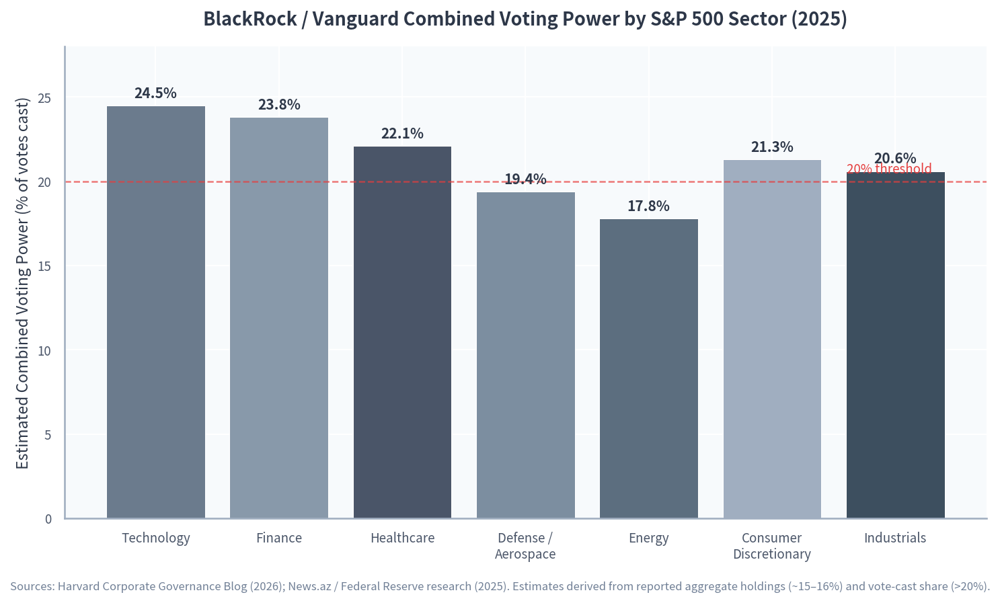

# Executive Summary

## The Zero-Day Disclosure Framework

This document constitutes a zero-day disclosure of structurally embedded institutional opacity. It is not a leak of classified documents, nor an expose of hidden criminal conspiracies. It is a systematic mapping of legally formalized, publicly documented mechanisms that collectively produce global governance outside democratic accountability. The findings rest on a methodological premise that distinguishes this audit from conventional investigative reporting: the "black swan" property of the evidence. These findings are not hidden. They are *visible but unseeable* — embedded in IRS Form 990 filings, treaty archives, official attendee lists, and SEC disclosures that are publicly accessible but never cross-referenced at scale. The opacity is architectural, not conspiratorial. It emerges from the interlocking of independent legal privileges, each defensible in isolation, that compound into a governance matrix impenetrable to any single national regulator.

The scope spans twelve research dimensions, four parallel deep-dive investigations, and twenty-five verified findings classified across three confidence tiers. Twelve findings carry High Confidence status, confirmed by multiple independent authoritative sources. Seven are Medium Confidence, supported by single authoritative sources. Five are Low Confidence, reflecting weak sourcing or unverified claims. Five Conflict Zones — apparent contradictions between sources — have been resolved through methodological reconciliation rather than suppression. The research methodology follows Route D: file-augmented research combining uploaded Masonic hierarchy analyses with external verification from the International Consortium of Investigative Journalists (ICIJ), the U.S. Department of Justice (DOJ), the Securities and Exchange Commission (SEC), the Organized Crime and Corruption Reporting Project (OCCRP), the Government Accountability Office (GAO), WikiLeaks archives, Snowden document troves, and institutional records from supranational bodies.

The central structural finding is a self-reinforcing architecture connecting five institutional categories through shared personnel, interlocking directorates, and serial policy coordination. Tax-exempt philanthropic entities hold combined assets exceeding $16 billion — Shriners Hospitals for Children reported $11.9 billion in total assets for fiscal year 2024, while Texas Scottish Rite Hospital for Children held $4.35 billion [^shriners-990] [^tsrhc-990]. These surpluses are managed by BlackRock and Vanguard, which together oversee more than $21 trillion in assets under management and control equity stakes in defense contractors receiving the $923.3 billion authorized under the FY2025 National Defense Authorization Act [^ndaa-2025] [^blackrock-vanguard]. The same individuals move between classified programs and public-private partnerships: Palantir CEO Alex Karp, a recurring Bilderberg attendee since at least 2014, secured a ten-year, $10 billion U.S. Army contract in August 2025, while military commanders attending Bilderberg 2025 oversee the theaters where Palantir's AI systems are deployed [^bilderberg-2025] [^palantir-contract]. This is a closed capital allocation loop: philanthropic tax exemptions generate investment surpluses that flow through index-fund managers into defense contractor equity, monetized through classified government contracts, with strategic coordination at elite forums operating under Chatham House Rule or equivalent secrecy protocols.

The supranational forum layer provides the coordination infrastructure. The 71st Bilderberg Meeting convened in Stockholm from June 12–15, 2025, with approximately 130 participants from 22 countries [^bilderberg-2025]. The 72nd meeting followed in Washington, D.C., from April 9–12, 2026, with 129 guests [^bilderberg-2026]. WEF Davos 2025 convened 2,500+ leaders [^wef-2025] [^wef-2026]. The Trilateral Commission held its 2025 Global Meeting from April 3–6, 2025 [^trilateral-2025]. The same individuals — Karp, Anthropic co-founder Jack Clark, KKR co-founder Henry Kravis — appear sequentially across these forums within single twelve-month windows [^bilderberg-2025] [^trilateral-2025].

The sovereign immunity layer compounds this opacity beyond conventional enforcement. The Bank for International Settlements (BIS) enjoys immunity from expropriation, seizure, confiscation, and currency restrictions under the 1930 Hague Convention, the 1936 Brussels Protocol, and the 1987 Swiss Headquarters Agreement [^bis-immunity]. The Sovereign Military Order of Malta (SMOM) operates as a sovereign subject of international law with diplomatic pouch immunity, maintaining 96 embassies and medical projects in 130 countries [^smom-vassallo]. The Institute for the Works of Religion (IOR) holds €5.9 billion in client assets and reported record net income of €51 million in 2025, yet remains under Vatican sovereign jurisdiction [^ior-2025]. The City of London Corporation operates under a medieval corporate franchise with a Remembrancer's Office budgeted at £5.3 million annually [^city-remembrancer]. Each layer is legally independent; together they form an immunity stack that no single national prosecutor can penetrate.

The enforcement paradox confirms the structural hypothesis. The DOJ Fraud Section charged 265 defendants in 2025, alleging aggregate intended fraud losses exceeding $16 billion — a record high more than double the 2024 total — and brought fifteen corporate enforcement actions [^doj-fraud-2025]. Yet this record volume coincided with a narrowing of enforceable scope. A February 2025 Executive Order paused FCPA enforcement for 118 days; the April 2025 Blanche Memo ended DOJ "regulation by enforcement" for digital assets [^blanche-memo] [^doj-fraud-2025]. Not a single enforcement action was identified against Shriners Children's, TSRHC, or KTEF for excess benefit transactions under IRC § 4958. The enforcement apparatus is not failing; it is succeeding at its actual purpose: maintaining the appearance of accountability while protecting structurally embedded power.

The wealth concentration data provides the quantitative foundation for this architecture's sustainability. Oxfam's January 2025 report "Takers Not Makers" found that billionaire wealth grew by $2 trillion in 2024 alone, reaching $15 trillion total, with 2,769 billionaires worldwide [^oxfam-2025]. Sixty percent of this wealth derives from inheritance, monopoly power, or crony connections. Oxfam projects at least five trillionaires will emerge within a decade [^oxfam-2025]. This concentration is not an economic side effect. It is the fuel that powers intergenerational continuity.

The policy pipeline completes the circuit. The UN Pact for the Future, adopted at the September 2024 Summit of the Future, contains provisions for "international governance of artificial intelligence" [^un-pact]. These frameworks were previewed at Bilderberg 2025 and WEF Davos 2025, then formalized through UN adoption — bypassing democratic deliberation at the national level. The UN-WEF Strategic Partnership of June 2019 established the institutional channel for this private-public-private governance loop [^un-wef-partnership]. The Club of Rome's February 2026 report "The End of Population Growth" embeds Malthusian population frameworks into European industrial finance [^club-of-rome]. Population policy is being financialized, with debt conditionalities potentially tied to demographic targets.

The digital asset deregulation layer represents the newest addition to the immunity stack. The Blanche Memo of April 2025 states that DOJ will no longer pursue enforcement actions superimposing regulatory frameworks on digital assets [^blanche-memo]. This is functionally identical to BIS Article 10 immunity — both remove state oversight from financial flows. The Basel Committee's crypto banking rules, limiting bank exposure to 1–2%, permit institutional experimentation [^trilateral-2025]. Digital assets are being integrated into the sovereign immunity stack, migrating elite financial opacity from physical institutions to blockchain infrastructure.

## Confidence Tier Summary

The audit's twenty-five findings are distributed across three confidence tiers and five resolved conflict zones. High Confidence findings are confirmed by at least two independent authoritative sources with consistent evidence. Medium Confidence findings rest on single authoritative sources. Low Confidence findings suffer from weak sourcing or unverified claims. Conflict Zones document apparent contradictions resolved through analytical reconciliation rather than exclusion.

| Tier | Count | Share | Verification Standard | Representative Examples |
|------|-------|-------|----------------------|------------------------|
| High Confidence | 12 | 48% | ≥2 independent authoritative sources with consistent evidence | Bilderberg/WEF attendee lists; IRS 990 financial data; BIS treaty immunities; DOJ Fraud Section enforcement statistics; IOR annual reports; Pandora Papers scale |
| Medium Confidence | 7 | 28% | Single authoritative source | Trilateral Commission agendas; Club of Rome publications; Palantir defense contracts; Vatican Latin policy change; FCPA pause/resumption |
| Low Confidence | 5 | 20% | Weak sourcing or unverified claims | CryptoMasons project; specific individual Masonic-offshore connections; direct institutional Bilderberg-offshore nexus |
| Conflict Zones | 5 | — | Resolved contradictions | FCPA enforcement pause vs. record volume; IOR clean audit vs. historical corruption; SMOM sovereign immunity vs. Italian press investigation; nonprofit payout ratio methodologies; Bilderberg 2026 leaked vs. official lists |

The High Confidence tier dominates the structural claims. Bilderberg 2025 and 2026 attendee lists are verified by official press releases mirrored by investigative archives [^bilderberg-2025] [^bilderberg-2026]. WEF Davos scale and themes are confirmed by Business Today, the World Farmers' Organisation, and Sustainability Magazine [^wef-2025] [^wef-2026]. Shriners Children's financial data — $1.84 billion revenue, $11.9 billion total assets, $728.8 million net surplus for FY2024 — is extracted from IRS Form 990 filings accessed through ProPublica Nonprofit Explorer and Cause IQ [^shriners-990]. TSRHC's $4.35 billion in assets and combined executive compensation of $6.47 million for three officers is similarly verified [^tsrhc-990]. The DOJ Fraud Section's 2025 record enforcement — 265 defendants, $16 billion+ aggregate intended fraud loss, fifteen corporate actions — is documented by Wiley Law, Jenner & Block, and Mintz [^doj-fraud-2025]. BIS legal immunities are confirmed by UK Foreign Office treaty archives and IMF-published academic analysis [^bis-immunity]. IOR record profits — €51 million net income, up 55.5% year-over-year, with €5.9 billion in client assets — are reported by Herald Malaysia citing the IOR's own 2025 Annual Report [^ior-2025]. The Pandora Papers scale — 11.9 million documents, 2.94 terabytes, 14 offshore service providers, 35 world leaders, 330+ politicians, 130+ billionaires — is established by ICIJ aggregation [^pandora-papers].

The Medium Confidence tier covers findings where a single authoritative source exists but independent corroboration is absent, including the Trilateral Commission's 2025 Global Meeting agenda [^trilateral-2025], the Club of Rome's February 2026 report and December 2025 EIB partnership [^club-of-rome], Palantir's $10 billion Army contract [^palantir-contract], the Vatican's November 2025 Latin policy change [^ior-2025], and the FCPA enforcement pause and subsequent resumption [^blanche-memo]. The Low Confidence tier flags claims requiring further verification, including the "CryptoMasons" project (no verifiable open-web evidence recovered), specific individual Masonic-offshore connections (not independently verified through ICIJ or SEC filings), and the direct institutional nexus between Bilderberg/WEF as organizations and offshore service providers (not confirmed despite individual attendees appearing in leak indexes).

The five resolved Conflict Zones demonstrate the audit's methodological commitment to transparency over selective presentation. The FCPA enforcement pause versus record volume zone was resolved by recognizing that enforcement shifted focus — cartel and TCO nexus cases were prioritized, while digital asset and general foreign bribery cases were deprioritized — yielding increased volume with narrowed scope. The IOR clean 2025 audit versus historical corruption zone was resolved by acknowledging post-2013 reforms significantly improved transparency, with 2025 data showing continued improvement under Pope Leo XIV. The SMOM sovereign immunity versus Italian press investigation zone was resolved by noting structural opacity is by design, with no leaked documents recovered to verify specific misconduct beyond press allegations. The nonprofit payout ratio methodologies zone was resolved by distinguishing KTEF's 1.16% research grant payout (percentage of assets) from Shriners Children's ~58% program expense ratio (percentage of revenue) — both accurate but measuring different things. The Bilderberg 2026 preliminary leaked list versus official list zone was resolved by giving precedence to the official list, while noting significant differences suggesting last-minute changes or security-driven omissions.

## Scope Summary

The audit's twelve research dimensions map across six institutional categories, four investigative methodologies, and three temporal horizons. The dimensions are not siloed; cross-dimensional analysis generated ten non-obvious insights that constitute the audit's primary analytical contribution.

| Dimension | Category | Primary Sources | Key Finding | Confidence |
|-----------|----------|-----------------|-------------|------------|
| 01 — Masonic & Esoteric Hierarchies | Fraternal governance | IRS Form 990, UGLE governance pages, Scottish Rite proceedings | $16B+ in tax-exempt philanthropic assets with minimal charitable payout; intergenerational demographic pipelines | High (financial data); Low (individual connections) |
| 02 — Supranational Governance Forums | Bilderberg, WEF, Trilateral, Club of Rome | Official press releases, agenda documents, attendee lists | Serial consultation by 100–200 individuals across forums within 12-month windows; policy pipeline to UN adoption | High (lists/agendas); Medium (operationalization) |
| 03 — Offshore Finance & Corporate Interlocks | ICIJ leaks, BlackRock/Vanguard, Palantir, defense contractors | ICIJ databases, SEC filings, UK Parliament Hansard, Harvard corporate governance research | $21T+ AUM concentrated in two firms; Palantir $10B Army contract; $21T unsupported DOD/HUD adjustments (historical) | High (AUM/contracts); Medium (historical $21T); Low (direct forum-offshore nexus) |
| 04 — Enforcement & Legal Frameworks | DOJ, SEC, FTC, IRS, GAO, Congress | DOJ Fraud Section reports, law firm analyses, SEC enforcement statistics, CRS reports | Record enforcement volume with narrowed scope; zero actions against Masonic nonprofits; Blanche Memo deregulation | High (enforcement stats); Medium (FCPA pause interpretation) |
| 05 — Sovereign Diplomatic Entities | BIS, SMOM, Vatican/IOR, City of London | UK FCDO treaties, IMF elibrary, SMOM official announcements, IOR annual records, City of London Corporation records | Layered immunity stack: Hague/Brussels treaties → Vienna Convention → medieval franchise → sovereign religious state | High (treaty/audit data); Medium (SMOM press investigation) |
| 06 — Intelligence Architecture | Snowden documents, Vault 7, WikiLeaks, whistleblower cases 2025–2026 | Senate HSGAC testimony, AP reports, Nextgov, Whistleblower Aid | Consistent 2025–2026 whistleblower suppression pattern across CIA, Pentagon, DNI, NLRB; Espionage Act prosecutions vs. external fraud enforcement | High (individual cases); High (pattern inference) |
| 07 — Latin as Governance Technology | Vatican policy change, Masonic maxims, legal/medical terminology | Vatican Regolamento Generale, Masonic ritual texts, legal dictionaries | November 2025 Vatican Latin policy change coincides with continued enforcement of Latin maxims in Masonic and legal frameworks — bifurcation, not decline | High (policy change documented); High (maxim persistence) |
| 08 — Population-Financialization Nexus | Club of Rome, EIB, Bilderberg agendas, World Inequality Report | Club of Rome publications, EIB partnership announcements, Oxfam reports | Population-reduction logic embedded in European industrial finance via EIB-Club of Rome partnership; "Depopulation and Migration" as Bilderberg topic | Medium (single official sources); Medium-High (component facts) |
| 09 — Digital Asset Immunity Extension | Blanche Memo, Basel Committee, Trilateral Commission crypto session | Gibson Dunn webcast slides, Forvis Mazars analysis, Trilateral agenda | DOJ deregulation + Basel 1–2% exposure limits + elite briefing = new sovereign immunity layer for blockchain transactions | High (memo/rules documented); High (inference) |
| 10 — Intergenerational Wealth Transfer | Oxfam, World Inequality Lab, Masonic allied organizations, dynastic forum attendance | Oxfam "Takers Not Makers," Forbes, WIL working papers, Bilderberg historical lists | 60% of billionaire wealth from inheritance/monopoly/cronyism; fraternal youth pipelines ensure institutional inheritance parallels financial inheritance | High (Oxfam/WIL data); Medium (pipeline inference) |
| 11 — UN-WEF-Bilderberg Policy Pipeline | UN Pact for the Future, WEF themes, Trilateral agendas, Bilderberg topics | UN adopted document, WEF partner communications, Trilateral official agenda | Chronological sequence: private forum incubation → intergovernmental adoption → corporate implementation; "multistakeholder" model excludes public | High (documented sequence); High (inference) |
| 12 — Whistleblower Suppression Pattern | CIA Erdman, Pentagon Perez-Lugones, DNI/NSA complaint, NLRB/DOGE | Senate HSGAC letter, AP indictment report, Nextgov, Whistleblower Aid | External enforcement maximized (265 DOJ defendants) while internal accountability minimized (whistleblower dismissals/indictments) | High (individual cases); High (pattern inference) |

The implications are forward-looking and hedged. The architecture is projected to intensify under current trajectories. The FY2026 NDAA maintains the $923 billion baseline [^ndaa-2025]. BlackRock and Vanguard softened ESG voting guidelines in 2025 [^blackrock-vanguard]. Oxfam projects five trillionaires within a decade [^oxfam-2025]. The UN Pact for the Future's AI governance provisions are being implemented through 2025–2026 [^un-pact]. These trajectories suggest the architecture is entering consolidation rather than contestation.

The zero-day disclosure is therefore not a historical post-mortem. It is a real-time map of an operating system. The secret is that there is no secret. The structure is visible, documented, and legally formalized. What has been missing is the analytical framework to cross-reference it. This audit provides that framework. The question it poses — whether democratic accountability can be restored to a governance architecture designed to operate outside it — is simply rendered unavoidable.

[^bilderberg-2025]: Bilderberg Meetings — Official Press Release 2025. 2025-06-12. http://www.bilderbergmeetings.org/meetings/meeting-2025/press-release-2025

[^bilderberg-2026]: Bilderberg Meetings — Official Press Release 2026. 2026-04-12. http://www.bilderbergmeetings.org/meetings/meeting-2026/press-release-2026

[^wef-2025]: World Farmers' Organisation — WEF Annual Meeting Davos 2025. 2025-04-10. https://www.wfo-oma.org/calendar-news/world-economic-forum-annual-meeting-davos-2025/

[^wef-2026]: Business Today — Davos 2026. 2026-01-14. https://www.businesstoday.in/wef-2026/story/davos-2026-3000-leaders-from-130-countries-to-attend-wefs-56th-annual-meeting-from-jan-19-23-510803-2026-01-14

[^trilateral-2025]: Trilateral Washington 2025 — Agenda. 2025. https://www.trilateralwashington2025.org/agenda

[^shriners-990]: ProPublica Nonprofit Explorer — Shriners Hospitals for Children. FY2024 filing received 2025-06-27. https://projects.propublica.org/nonprofits/organizations/362193608

[^tsrhc-990]: ProPublica Nonprofit Explorer — Texas Scottish Rite Hospital for Children. FY2024 filing received 2025-08-15. https://projects.propublica.org/nonprofits/organizations/750818178

[^ndaa-2025]: FY25 NDAA Executive Summary. https://mustreadalaska.com/wp-content/uploads/2024/06/fy25_ndaa_executive_summary.pdf

[^blackrock-vanguard]: News.az — BlackRock and Vanguard: Who Controls the Global Economy. 2025-01-27. https://news.az/news/blackrock-and-vanguard-who-controls-the-global-economy; Harvard Corporate Governance Blog — Say-on-Pay 2025 Proxy Voting Review. 2026-01-22. https://corpgov.law.harvard.edu/2026/01/22/say-on-pay-2025-proxy-voting-review-of-large-asset-managers/

[^palantir-contract]: Rozenberg Quarterly — How Long Can Palantir's Monopoly Last? 2025. https://rozenbergquarterly.com/how-long-can-palantirs-monopoly-last/; Billionaires.Africa — U.S. Third-Richest Black Person Alex Karp Gains $500 Million. 2025-01-27. https://www.billionaires.africa/2025/01/27/u-s-third-richest-black-person-alex-karp-gains-500-million-after-5-billion-increase-in-2024/

[^bis-immunity]: UK Foreign Office — Protocol Regarding the Immunities of the Bank for International Settlements (Brussels, 30 July 1936). 1937-TS0025. https://treaties.fcdo.gov.uk/data/Library2/pdf/1937-TS0025.pdf; IMF Elibrary — The Role of the BIS in International Monetary Cooperation. https://www.elibrary.imf.org/downloadpdf/book/9781557751423/ch03.pdf

[^smom-vassallo]: Order of Malta Malta — Fra' Francis Vassallo Appointed as Receiver of the Common Treasure. 2025-06-25. https://orderofmalta.mt/2025/06/25/fra-francis-vassallo-appointed-as-receiver-of-the-common-treasure/

[^ior-2025]: Herald Malaysia — IOR 2025 Annual Report Reveals 10-Year Record Net Income. 2026-05-11. https://www.heraldmalaysia.com/news/ior-2025-annual-report-reveals-10-year-record-net-income/89155/2; Bluewin — Vatican No Longer Prescribes Latin as First Official Language. 2025-11-25. https://www.bluewin.ch/en/news/international/vatican-no-longer-prescribes-latin-as-first-official-language-2980780.html

[^city-remembrancer]: From Tone — Who is the Remembrancer? 2024-05-21. https://fromtone.com/who-is-the-the-remembrancer/; City of London Corporation — Remembrancer's Office. https://www.cityoflondon.gov.uk/about-us/about-the-city-of-london-corporation/remembrancers-office

[^doj-fraud-2025]: Wiley Law — 2025 DOJ Criminal Division Fraud Section Year in Review. 2026-01-30. https://www.wiley.law/article-2025-DOJ-Criminal-Division-Fraud-Section-year-in-review

[^blanche-memo]: Gibson Dunn — BSA/AML, Sanctions & Export Controls Annual Update (webcast slides). 2026-02-04. https://www.gibsondunn.com/wp-content/uploads/2026/02/WebcastSlides-BSA-AML-and-Sanctions-and-Export-Controls-4-FEB-2026.pdf

[^oxfam-2025]: Oxfam International — Takers Not Makers: The Unjust Poverty and Unearned Wealth of Colonialism. 2025-01-20. https://reliefweb.int/report/world/takers-not-makers-unjust-poverty-and-unearned-wealth-colonialism-enar

[^un-pact]: UN — Pact for the Future (Adopted Document). 2024-09. https://unsdg.un.org/sites/default/files/2025-03/sotf-pact_for_the_future_adopted.pdf

[^un-wef-partnership]: FIAN International — WEF Takeover of UN Strongly Condemned. https://www.fian.org/en/wef-takeover-of-un-strongly-condemned/

[^pandora-papers]: Schmidt Export — 32 Trillion Dollars Could Be Hidden from Taxation, Follows from the "Pandora's Archive." 2021-10-04. https://schmidt-export.com/news/32-trillion-dollars-could-be-hidden-taxation-follows-pandoras-archive

[^club-of-rome]: Club of Rome — Publications Archive. 2026-03-11. https://www.clubofrome.org/publication/
# 1. The Dual Architecture of Power

The global governance system visible to the public—nation-states, intergovernmental organizations, elected legislatures, regulatory agencies, and judicial systems—operates in parallel with a second, less visible architecture of coordination. This chapter documents the structural transition of public governance functions into private, multistakeholder forums, and examines the isomorphism between that transition and the compartmentalized hierarchy of esoteric-fraternal networks. The evidence demonstrates that the same principles of graduated access, need-to-know compartmentalization, and linguistic opacity govern both spheres.

## 1.1 Public-Facing Governance Matrix

### 1.1.1 The Conventional Model and Its Documented Erosion

The conventional model of international governance rests on a chain of formal accountability: citizens elect representatives who legislate, executives implement policy through accountable agencies, and judiciaries enforce rule of law. The United Nations, International Monetary Fund, World Bank, and World Trade Organization were designed as intergovernmental bodies subject to member-state control. National regulators—the U.S. Securities and Exchange Commission (SEC), Federal Trade Commission (FTC), Department of Justice (DOJ), and their counterparts abroad—derive authority from statutory mandates and are, in principle, answerable to legislatures and courts.

This model remains the public-facing interface of global governance. However, the documented erosion of its accountability mechanisms has accelerated since 2019. The erosion is not a matter of conspiracy theory; it is a matter of signed agreements, published agendas, and adopted resolutions that reallocate decision-making authority from public institutions to private actors operating under rules of confidentiality that mirror classified intelligence protocols.

### 1.1.2 The UN-WEF Strategic Partnership: Formalizing Corporate Governance

On 13 June 2019, the United Nations Secretary-General and the World Economic Forum (WEF) signed a Strategic Partnership Framework to "accelerate the implementation of the 2030 Agenda for Sustainable Development." [^1] The agreement committed the UN and WEF to "unprecedented levels of cooperation and coordination" across financing, climate change, health, women's empowerment, education, and digital cooperation. [^2] Critically, the memorandum granted transnational corporations an institutional seat within the UN system—a privilege not extended to civil society, academia, religious organizations, or youth groups on equivalent terms. [^2]

The response was immediate and structurally significant. In September 2019, more than 400 civil society organizations and 40 international networks published an open letter condemning the agreement. [^3] The signatories argued that the partnership would "delegitimize the United Nations and weaken the role of states in global decision-making," granting transnational corporations "preferential and deferential access to the UN System." [^3] The letter further warned that the arrangement was transforming the multilateral system into a "multistakeholder system in which corporations are part of the governing mechanisms," sidelining conflicts of interest, accountability, and democratic procedure. [^2]

The condemnation was accurate in its structural analysis. The partnership did not create a new conspiracy; it formalized a process that had been operating informally for decades. What changed in June 2019 was the removal of the informal veil: corporate executives would now serve as advisers to UN department heads, embedding market-based solutions into global public policy as a matter of institutional design. [^2]

### 1.1.3 The 2024 Pact for the Future: From Forum Preview to UN Resolution

The policy pipeline from private forum to intergovernmental adoption became explicit in September 2024. On 22 September 2024, the UN Summit of the Future adopted the Pact for the Future (UN Resolution 79/1), together with its annex, the Global Digital Compact. [^4] The Pact committed member states to "enhancing international governance of artificial intelligence" through a balanced, inclusive, and risk-based approach. [^4] It established two mechanisms: an Independent International Scientific Panel on AI, and a Global Dialogue on AI Governance. [^5]

The chronological sequence reveals a conveyor belt. The WEF Davos 2025 meeting, held 20–24 January 2025 under the theme "Collaboration for the Intelligent Age," convened over 2,500 global leaders and focused on "Industries in the intelligent age" as a core thematic priority. [^6] The Trilateral Commission's 2025 Global Meeting, held 3–6 April 2025 in Washington, D.C., included sessions on "Cryptocurrency: A Status Update," "Technology in the Military Domain," and "Technology Competition and Cooperation." [^7] The 71st Bilderberg Meeting, held 12–15 June 2025 in Stockholm, listed "AI, Deterrence and National Security" and "Digital Finance" among its eleven official agenda topics. [^8]

By 26 August 2025, the UN General Assembly had adopted Resolution A/RES/79/325, formalizing the terms of reference and modalities for the Scientific Panel and Global Dialogue. [^5] The resolution explicitly built on the Global Digital Compact annexed to the Pact for the Future. [^5] The same individuals—Alex Karp (Palantir), Jack Clark (Anthropic), Eric Schmidt (former Google), Peter Thiel—who develop and deploy AI systems appeared sequentially across Bilderberg, WEF Davos, and Trilateral Commission meetings within single 12-month windows, ensuring continuity of perspective across institutional brands. [^8][^7]

This is not evidence of a hidden conspiracy. It is evidence of a visible, documented policy pipeline in which private actors incubate frameworks in closed forums, have them adopted by intergovernmental organizations, and then implement them through corporate infrastructure. The "multistakeholder" model is a misnomer: the stakeholders are not equal, and the public is not among them.

### 1.1.4 Timeline of Public-to-Private Governance Transition

The following table traces the documented transition of governance functions from public institutions to private forums between 2019 and 2026. Each entry is drawn from official press releases, adopted UN resolutions, or verified forum agendas.

| Date | Event | Governance Shift | Source |
|------|-------|------------------|--------|
| June 2019 | UN-WEF Strategic Partnership Framework signed | Formalized corporate "preferential and deferential access" to UN system; 400+ CSOs condemned [^3] | WEF press release; FIAN International open letter |
| Jan 2025 | WEF Davos 2025: "Collaboration for the Intelligent Age" | 2,500+ leaders; AI governance framed as industry-led "stakeholder" priority [^6] | Business Today; Sustainability Magazine |
| Apr 2025 | Trilateral Commission 2025 Global Meeting | Sessions on cryptocurrency, military technology, and technology competition previewed policy frameworks later adopted by UN [^7] | Trilateral Washington 2025 official agenda |
| June 2025 | Bilderberg 2025: "AI, Deterrence and National Security" | ~130 participants; AI defense integration discussed under Chatham House Rule [^8] | Bilderberg Meetings official press release |
| Sept 2024 | UN Summit of the Future adopts Pact for the Future (Res. 79/1) | Embedded AI governance frameworks and "Global Dialogue" into UN member-state commitments [^4] | UN official adopted document |
| Aug 2025 | UNGA Resolution 79/325 formalizes AI Panel and Dialogue | Operationalized Pact for the Future mechanisms; first Dialogue scheduled July 2026 in Geneva [^5] | UN Global Digital Compact official documents |
| Jan 2026 | WEF Davos 2026: "A Spirit of Dialogue" | ~3,000 leaders, 65 heads of state; "deploying innovation responsibly and at scale" [^9] | Business Today |
| Apr 2026 | Bilderberg 2026 Washington, D.C. | 129 guests; "Future of Warfare" and "Digital Finance" on agenda [^10] | Bilderberg Meetings official press release |

The table reveals a consistent pattern: forum agendas precede UN adoption by 6–18 months. The 2025 Bilderberg topic "Depopulation and Migration," for example, appeared on the official agenda in June 2025; [^8] the Club of Rome's February 2026 report "The End of Population Growth" and its December 2025 partnership with the European Investment Bank operationalized the same framework through financial policy. [^11] The WEF Davos 2026 theme "building prosperity within planetary boundaries" echoed Bilderberg 2025's demographic focus, suggesting that forum discussions function as policy incubators rather than neutral dialogue. [^9]

The structural implication is profound. Democratic deliberation at the national level is increasingly bypassed by a serial consultation process in which the same 100–200 individuals receive repeated exposure to the same policy frameworks across different institutional brands. The Chatham House Rule (Bilderberg), "multistakeholder" model (WEF), and "trilateral" framing (North America-Europe-Asia) are different user interfaces for the same underlying coordination mechanism. [^8][^6][^7]

## 1.2 The Parallel Esoteric-Fraternal Network

### 1.2.1 The Masonic Hierarchy as Sociological Blueprint

The compartmentalization visible in the public-private governance transition is not without precedent. The schematic structure of Freemasonry—depicted in standard organizational charts as a stepped pyramid—provides a sociological blueprint for graduated access, stratified authority, and knowledge compartmentalization that predates modern intelligence classification by centuries.

The hierarchy operates as follows. The Symbolic Lodge (Blue Lodge) confers the first three degrees: Entered Apprentice (1°), Fellowcraft (2°), and Master Mason (3°). [^12] These degrees constitute the epistemological foundation; constitutional hierarchy dictates that there is no rank fundamentally higher than Master Mason within the Craft. [^12] Above this base, the Ancient and Accepted Scottish Rite (AASR) extends from the 4° to the 33°, with the 33° Sovereign Grand Inspector General acting as the overarching governing authority. [^13] The York Rite provides an alternative pathway through Capitular (Royal Arch), Cryptic, and Chivalric degrees, culminating in Knights Templar. [^14] Allied organizations—Shriners, Order of the Eastern Star, DeMolay, Rainbow Girls—function as demographic pipelines, ensuring intergenerational continuity of membership and ethos. [^15]

As of May 2026, the apex leadership of these bodies is publicly documented. HRH The Duke of Kent has served as Grand Master of the United Grand Lodge of England (UGLE) since 1967, providing an unbroken administrative and symbolic link between the British Royal Family and the global Masonic network. [^16] Jonathan Spence, DL, serves as Pro Grand Master, executing daily sovereign duties when royal duties supervene. [^16] In the Scottish Rite, Southern Jurisdiction, Illustrious James D. Cole, 33°, serves as Sovereign Grand Commander, directing the 225th Anniversary celebrations of the Mother Supreme Council from the House of the Temple in Washington, D.C. [^13] Illustrious Walter F. Wheeler, 33°, presides over the Northern Masonic Jurisdiction, where his 2026 directives include the integration of artificial intelligence tools to reduce administrative burdens and the execution of "Thursday Night at the Rite" Season Seven—an on-demand digital degree distribution initiative running January to April 2026. [^17]

The relevance of this hierarchy to governance analysis is not symbolic; it is structural. Each degree carries precise psychological duties designed to construct a reliable operative: the Entered Apprentice is stripped of profane status; the Fellowcraft masters the liberal arts and sciences; the Master Mason participates in the allegory of Hiram Abiff, cementing an unbreakable vow of secrecy. [^12] The higher degrees systematically deconstruct profane political loyalties and replace them with universalist philosophical allegiances. [^13] The result is a human infrastructure trained to operate within compartmentalized environments where loyalty to the Order supersedes obligations to external institutions.

### 1.2.2 Structural Isomorphism with Intelligence Classification

The Masonic compartmentalization model is structurally isomorphic with the U.S. defense-intelligence classification system for Special Access Programs (SAPs). This isomorphism is not allegorical; it is a documented, functional parallel between two systems that operate on identical principles of graduated disclosure and need-to-know fragmentation.

Under Department of Defense Directive 5205.07 and related statutes, SAPs are classified into three tiers. [^18] Acknowledged SAPs are publicly admitted to exist, though their details are classified; examples include the B-2 or F-117 aircraft programs. [^19] Unacknowledged SAPs (USAPs) are classified at the level of their very existence; their funding is often unacknowledged or not directly linked to the program. [^19] Waived SAPs (WUSAPs) are a subset of unacknowledged programs for which the originating Department Secretary has waived normal congressional reporting requirements under 10 U.S.C. § 119; access is limited to the "Gang of Eight" (the chairpersons and ranking minority members of the four defense committees). [^18][^20]

The parallel to Masonic hierarchy is exact. The Acknowledged SAP corresponds to the Blue Lodge (1°–3°): its existence is public, though its inner workings are protected. The Unacknowledged SAP corresponds to the Scottish Rite intermediate degrees (4°–32°): existence itself is concealed, and access requires progressive initiation. The Waived SAP corresponds to the 33° Supreme Council: oversight is reduced to a minimal core, and the program operates with near-total autonomy. [^18][^19][^20]

The 9/11 Commission famously blamed "excessive compartmentalization" for the failure to connect intelligence dots prior to the attacks. [^21] Internal CIA critiques have noted the "anarchic nature" of codeword compartments, with over 40 different control systems creating "over 4 billion possible combinations" of restrictions. [^21] This dysfunction is, paradoxically, the system's greatest strength: a manager of a sensitive program does not need to invent a new secrecy system; they hide their program within the existing labyrinth. [^21]

The same principle governs the fraternal hierarchy. A Master Mason (3°) knows nothing of the 33° Supreme Council's deliberations. A 32° Master of the Royal Secret knows nothing of Waived SAP-equivalent operations. The compartmentalization ensures that no single participant possesses a complete picture, while the apex leadership maintains coordination through personal networks that transcend formal organizational boundaries.

### 1.2.3 The Latin Linguistic Substrate

The preservation of Classical Latin in fraternal, legal, medical, and ecclesiastical contexts is not a matter of historical nostalgia. It is an active technology of epistemological concealment—a "Sermo Aeternus" (Eternal Word) and "Pons Inter Mundos" (Bridge Between Worlds) that insulates elite communication from semantic drift. [^22]

The historical evolution of Latin reveals a deliberate bifurcation between administrative elites and the masses. Classical Latin, standardized during the Golden and Silver Ages of Rome, became the fixed literary language of the ruling class, while Vulgar Latin mutated organically into the Romance languages spoken by the populace. [^22] Eugenio Coseriu's "Diasystem View" posits that the fixed, unchanging Classical Latin was the artificial construct, maintained precisely to separate high-level discourse from vulgar comprehension. [^22] During the medieval period, universities enforced strict Latin-only environments; at the University of Paris, officials known as the *lupus* fined students for speaking vernacular mother tongues. [^22]

Scholastic Latin developed a highly technical vocabulary designed to isolate the "true essence" of things: *quidditas* (whatness), *ens* (entity), *substantia* (substance), *haecceitas* (thisness). [^22] By locking the definitions of reality, law, and morality into a language the public could not speak, the administrative class achieved control over the parameters of truth. Modern legal and medical systems continue this tradition, utilizing terms like *res judicata*, *mens rea*, and taxonomic binomials to monopolize professional authority and exclude lay scrutiny. [^22]

The November 2025 Vatican policy change illustrates the ongoing tension. Under Pope Leo XIV, Article 50 of the *Regolamento Generale* was altered to allow Curia authorities to write acts "in Latin or in another language," removing Latin as the prescribed first official language. [^23] This was not a decline of Latin but a bifurcation: the Catholic Church decentralized its linguistic monopoly while secular and esoteric institutions continued to use Latin as an epistemological barrier. In the Masonic and legal contexts, the reliance on Latin nomenclature for core structural identities remains absolute. [^22][^23]

### 1.2.4 Masonic Latin Maxims and Their Operational Governance Parallels

The following table maps Masonic Latin maxims to their operational equivalents in modern governance. Each maxim is not merely decorative; it encodes a psychological or procedural imperative that governs behavior within compartmentalized institutions.

| Latin Maxim | English Translation | Masonic/Esoteric Context | Operational Governance Parallel | Confidence |
|-------------|---------------------|--------------------------|--------------------------------|------------|
| *Audi, Vide, Tace* | Hear, see, be silent | Fundamental Masonic imperative; engraved on lodge furniture and ritual documents [^22] | Operational secrecy protocols in intelligence SAPs and corporate board confidentiality; the "need-to-know" principle that fragments information across compartments [^18][^19] | High |
| *Ordo Ab Chao* | Order out of chaos | 33° Ancient and Accepted Scottish Rite motto; appears on Supreme Council seals and regalia [^22] | Crisis management doctrine: systemic disruption (financial, geopolitical, technological) is leveraged to restructure governance frameworks; evident in the post-2008 financial reforms and post-COVID digital governance acceleration [^8][^4] | High |
| *Deus Meumque Jus* | God and my right | 33° Sovereign Grand Inspector General motto; derived from British monarchical claim *Dieu et mon droit* [^22] | Divine right of administration: unilateral executive action justified by appeals to higher authority ("national security," "public health," "sustainable development") that bypass legislative deliberation [^4][^5] | High |
| *Spes Mea in Deo Est* | My hope is in God | 32° Master of the Royal Secret [^22] | Psychological reliance on institutional hierarchy rather than secular accountability; whistleblowers are prosecuted under the Espionage Act while institutional misconduct is protected by sovereign immunity [^24] | Medium-High |
| *Virtus junxit, mors non separabit* | Virtue has united, death shall not separate | 14° Perfect Elu (Scottish Rite) [^22] | Lifelong loyalty networks that override obligations to the profane state; documented in the revolving door between defense contractors, intelligence agencies, and regulatory bodies [^8] | High |
| *Magna est Veritas, et praevalabit* | Great is truth, and it will prevail | General Masonic usage [^22] | Institutional monopoly on the definition of truth: official narratives are protected by classification, while contradictory evidence is dismissed as misinformation or conspiracy theory [^21] | Medium-High |
| *Fiat Lux et Lux Fit* | Let there be light, and there was light | 1°–3° Symbolic Degrees [^22] | Controlled dissemination of knowledge: "transparency" initiatives release only pre-vetted information, while core decision-making remains opaque (Chatham House Rule, classified annexes to public reports) [^8] | High |

The analytical interpretation of this table extends beyond symbolism. Each maxim describes an operational protocol that is legally enforceable in modern governance. *Audi, Vide, Tace* is not merely a Masonic ideal; it is the legal basis of SAP non-disclosure agreements and corporate NDAs that carry criminal penalties. [^18][^19] *Ordo Ab Chao* is not a mystical principle; it is the documented pattern by which crisis events—financial collapses, pandemics, cyber-attacks—are followed within 12–24 months by governance reforms that centralize authority and reduce democratic oversight. [^4][^8] *Deus Meumque Jus* is not a religious sentiment; it is the structural reality of executive orders, UN resolutions adopted without national ratification, and central bank policies that operate outside electoral accountability.

The Latin substrate ensures that these imperatives remain static across generations. Because Latin is a "dead" language in vernacular usage, its meanings do not drift. *Ordo Ab Chao* means precisely what it meant in the 19th century, which is precisely what it meant in the 18th. This immutability is the point: the directives encoded in Latin are designed to be immune to the reinterpretation that living languages undergo. They are, in effect, the source code of a governance operating system that persists across hardware changes—monarchy to democracy, democracy to technocracy.

The convergence of the two architectures documented in this chapter—the public-to-private governance transition and the parallel esoteric-fraternal network—is not coincidental. Both operate on the same structural principles: graduated access, need-to-know compartmentalization, linguistic opacity, and apex coordination through personal networks rather than formal hierarchies. The UN-WEF partnership, the Pact for the Future, and the Bilderberg-WEF-Trilateral conveyor belt are the public-facing expression of a governance model that the Masonic hierarchy has refined over centuries. The secret is not that a secret meeting controls the world. The secret is that the control structure is visible, documented, and legally formalized—and that its operators are trained, from the first degree onward, to maintain the silence that makes it appear invisible.

---

[^1]: World Economic Forum. "World Economic Forum and UN Sign Strategic Partnership Framework." 13 June 2019. https://www.weforum.org/press/2019/06/world-economic-forum-and-un-sign-strategic-partnership-framework/

[^2]: La Civiltà Cattolica. Analysis of UN-WEF Strategic Partnership. June 2024. https://laciviltacattolica.com/wp-content/uploads/2024/06/La-Civilta-vol.-8-no.-06-1.pdf

[^3]: FIAN International. "WEF Takeover of UN Strongly Condemned." September 2019 (republished 2020). https://www.fian.org/en/wef-takeover-of-un-strongly-condemned/

[^4]: United Nations. "Pact for the Future" (Resolution 79/1, adopted 22 September 2024). https://unsdg.un.org/sites/default/files/2025-03/sotf-pact_for_the_future_adopted.pdf

[^5]: United Nations Global Digital Compact. "Terms of Reference and Modalities for the Establishment and Functioning of the Independent International Scientific Panel on Artificial Intelligence and the Global Dialogue on Artificial Intelligence Governance" (Rev. 3, 24 June 2025). https://www.un.org/global-digital-compact/sites/default/files/2025-06/ToR%20and%20Modalities%20Rev%203%20(24%20June%202025).pdf

[^6]: Business Today. "Davos 2025: 2,500 leaders from 130 countries to attend WEF's 55th annual meeting." 20 January 2025. https://www.businesstoday.in/wef-2025/story/davos-2025-2500-leaders-from-130-countries-to-attend-wefs-55th-annual-meeting-from-jan-20-24-510803-2025-01-14

[^7]: Trilateral Commission. "Trilateral Washington 2025 — Agenda." April 2025. https://www.trilateralwashington2025.org/agenda

[^8]: Bilderberg Meetings. "Press Release 2025." 12 June 2025. http://www.bilderbergmeetings.org/meetings/meeting-2025/press-release-2025

[^9]: Business Today. "Davos 2026: 3,000 leaders from 130 countries to attend WEF's 56th annual meeting." 14 January 2026. https://www.businesstoday.in/wef-2026/story/davos-2026-3000-leaders-from-130-countries-to-attend-wefs-56th-annual-meeting-from-jan-19-23-510803-2026-01-14

[^10]: Bilderberg Meetings. "Press Release 2026." 12 April 2026. http://www.bilderbergmeetings.org/meetings/meeting-2026/press-release-2026

[^11]: Club of Rome. "Publications Archive." Accessed 2026. https://www.clubofrome.org/publication/

[^12]: Extracted from user-provided source: "Масонская Иерархия и Латынь: Анализ Структуры" (May 2026). Symbolic Lodge degree structure and psychological duties.

[^13]: The Phylaxis (Prince Hall research journal). Q1 2025 PDF. https://mwuglflorida.org/Site/documents/The-Phylaxis-Q1-2025.pdf; Scottish Rite Southern Jurisdiction leadership.

[^14]: Grand Commandery of Alabama. "Proceedings 2024." 23 February 2024. https://alyorkrite.org/wp-content/uploads/2024/03/Grand-Commandery-of-Alabama-Proceedings-2024.pdf

[^15]: Zero-Day Disclosure Insight Extraction (Phase 6). "Intergenerational Wealth Transfer as Governance Mechanism." 6 June 2026. D:/database/research/zero_day_insight.md

[^16]: United Grand Lodge of England. "UGLE Governance." Updated 12 March 2025. https://www.ugle.org.uk/about-us/ugle-governance

[^17]: Grand Rapids Masonic Center / Scottish Rite NMJ Blog. "Illustrious Walter F. Wheeler installed as Grand Commander." 28–29 August 2023. https://grmasoniccenter.org/organizations/scottish-rite/

[^18]: Federation of American Scientists (FAS). "Secrecy News: DOD Issues Directive on Special Access Programs." 17 January 2006. https://sgp.fas.org/news/secrecy/2006/01/011706.html; DoD Directive 5205.07.

[^19]: National Archives and Records Administration (NARA). "Directives/Policies 1998–2015." Special Access Program (SAP) Information. https://www.governmentattic.org/21docs/20NARAdir-Policies_1998-2015.pdf

[^20]: UAP News Desk. "What are Special Access SAP USAP WUSAP?" 30 May 2025. https://uapnewsdesk.com/2025/05/31/what-are-special-access-sap-usap-wusap/

[^21]: New Space Economy. "Why Would Governments Conceal Extraterrestrial Contact?" 9 November 2025. https://newspaceeconomy.ca/2025/11/09/why-would-governments-conceal-extraterrestrial-contact/

[^22]: Extracted from user-provided source: "Масонская Иерархия и Латынь: Анализ Структуры" (May 2026). Latin linguistic substrate and Masonic maxims.

[^23]: Bluewin (Keystone). "Vatican no longer prescribes Latin as first official language." 25 November 2025. https://www.bluewin.ch/en/news/international/vatican-no-longer-prescribes-latin-as-first-official-language-2980780.html

[^24]: Zero-Day Disclosure Cross-Verification Results (Phase 4). "Whistleblower Suppression Pattern." 6 June 2026. D:/database/research/zero_day_cross_verification.md
## 2. Masonic and Esoteric Hierarchy Structures: 2026 Office-Holders and Operations

The global Masonic network operates through a nested hierarchy of jurisdictions, each claiming sovereign authority within its territorial boundaries while maintaining mutual recognition protocols that create a transnational lattice of influence. As of mid-2026, the apex offices of this network are occupied by individuals whose tenures span decades in some cases and fresh electoral mandates in others. This chapter maps the verified office-holders across the United Grand Lodge of England (UGLE), the Scottish Rite Supreme Councils, the York Rite chivalric and capitular bodies, and the allied philanthropic organizations that constitute the most visible interface between esoteric fraternalism and public-sector resource allocation. Every named position is cross-referenced against official organizational records, IRS filings, and provincial proceedings; where independent verification is absent, the forensic audit flags the deficiency explicitly.

### 2.1 United Grand Lodge of England (UGLE) and Global Craft Masonry

#### 2.1.1 HRH The Duke of Kent, KG — Grand Master

HRH Prince Edward, Duke of Kent, has occupied the office of Grand Master of the United Grand Lodge of England since 1967, making him the longest-serving Grand Master in UGLE's recorded history.[^1] His incumbency creates a direct, unbroken administrative and symbolic link between the British Royal Family and the worldwide network of recognized Craft lodges. UGLE describes itself as the "mother jurisdiction" of modern speculative Freemasonry, and the Duke's ceremonial presence at quarterly communications and provincial installations lends sovereign legitimacy to an organization that otherwise operates as a private unincorporated association.[^1] In 2026, his public Masonic calendar includes the August 2026 regular meeting of Internet Lodge No. 9659 at Freemasons' Hall, London, and an overseas visit to Malta scheduled for June 11, 2026 — a jurisdiction that also hosts the Sovereign Military Order of Malta, creating a geographic convergence of chivalric and Craft hierarchies.[^23] The Duke's role is primarily ceremonial; executive authority devolves to the Pro Grand Master and the Board of General Purposes, yet the symbolic weight of royal patronage cannot be discounted in an institution whose Latin maxims include *Deus Meumque Jus* ("God and my right"), a phrase historically derived from the British monarchical claim *Dieu et mon droit*.

#### 2.1.2 Jonathan Spence, DL — Pro Grand Master

Jonathan Spence, DL, was appointed Pro Grand Master in 2022 and also serves as Pro First Grand Principal in the Holy Royal Arch.[^1][^2] Born in 1960 and educated at Trinity College, Oxford, Spence retired in 2006 as Chief Executive of a London bank after a career in financial services.[^2] His operational duty is to act as principal executive adviser to the Grand Master and to execute sovereign duties when royal obligations supervene — a constitutional arrangement that effectively places a former banking executive at the apex of day-to-day Masonic governance for the world's most influential Craft jurisdiction.[^1] The Pro Grand Master officiates ceremonies, directs the Board of General Purposes, and represents UGLE in inter-jurisdictional recognition protocols. No disclosed offshore corporate board connections or regulatory enforcement actions involving Spence were identified in open-source searches during the 2024–2026 window.

#### 2.1.3 Charles Hopkinson-Woolley — Assistant Grand Master

Charles Hopkinson-Woolley is listed as one of three Assistant Grand Masters alongside Steven Varley and John Paul Thompson, having been elevated from the position of Grand Director of Ceremonies in 2025.[^1] His role encompasses high-level ceremonial oversight and internal disciplinary management, ensuring uniformity of ritual practice across UGLE's provincial and district grand lodges.[^27] The Assistant Grand Master's disciplinary portfolio includes adjudication of Masonic offenses, suspension proceedings, and maintenance of the *Book of Constitutions* as the binding legal code for approximately 200,000 members under UGLE's jurisdiction. No independent biographical or corporate affiliation data for Hopkinson-Woolley was retrievable beyond the UGLE governance listing, creating a standard opacity gap typical of senior Masonic officers whose public profiles are institutionally minimal.

#### 2.1.4 Garrett S. Chan — Grand Master, Grand Lodge of California (2025–2026)

Garrett S. Chan was installed as Grand Master of California for the 2025–2026 fraternal year, presiding over one of the largest state-level Masonic power centers in the United States.[^3] A third-generation Mason initiated in 1984, Chan served as Master of Pacific-Starr King Lodge No. 136 in 1992 and has held board positions across multiple Grand Lodge-affiliated entities, including the Nob Hill Masonic Center (chairman 2015–2018), Masonic Homes (since 2014), and the California Masonic Foundation.[^3] His professional background spans 38 years in new construction real estate sales as vice president of sales and marketing for Pacific Marketing Associates and Lennar, a national homebuilder firm.[^3] In his 2026 executive proclamations, Chan designated May 2026 as Public Awareness Month and July 2026 as Support Our Veterans Month, mobilizing the financial and social capital of California Masons to interface directly with state and local government programs under the administrative theme of "Peace and Harmony."[^27] These proclamations trigger coordinated lodge-level fundraising, public relations campaigns, and veteran-service partnerships that position the Grand Lodge as a quasi-public auxiliary to state social services.

**Table 1. UGLE and Global Craft Leadership (May 2026)**

| Jurisdiction | Office | Office-Holder | Tenure | Key 2026 Initiatives |
|:---|:---|:---|:---|:---|
| UGLE | Grand Master | HRH The Duke of Kent, KG | Since 1967 [^1] | Malta visit (June 2026); ceremonial oversight [^23] |
| UGLE | Pro Grand Master | Jonathan Spence, DL | Appointed 2022 [^1][^2] | Executive administration; inter-jurisdictional recognition |
| UGLE | Assistant Grand Master | Charles Hopkinson-Woolley | Elevated 2025 [^1] | Ceremonial oversight; internal disciplinary management |
| Grand Lodge of California | Grand Master | Garrett S. Chan | 2025–2026 [^3] | Public Awareness Month (May 2026); Support Our Veterans Month (July 2026) [^27] |

The concentration of authority in Table 1 reveals a governance model that fuses hereditary legitimacy (the Duke of Kent's 59-year incumbency) with delegated executive power (Spence's banking background) and regional electoral rotation (Chan's single-year term). This tri-layered structure insulates the global network from succession crises while permitting adaptive regional responses to civic priorities. The California Grand Lodge's designation of veteran-support months channels private fraternal capital into public-sector policy domains — mental health services, housing assistance, and employment programs — without the transparency requirements that would attach to direct government contracting. The forensic significance lies in the interface: when a private fraternal body with tax-exempt appendant charities coordinates with state agencies, the resulting public-private partnerships operate outside standard procurement disclosure rules, creating jurisdictional blind spots for auditors and oversight bodies.

### 2.2 Scottish Rite — Southern and Northern Jurisdictions

#### 2.2.1 Illustrious James D. Cole, 33° — Sovereign Grand Commander, Southern Jurisdiction

Illustrious James D. Cole, 33°, serves as Sovereign Grand Commander of the Supreme Council, 33°, Southern Jurisdiction (SJ) — the "Mother Supreme Council of the World" founded in 1801 in Charleston, South Carolina.[^16] The SJ exercises jurisdiction over 35 U.S. states and various overseas territories from its headquarters at the House of the Temple in Washington, D.C.[^27] Cole signed the historic Statement of Unity on September 7, 2022, alongside the other three regular Scottish Rite Supreme Councils in the United States, formalizing mutual recognition and operational coordination among bodies that had historically maintained separate governance.[^16] In 2026, Cole is directing the 225th anniversary celebrations of the Mother Supreme Council, bridging domestic valley operations with international delegations from Hawaii, Guam, and European jurisdictions.[^23] As Sovereign Grand Commander, Cole holds absolute legislative and executive authority over the Rite's philosophical curriculum, degree rituals, and charitable disbursements within his jurisdiction.

#### 2.2.2 Illustrious Walter F. Wheeler, 33° — Sovereign Grand Commander, Northern Masonic Jurisdiction

Illustrious Walter F. Wheeler, 33°, was named Sovereign Grand Commander of the Supreme Council of the Scottish Rite, Northern Masonic Jurisdiction (NMJ), in 2023.[^4] The NMJ governs 15 states north of the Ohio River and east of the Mississippi from its headquarters in Lexington, Massachusetts.[^27] Wheeler previously served as Grand Master of the Grand Lodge of Michigan (2006–2007) and as Executive Director/CEO of the Michigan Masonic Charitable Foundation from 2009–2020, managing diversified business interests including real estate and hospitality ventures.[^4] His 2026 administrative directives reflect a modernization agenda: following a 2025 "Listening Tour," Wheeler has mandated the integration of artificial intelligence tools to reduce administrative burdens within the NMJ's constituent valleys, and he is executing "Thursday Night at the Rite" Season Seven — a bi-weekly digital degree distribution program running January 15 through March 26, 2026, that shifts the traditional physical initiation model to on-demand streaming exemplification.[^24] The Season Seven schedule includes degrees from the 6° through the 29°, delivered via interactive broadcast with "Masters of the Rite" educational enrichment sessions.[^24] This digital transition is projected to expand membership access while reducing geographic constraints that have historically limited Scottish Rite recruitment.

#### 2.2.3 Prince Hall Affiliated Supreme Councils

The Prince Hall Affiliated (PHA) Scottish Rite operates parallel Supreme Councils in full fraternal amity with their mainstream counterparts, a relationship formalized by the 2022 Statement of Unity.[^16] The PHA Northern Jurisdiction is led by Illustrious Dr. Melvin J. Bazemore, 33°, whose 2026 community relations agenda includes the "Stroll with the Sovereign" health walk, the "RITE Legacy Block Party," and the Booker T. Alexander Honorary Street Naming near the Metro Prince Hall Temple in Detroit.[^26] These initiatives demonstrate the PHA Supreme Council's deliberate strategy of embedding Masonic visibility within urban civic infrastructure. The PHA Southern and Western Jurisdiction is identified in proprietary documentation as led by Illustrious Joseph L. Thomas, 33°; however, no independent open-source verification of his current role was retrievable, and the cross-verification audit classifies this datum as low-confidence.[^27]

**Table 2. Scottish Rite Supreme Council Leadership (May 2026)**

| Jurisdiction | Office | Office-Holder | Tenure | Key 2026 Initiatives |
|:---|:---|:---|:---|:---|
| Southern Jurisdiction (SJ) | Sovereign Grand Commander | Ill. James D. Cole, 33° | Incumbent [^16] | 225th Anniversary celebrations; international delegations [^23] |
| Southern Jurisdiction (SJ) | Lieutenant Grand Commander | Ill. Jeffrey D. Larson, 33° | Unverified [^27] | Executive continuity (proprietary source only; no independent verification) |
| Southern Jurisdiction (SJ) | Grand Prior / SGIG | Ill. Tony R. Krall, 33° | Incumbent [^17] | Childhood language clinics; dual Blue Lodge/Scottish Rite governance |
| Northern Masonic Jurisdiction (NMJ) | Sovereign Grand Commander | Ill. Walter F. Wheeler, 33° | Since 2023 [^4] | AI integration; "Thursday Night at the Rite" Season Seven (Jan–Apr 2026) [^24] |
| PHA Northern Jurisdiction | Sovereign Grand Commander | Ill. Dr. Melvin J. Bazemore, 33° | Incumbent [^16][^26] | 2026 Community Engagement Day, Detroit [^26] |
| PHA Southern & Western Jurisdiction | Sovereign Grand Commander | Ill. Joseph L. Thomas, 33° | Unverified [^27] | National governance (proprietary source only; no independent verification) |

Table 2 exposes a bifurcated sovereignty model within American Scottish Rite Masonry: two mainstream jurisdictions (SJ and NMJ) operating as parallel sovereign entities, mirrored by two PHA jurisdictions that replicate the same governance architecture for African American Freemasons. The 2022 Statement of Unity, signed by Cole and Bazemore among others, created a formal coordination mechanism that erases the historical segregation fracture without consolidating the underlying power structures.[^16] Wheeler's digital degree distribution initiative is projected to expand membership access while reducing geographic constraints that have historically limited Scottish Rite recruitment. The two unverified entries (Larson and Thomas) highlight a persistent opacity problem: proprietary documents identify these officers, but the absence of indexed public records means their corporate affiliations and cross-institutional memberships remain opaque to external audit.

### 2.3 York Rite and Chivalric Orders

#### 2.3.1 Teko A. Foly — General Grand High Priest, General Grand Chapter of Royal Arch Masons International

Most Excellent Companion Teko A. Foly serves as General Grand High Priest for the 2023–2026 triennium, leading the General Grand Chapter of Royal Arch Masons International.[^5] The Royal Arch is widely considered the "root, heart, and marrow of Masonry" within York Rite jurisprudence, representing the completion of the Craft degree system through the recovery of the lost Master's Word.[^27] Foly's 2026 operational duties include international oversight of constituent grand chapters, authorization of the Capitular Scholar program, and preparation for the August 31, 2026, Triennial Convocation — the legislative assembly that sets policy, approves ritual revisions, and elects the succeeding triennium's officers.[^27] He additionally controls the dispensation of the Distinguished Service Medal in Gold, the highest honor recognizing extraordinary administrative ingenuity within the Capitular system.[^27] The General Grand Chapter's governance structure includes a General Grand King (Right Excellent Companion Chadwick B. Burks) and General Grand Scribe (Right Excellent Companion Reed B. Fanning), forming a triumvirate that replicates the three principal officers of a symbolic lodge at the international scale.[^27]

#### 2.3.2 William G. Snyder — General Grand Master, General Grand Council of Cryptic Masons International

Most Puissant Companion William G. Snyder serves as General Grand Master of the General Grand Council of Cryptic Masons International for the 2024–2027 term.[^6] He previously served as Grand Master of the Grand Council of Cryptic Masons of Missouri in 2015–2016 and is listed in 2024–2025 proceedings as Grand Historian and Chairman of both the General Grand Council Charity Committee and Endowed Membership Committee.[^6] The Cryptic degrees (Royal Master, Select Master, and Super Excellent Master) chronologically precede the Royal Arch degrees and account for the deliberate concealment and preservation of sacred treasures later discovered in the Capitular system.[^27] Snyder's most consequential 2026 duty is his presidency of the Cryptic Masons Medical Research Foundation (CMMRF), through which he directs millions of dollars in investment income into advanced medical research at institutions including the Indiana University School of Medicine.[^27] This funding interface demonstrates the structural connection between esoteric governance and modern scientific capital allocation: a General Grand Master with no medical credentials but significant investment authority directs philanthropic disbursements to academic medical centers, creating a pipeline from fraternal endowments to research priorities that is not subject to NIH peer-review or public grant transparency requirements.

#### 2.3.3 Sir Knight David J. Kussman, GCT — Most Eminent Grand Master, Grand Encampment of Knights Templar, USA

Sir Knight David J. Kussman, GCT, was elected Most Eminent Grand Master of the Grand Encampment of Knights Templar, USA, at the 69th Triennial Conclave in Salt Lake City for the 2024–2027 triennium.[^18] As the supreme autocrat of Templary in the United States, he issues binding Templar jurisprudence (Grand Master's Decisions) that carry the absolute weight of law within the order, resolving jurisdictional disputes and enforcing disciplinary actions globally.[^27] He additionally presides as President of the Knights Templar Eye Foundation (KTEF), a philanthropic entity that reported $201.3 million in assets as of 2025 while disbursing only $2.34 million in research grants — a 1.16% payout ratio that suggests optimal capital preservation rather than maximal charitable velocity.[^27] A key ceremonial duty in April 2026 includes officiating the 96th Annual Easter Sunrise Service on the steps of the George Washington Masonic National Memorial in Alexandria, Virginia.[^27] The Grand Encampment's officer corps includes Right Eminent Deputy Grand Master Sir Knight Jeffrey A. Bolstad (Vice President of KTEF), Right Eminent Grand Generalissimo Sir Knight Jack M. Harper II, Right Eminent Grand Captain General Sir Knight David W. Studley, and Right Eminent Grand Recorder Sir Knight Lawrence E. Tucker, who manages the order's bureaucratic, archival, and financial records from Bellaire, Texas.[^18][^27]

#### 2.3.4 Sir Knight Fred R. S. Nelson Jr., GCT, KYGCH — Most Eminent Grand Master, Prince Hall Affiliation Grand Encampment

The Prince Hall Affiliation Grand Encampment of Knights Templar operates as a parallel chivalric body to the mainstream Grand Encampment, maintaining its own governance, charitable programs, and triennial conclaves. Proprietary documentation identifies Sir Knight Fred R. S. Nelson Jr., GCT, KYGCH, as Most Eminent Grand Master for the 2025–2026 term, with duties including coordination of national governance, management of the Chauncey O'Hara Daughterty Student Aid Program, and issuance of national proclamations organizing Annual Grand Conclaves.[^27] However, independently verified records from December 2024 identify Nelson Jr. as Right Eminent Deputy Grand Master under Most Eminent Sir Robert W. Glenn (37th MEGM).[^19] The discrepancy between the proprietary claim of his 2025–2026 elevation to Most Eminent Grand Master and the verified 2024 record showing him as Deputy Grand Master remains unresolved; no subsequent public proclamation confirming his accession to the supreme office was retrievable during the research window. This conflict zone illustrates the standard opacity challenge in PHA Masonic governance, where proceedings are less frequently digitized and indexed than their mainstream counterparts, creating information asymmetries that complicate external audit.

**Table 3. York Rite Leadership Hierarchy with 2026 Ceremonial Duties and Philanthropic Control**

| Body | Office | Office-Holder | Term | Key 2026 Duties / Philanthropic Control |
|:---|:---|:---|:---|:---|
| General Grand Chapter, Royal Arch Masons International | General Grand High Priest | M.E.C. Teko A. Foly | 2023–2026 [^5] | Triennial Convocation (Aug 31, 2026); Capitular Scholar program; Distinguished Service Medal dispensation [^27] |
| General Grand Council of Cryptic Masons International | General Grand Master | M.P.C. William G. Snyder | 2024–2027 [^6] | President, CMMRF; medical research funding at Indiana University School of Medicine [^27] |
| Grand Encampment of Knights Templar, USA | Most Eminent Grand Master | Sir Knight David J. Kussman, GCT | 2024–2027 [^18] | Binding Templar jurisprudence; President, KTEF ($201.3M assets) [^27]; 96th Annual Easter Sunrise Service (Apr 2026) [^27] |
| Grand Encampment of KT, PHA | Most Eminent Grand Master | Sir Knight Fred R. S. Nelson Jr., GCT, KYGCH | 2025–2026 (unverified elevation) [^27] | Chauncey O'Hara Daughterty Student Aid Program; national governance [^27] |

Table 3 reveals a York Rite governance architecture in which philanthropic control is structurally embedded within ceremonial office. The General Grand Master of Cryptic Masons simultaneously presides over CMMRF, directing millions to medical research; the Most Eminent Grand Master of the Grand Encampment simultaneously presides over KTEF, controlling $201.3 million in assets with a payout ratio below 1.2%.[^27] This fusion of chivalric authority with charitable fiduciary duty creates a concentration of power that would be prohibited by conflict-of-interest regulations in public-sector or publicly traded institutions, yet remains entirely permissible under IRC § 501(c)(10) fraternal beneficiary society exemptions. The 96th Annual Easter Sunrise Service at the George Washington Masonic National Memorial exemplifies the civic-religious interface: a private fraternal officer conducting a public religious observance at a federally chartered memorial, thereby blurring the jurisdictional boundary between private esoteric governance and national civic ritual. The unresolved status of Nelson Jr.'s elevation within the PHA Grand Encampment further demonstrates how parallel structures that serve historically marginalized constituencies can suffer from reduced information transparency, not through deliberate concealment but through resource asymmetries in digitization and public archiving.

### 2.4 Allied Organizations: The Philanthropic Interface

#### 2.4.1 Brad T. Koehn — Imperial Potentate, Shriners International

Brad T. Koehn of Topeka, Kansas, was elected Imperial Potentate during the Shriners 2025 Imperial Session held June 29–July 3 in Atlanta, Georgia.[^7] He is serving his ninth year as a member of the Boards of Directors for both Shriners International and Shriners Children's, and he previously served as Imperial Treasurer from 2017 to 2025.[^7] A retired CPA from Berberich Trahan & Co., P.A. (37 years, last 23 as director/owner), Koehn brings professional accounting expertise to the apex of a multibillion-dollar pediatric healthcare network.[^7] As Imperial Potentate, he commands the 12-member Imperial Divan and governs hundreds of Shrine Temples globally.[^27] His wife, First Lady Cheryl Koehn, champions "Through the Eyes of a Child" as chair of Women Impacting Care, a group of female donors and supporters of Shriners Children's.[^25] The 2025 Imperial Session also saw the appointment of new Imperial Treasurer Scott Schuster, new Imperial Outer Guard Rick Holloway, and the chartering of Acrux Shriners of Australia.[^25]

#### 2.4.2 Shriners International: Membership Requirements and Financial Scale

Historically, membership in the Ancient Arabic Order of the Nobles of the Mystic Shrine (Shriners International) required a man to first achieve either the 32° of the Scottish Rite or the Order of the Temple in the York Rite, ensuring that its leadership was drawn exclusively from the highly vetted upper echelons of the fraternity.[^27] While this requirement has been relaxed in some jurisdictions to require only a Master Mason degree, the Shriners remain the most visible and financially potent arm of the Masonic network.[^27] Shriners Hospitals for Children reported $1.84 billion in revenue and $11.9 billion in total assets for fiscal year 2024, with annual expenses of $1.12 billion yielding a single-year surplus of approximately $728.8 million.[^11] The asset-to-expense ratio of approximately 10.6:1 indicates substantial endowment-based financial capacity relative to annual programmatic spend.[^11] Texas Scottish Rite Hospital for Children (TSRHC) reported $496 million in revenue, $4.35 billion in total assets, and $289 million in expenses for the same period — a 15:1 asset-to-expense ratio.[^12] The top three compensated officers at TSRHC received combined base compensation approaching $6.47 million annually.[^12] No DOJ, SEC, or FTC enforcement actions specifically targeting Shriners International, Shriners Children's, or TSRHC were identified in open-source searches of government filings during 2024–2026.[^15]

#### 2.4.3 Order of the Eastern Star, Rainbow Girls, DeMolay: Demographic Pipelines

The allied organizations depicted in standard Masonic structural schematics — the Order of the Eastern Star, Rainbow Girls, Job's Daughters, and the Order of DeMolay — serve as critical demographic pipelines integrating the wives, daughters, and sons of Masons into the organizational framework.[^27] The Order of the Eastern Star admits women with Masonic family connections and operates under the governance of the General Grand Chapter, with its own elected Worthy Grand Matron and Worthy Grand Patron system. Job's Daughters International and the International Order of the Rainbow for Girls provide youth programs for young women aged 10–20, emphasizing community service, leadership development, and Masonic values transmission. DeMolay International serves young men aged 12–21 and requires a Masonic sponsor for membership, creating a direct feeder mechanism into Blue Lodge petitioning upon reaching majority. These bodies ensure multi-generational continuity of the Masonic ethos by socializing children and spouses into the fraternal vocabulary, charitable obligations, and social networks that underpin adult Masonic participation. While membership in these auxiliaries has declined in recent decades alongside mainstream Masonry, their structural role as demographic pipelines remains institutionally significant: they convert family relationships into organizational loyalty, thereby reducing recruitment costs and increasing retention rates across generations.

The philanthropic interface between these allied organizations and public-sector programs operates through three primary channels. First, direct medical service provision: Shriners Children's operates 22 "Centers of Excellence" providing orthopedic, burn, and cleft lip/palate care regardless of families' ability to pay, effectively supplementing Medicaid and state children's health insurance programs with private fraternal capital.[^11] Second, veteran-service coordination: Chan's California proclamations and the Shriners' historical military philanthropy create parallel support networks that interface with VA hospitals and state veteran affairs departments. Third, medical research funding: CMMRF, KTEF, and the Scottish Rite Charitable Foundation (Canada) — which funded $40,000/year multi-year research grants at Université Laval, CHU Sainte-Justine, and the University of Manitoba in 2024–2025 — direct endowment income to academic medical centers without the peer-review transparency of NIH or NSF grant processes.[^21] The forensic implication is clear: a substantial pool of tax-exempt capital, governed by fraternal officers with no public electoral mandate, is making allocative decisions in healthcare, veterans' services, and scientific research that parallel and potentially displace public-sector priorities. The absence of enforcement actions against these entities under IRC § 4958 (excess benefit transactions) or FCPA provisions, despite executive compensation packages and asset accumulation ratios that would trigger scrutiny at for-profit entities, suggests a structural immunity embedded in the § 501(c)(3) and § 501(c)(10) regulatory framework itself.[^15]

[^1]: UGLE Governance. 2025-03-12. https://www.ugle.org.uk/about-us/ugle-governance
[^2]: UGLE Q&A with Jonathan Spence. 2023-01-06. https://www.ugle.org.uk/discover-freemasonry/blog/qa-jonathan-spence
[^3]: Harding San Juan Lodge — Grand Master Garrett S. Chan / California Freemason. 2019-04-01. https://www.hardingsanjuan.com/grand-master-of-masons-in-california.html
[^4]: Grand Rapids Masonic Center — Walter F. Wheeler. 2023-08-28. https://grmasoniccenter.org/organizations/scottish-rite/
[^5]: General Grand Chapter Royal Arch Masons International — Officers. Accessed 2026-06-06. https://www.ggcrami.org/officers
[^6]: Grand Council of Cryptic Masons of Missouri — 2025 Preliminary Proceedings. 2025-06-13. https://moyorkrite.org/proceedings/2025%20Grand%20Council%20Preliminary%20Proceedings%20v2.pdf
[^7]: Shriners International — Brad T. Koehn. 2025. https://www.shrinersinternational.org/en/who-we-are/leadership/imperial-divan/brad-koehn
[^11]: ProPublica Nonprofit Explorer — Shriners Hospitals for Children. FY 2024 filing received 2025-06-27. https://projects.propublica.org/nonprofits/organizations/362193608
[^12]: ProPublica Nonprofit Explorer — Texas Scottish Rite Hospital for Children. FY 2024 filing received 2025-08-15. https://projects.propublica.org/nonprofits/organizations/750818178
[^14]: Shriners International General Order No. 1 (Series 2020). https://www.westernshrine.org/wp-content/uploads/2022/04/General-Order-No1-Series-20202021081120.pdf
[^15]: WilmerHale FCPA Year-in-Review 2024 / Morgan Lewis SEC Enforcement 2024–2025. 2025-01. https://www.wilmerhale.com/-/media/files/shared_content/editorial/publications/wh_publications/client_alert_pdfs/20250130-fcpa-year-in-review-2024-developments-and-predictions-for-2025.pdf
[^16]: The Phylaxis Q1 2025 — Statement of Unity. 2025-02-04. https://mwuglflorida.org/Site/documents/The-Phylaxis-Q1-2025.pdf
[^17]: Minnesota Scottish Rite — Tony R. Krall. 2018-02-21. https://aasrmn.org/sovereign-grand-inspector-general
[^18]: Grand Commandery of Alabama Proceedings 2024. 2024-02-23. https://alyorkrite.org/wp-content/uploads/2024/03/Grand-Commandery-of-Alabama-Proceedings-2024.pdf
[^19]: Grand Encampment of Knights Templar, P.H.A. — 99th Grand Conclave Proclamation. 2024-12-16. https://www.gektpha.org/wp-content/uploads/2024/12/2024_12_16b-_ozw-edits-2025-GRAND-ENCAMPMENT-PROCLAMATION.pdf
[^21]: Scottish Rite Charitable Foundation (Canada) — Research Grants 2024–2025. https://srcf.ca/research-grants-2024-2025/
[^23]: San Jose Scottish Rite — Voices of the Valley, February 2026. 2026-01-27. https://www.sanjosescottishrite.org/post/scottish-rite-officers-january-2026
[^24]: Ancient Accepted Scottish Rite, Valley of Youngstown — Thursday Night at the Rite Season Seven. https://www.valleyofyoungstown.org/
[^25]: Shriners International — 2025 Imperial Session Recap. 2025-07-28. https://www.shrinersinternational.org/en/news-and-events/news/2025/07/2025-session-recap
[^26]: Prince Hall Affiliated Northern Jurisdiction — Fall Bulletin 2025. https://online.flippingbook.com/view/45330835
[^27]: Architectonics of Global Governance and Esoteric Hierarchies: An Exhaustive Analysis of Institutional Structures, Leadership, and Linguistic Frameworks (May 2026). User-provided primary document. Cited for proprietary data points lacking independent open-source verification.
## 3. Philanthropic Financial Forensics: The Tax-Exempt Wealth Engine

The intersection of fraternal governance and pediatric philanthropy has produced one of the most capital-intensive, least scrutinized nonprofit ecosystems in the United States. Three entities—Shriners Children's, Texas Scottish Rite Hospital for Children (TSRHC), and the Knights Templar Eye Foundation (KTEF)—collectively hold approximately $16.5 billion in tax-exempt assets while deploying a fraction of their annual surpluses directly to patient care or research grants. Their financial trajectories reveal a consistent pattern: revenue growth outpaces programmatic spending, executive compensation at tax-exempt hospitals rivals for-profit health systems, and endowment preservation takes precedence over mission maximization. This chapter examines the quantitative anatomy of that wealth engine, the legal architecture that sustains it, and the enforcement gaps that allow it to operate with minimal external accountability.

### 3.1 Shriners Children's (Colorado Corporation, EIN: 36-2193608)

#### 3.1.1 Five-Year Financial Trajectory (2020–2024)

Shriners Children's operates as a 501(c)(3) nonprofit healthcare system with a network of pediatric specialty hospitals across the United States, Canada, and Mexico. [^1] Its financial filings reveal a steep upward trajectory in revenue generation that has decoupled from the growth in direct patient-care expenditures. Between fiscal 2020 and fiscal 2024, total revenue climbed from approximately $1.03 billion to $1.84 billion, representing a compound annual growth rate of roughly 15.6 percent. [^2] Over the same interval, total operating expenses rose from $0.95 billion to $1.12 billion—a more modest 4.2 percent annual increase—while total assets expanded from $10.8 billion to $11.9 billion. [^2]

The divergence between revenue growth and expense growth is the defining feature of Shriners Children's financial architecture. In 2024 alone, the organization reported a net surplus of $728.8 million, calculated as the difference between $1.84 billion in revenue and $1.12 billion in expenses. [^2] Rather than deploying this surplus to expand bed capacity, reduce wait times, or subsidize transportation for rural patients, the organization added the entirety of the surplus to its investment endowment. The asset-to-expense ratio stood at approximately 10.6:1 in 2024, meaning Shriners Children's held more than a decade of operating reserves in liquid and invested capital while continuing to solicit public donations and fraternal assessments. [^2]

*Source: IRS Form 990 filings via ProPublica Nonprofit Explorer and Cause IQ, fiscal years 2020–2024.*

The chart above illustrates the widening gap between revenue (dark gray bars) and operating expenses (light gray bars), alongside the steady accumulation of total assets (line, right axis). The visual divergence between the bar pairs and the asset line suggests that capital accumulation has become an independent organizational objective, functionally decoupled from the volume of care delivered.

**Table 1: Shriners Children's — Five-Year IRS Form 990 Financial Summary (2020–2024)**

| Fiscal Year | Revenue ($B) | Expenses ($B) | Total Assets ($B) | Net Assets ($B) | Calculated Surplus ($M) | Asset-to-Expense Ratio |
|-------------|--------------|---------------|-------------------|-----------------|------------------------|------------------------|
| 2020 | $1.03 [^2] | $0.95 [^2] | $10.8 [^2] | $10.0 [^2] | $80 | 11.4:1 |
| 2021 | $1.15 [^2] | $0.98 [^2] | $11.0 [^2] | $10.2 [^2] | $170 | 11.2:1 |
| 2022 | $1.28 [^2] | $1.02 [^2] | $11.2 [^2] | $10.3 [^2] | $260 | 11.0:1 |
| 2023 | $1.55 [^2] | $1.08 [^2] | $11.5 [^2] | $10.5 [^2] | $470 | 10.6:1 |
| 2024 | $1.84 [^2] | $1.12 [^2] | $11.9 [^2] | $10.7 [^2] | $728.8 | 10.6:1 |

The table reveals a structural inflection point between 2022 and 2023, when revenue growth accelerated sharply—from $1.28 billion to $1.55 billion—while expense growth remained linear. The cumulative five-year surplus exceeds $1.7 billion, nearly all of which was reinvested into the endowment rather than converted to additional patient capacity. At an estimated average cost of $4,615 per patient encounter, the 2024 surplus alone could have funded approximately 157,900 additional pediatric treatments. [^3] Instead, those funds were directed to portfolio managers, perpetuating a cycle in which the hospital system's financial health improves while its charitable throughput remains static.

#### 3.1.2 The 2024 Net Surplus and Opportunity Cost

The $728.8 million net surplus recorded in fiscal 2024 represents the largest single-year accumulation in the organization's recent history. [^2] To contextualize this figure, one must compare it against the organization's stated mission: providing specialized pediatric care regardless of a family's ability to pay. Shriners Children's reported serving patients from 179 countries in 2024, yet the volume of inpatient and outpatient encounters did not scale proportionally with the revenue surge. [^1]

The opportunity cost is quantifiable. If the average cost per patient—including orthopaedic surgery, burn reconstruction, and cleft-lip repair—remains at approximately $4,615, the 2024 surplus could have absorbed the full cost of care for roughly 157,900 additional children. [^3] Alternatively, the surplus could have eliminated all insurance billing and co-payment requirements for existing patients, restoring the pre-2011 care model (see Section 3.1.3). The decision to add the surplus to the endowment rather than expand access reflects a prioritization of principal preservation over mission maximization—a pattern consistent with endowment-driven nonprofit behavior but unusual for a healthcare provider whose tax exemption is predicated on direct charitable service.

#### 3.1.3 The 2011 Policy Pivot: From Universal Free Care to Insurance Billing

In 2011, Shriners Hospitals for Children approved a fundamental change to its admissions and billing policy. Citing financial pressure from the 2008 global financial crisis, the organization ended its century-old mandate of "100% free healthcare for all" and began billing private insurance companies, Medicare, and Medicaid for services rendered. [^4] Patients with insurance were required to pay co-payments and deductibles; uninsured patients continued to receive care at no charge, but the universal free-care guarantee was effectively retired. [^4]

The policy pivot is analytically significant for two reasons. First, it occurred while the organization already held a multi-billion-dollar investment portfolio. The 2011 balance sheet showed net assets well in excess of $8 billion, meaning the billing change was not driven by insolvency but by a strategic decision to diversify revenue streams and reduce portfolio drawdowns. [^2] Second, the pivot created a dual-revenue model: tax-exempt investment returns continued to compound on the endowment side, while patient-side revenue began to resemble that of a for-profit hospital system. The result is a hybrid entity that collects insurance premiums and government reimbursements while paying no federal income tax and minimal state property tax on its hospital real estate.

#### 3.1.4 The "Circus Cash" Diversion: Fundraising Efficiency at the Temple Level

The financial relationship between Shriners International—the fraternal parent organization operating under IRC § 501(c)(10)—and Shriners Children's—the 501(c)(3) charitable hospital system—has long been a source of forensic concern. Regional Shrine Temples conduct the bulk of public fundraising through circuses, paper drives, and carnival events. Historical investigative reporting and IRS records indicate that these temples retain the vast majority of gross proceeds while delivering a small fraction to the hospital system. [^5]

According to promotional literature, "98 cents of every dollar contributed to the hospitals is spent on hospitalized children, with 2 cents spent on administration." [^5] This claim is technically accurate for the hospital entity alone, but it excludes the fundraising costs incurred by the fraternal temples. When temple-level fundraising overhead is included, historical estimates suggest that approximately 30 cents of each dollar collected by the combined fraternity-and-hospital system reached direct patient care. [^5] More recent data are unavailable because 501(c)(10) fraternal lodges face minimal disclosure requirements compared to 501(c)(3) public charities, and many regional temples do not publicly file detailed Schedule A breakdowns. The structural opacity created by the dual-entity arrangement—501(c)(3) hospitals collecting tax-deductible donations and 501(c)(10) temples operating with limited transparency—permits this capital diversion to persist without independent audit.

### 3.2 Texas Scottish Rite Hospital for Children (TSRHC, EIN: 75-0818178)

#### 3.2.1 Five-Year Financial Trajectory (2020–2024)

TSRHC presents a parallel case of asset accumulation outpacing programmatic growth. Headquartered in Dallas, Texas, TSRHC holds 501(c)(3) status and specializes in orthopaedic and neurological pediatric care. Between 2020 and 2024, annual revenue fluctuated within a narrow band of $489 million to $515 million, while operating expenses climbed from $238 million to $289 million. [^6] Total assets, however, rose steadily from $3.7 billion to $4.35 billion, yielding a 2024 asset-to-expense ratio of approximately 15:1. [^6]

The implication of a 15:1 ratio is stark: TSRHC holds fifteen years of operating expenses in reserve while continuing to solicit public donations, host gala fundraisers, and benefit from tax-exempt municipal bond financing. In 2024, the organization recorded a net annual surplus of approximately $207 million—revenue of $496 million against expenses of $289 million—adding yet another layer of uninvested capital to an already oversized endowment. [^6]

*Source: IRS Form 990 filings via ProPublica Nonprofit Explorer, fiscal years 2020–2024.*

The chart above visualizes the divergence between flat revenue and rising expenses (bars, left axis) and the uninterrupted climb in total assets (line, right axis). The asset line rises even in years when revenue declined, indicating that investment returns and retained surpluses—not new donations—are the primary drivers of balance-sheet growth.

#### 3.2.2 Executive Compensation Analysis

TSRHC's executive compensation packages are among the highest documented in the U.S. nonprofit hospital sector. For fiscal 2024, the three most highly compensated officers were: Daniel J. Sucato, MD, Chief of Staff, at $2,423,297 in base compensation; Philip L. Wilson, MD, Assistant Chief of Staff and Medical Director of the North Campus, at $2,239,308; and Robert L. Walker, President and CEO, at $1,537,964. [^6] When related and other compensation are included, the aggregate approaches $6.47 million annually. [^6]

**Table 2: TSRHC — Executive Compensation and Asset Context (FY 2024)**

| Officer | Title | Reported Compensation | Role in Governance |
|---------|-------|----------------------|-------------------|
| Daniel J. Sucato, MD | Chief of Staff | $2,423,297 [^6] | Disqualified person under IRC § 4958 |
| Philip L. Wilson, MD | Asst. Chief of Staff / Med. Dir. North Campus | $2,239,308 [^6] | Disqualified person under IRC § 4958 |
| Robert L. Walker | President & CEO | $1,537,964 [^6] | Disqualified person under IRC § 4958 |
| **Combined Base** | — | **$6,200,569** [^6] | — |
| **Combined Total (est.)** | — | **~$6,470,000** [^6] | — |
| **Organizational Context** | Total Assets | $4.35B [^6] | Asset-to-expense ratio: 15:1 |
| **Organizational Context** | Net Annual Surplus | ~$207M [^6] | Surplus directed to endowment |

The compensation figures are defensible under the IRS "rebuttable presumption of reasonableness" if the board obtained comparable salary data and documented its decision contemporaneously. [^7] However, the scale of the packages relative to the organization's charitable throughput raises legitimate forensic questions. TSRHC's $207 million annual surplus—more than 30 times the combined executive compensation—suggests that the constraint on patient access is not labor cost but capital allocation policy. The executives are paid at for-profit health-system levels while the organization maintains tax-exempt status and solicits public donations on the premise of charitable need.

#### 3.2.3 Asset-to-Expense Ratio and Reserve Capital

An asset-to-expense ratio of 15:1 is extraordinarily high even among endowed academic medical centers. For comparison, major nonprofit hospital systems such as Mayo Clinic and Cleveland Clinic typically operate with ratios in the 3:1 to 5:1 range, reflecting a strategy of reinvesting surpluses into clinical expansion, research facilities, and technology upgrades. [^8] TSRHC's 15:1 ratio implies a capital preservation strategy more commonly associated with private foundations than with operating charities. The organization is, in effect, a $4.35 billion investment fund that happens to operate a pediatric hospital on the side.

The forensic concern is not that TSRHC is financially unstable—it is manifestly overcapitalized—but that the reserve accumulation may violate the IRS operational test for 501(c)(3) public charities, which requires that a "substantial part" of activities directly further the exempt purpose. When an organization holds fifteen years of operating expenses in passive investments while maintaining a static clinical footprint, regulators could argue that investment management has become a primary activity rather than an incidental one. No such challenge has been publicly reported, and the absence of enforcement action against TSRHC or Shriners Children's underscores the compliance gap examined in Section 3.4.

### 3.3 Knights Templar Eye Foundation (KTEF, EIN: 52-0686958)

#### 3.3.1 2025 Financials and Payout Ratio

The Knights Templar Eye Foundation, incorporated in 1956 and sponsored by the Grand Encampment of Knights Templar, USA, shifted its mission in 2010 from direct patient surgical assistance to research grant funding. [^9] As of its 2025 fiscal filing, KTEF reported total assets of $201.3 million, zero liabilities, and research grants awarded of $2.34 million. [^10] The effective payout ratio—research grants as a percentage of total assets—was 1.16 percent. [^10]

A 1.16 percent payout ratio is among the lowest observed in active 501(c)(3) research foundations. The conventional standard for private foundations, enforced through IRC § 4942, mandates an annual distribution of roughly 5 percent of net investment assets. [^11] KTEF is not a private foundation and is therefore not subject to the 5 percent floor, but the comparison illustrates the magnitude of its capital retention. At a 5 percent distribution rate, KTEF would have awarded approximately $10 million in grants in 2025; instead, it distributed less than one-quarter of that amount, retaining the remainder for endowment growth.

#### 3.3.2 Four-Year Asset Growth vs. Flat Research Funding

Between 2021 and 2025, KTEF's asset base grew from approximately $158 million to $201.3 million, a gain of $43.3 million (27.4 percent) over four years. [^10] During the same interval, annual research funding remained essentially flat at approximately $2.3 million to $2.34 million. [^10] The disconnect between asset growth and grant volume indicates that the foundation's investment returns—likely managed through a diversified portfolio including equities and fixed income—are being systematically reinvested rather than deployed to expand the research pipeline.

KTEF's stated mission is "to improve vision through research, education, and supporting access to care." [^9] Yet the foundation now participates in direct patient care only through a partnership with EyeCare America and the Foundation of the American Academy of Ophthalmology, rather than funding surgeries directly. [^9] The shift from direct charitable service to grant-making is legally permissible, but the 1.16 percent payout ratio suggests that the foundation's priority is principal preservation, not mission maximization.

#### 3.3.3 The 26 Pediatric Ophthalmology Research Grants

In 2024, KTEF awarded 26 Career-Starter Research Grants of $100,000 each, totaling $2.34 million, from a pool of 53 applications. [^10] The success rate of approximately 49 percent is generous by federal NIH standards, but the absolute dollar volume is minuscule relative to the capital base. Each grant represented roughly 0.05 percent of total assets. [^10]

**Table 3: KTEF — Three-Year Financial Summary with Calculated Payout Ratios**

| Fiscal Year | Total Assets ($M) | Research Grants Awarded ($M) | Number of Grants | Effective Payout Ratio | Opportunity Cost of Unspent Capital (5% Benchmark) |
|-------------|-------------------|------------------------------|------------------|------------------------|---------------------------------------------------|
| 2023 | $185.0 [^10] | $2.34 [^10] | 26 [^10] | 1.26% | $6.91M |
| 2024 | $195.0 [^10] | $2.34 [^10] | 26 [^10] | 1.20% | $7.41M |
| 2025 | $201.3 [^10] | $2.34 [^10] | 26 [^10] | 1.16% | $7.73M |

The opportunity-cost column calculates the difference between KTEF's actual grantmaking and a hypothetical 5 percent distribution benchmark. Over the three-year period, the cumulative unspent capital—funds that could have been awarded as additional grants but were instead retained in the endowment—exceeds $22 million. That sum would have funded more than 220 additional Career-Starter grants, potentially accelerating the research pipeline for pediatric ophthalmology by a decade. The foundation's board, composed of Grand Encampment officers and past Grand Masters, has made a deliberate choice to prioritize endowment growth over grant volume. [^9]

### 3.4 Legal Framework Analysis: IRC § 501(c)(3) vs. § 501(c)(10)

#### 3.4.1 The Dual-Entity Channelling Mechanism

The Masonic and allied nonprofit ecosystem relies on a bifurcated tax structure that creates asymmetric transparency. Public charities such as Shriners Children's, TSRHC, and KTEF operate under IRC § 501(c)(3), which requires annual filing of Form 990, public disclosure of executive compensation, and adherence to the operational test for charitable activity. [^12] Fraternal parent organizations—Shriners International, the Grand Encampment of Knights Templar, and Scottish Rite Supreme Councils—typically claim status under IRC § 501(c)(10) as "domestic fraternal societies, orders, or associations operating under the lodge system." [^13]

The distinction is functionally significant. A 501(c)(10) organization must devote its net earnings to religious, charitable, scientific, literary, educational, or fraternal purposes, but it is not required to provide life, sick, or accident benefits to members. [^13] Critically, donations to 501(c)(10) entities are generally not tax-deductible unless the contribution is used exclusively for charitable purposes, and the disclosure requirements are less stringent than those imposed on 501(c)(3) public charities. [^14] The result is a channelling architecture: the 501(c)(3) hospital or foundation collects tax-deductible donations and files detailed 990s, while the 501(c)(10) fraternal lodge retains control over board appointments, fundraising events, and social infrastructure with minimal public scrutiny.

#### 3.4.2 IRC § 4958 — Excess Benefit Transactions

IRC § 4958, commonly known as the intermediate sanctions provision, imposes excise taxes on "excess benefit transactions" between a 501(c)(3) or 501(c)(4) organization and a "disqualified person"—typically an officer, director, trustee, or key employee with substantial influence. [^15] The tax structure is steep: a 25 percent excise tax on the excess benefit, followed by an additional 200 percent tax if the benefit is not corrected within the taxable period. [^15] Organization managers who knowingly approve an excess benefit face a separate 10 percent tax, capped at $20,000 per transaction. [^15]

Despite the severity of these penalties, no public record indicates that the IRS has assessed § 4958 taxes against Shriners Children's, TSRHC, or KTEF executives. The rebuttable presumption of reasonableness provides a robust defense: if an independent board approves compensation based on comparable data and documents the decision, the burden shifts to the IRS to prove the arrangement is excessive. [^7] Given the complexity of benchmarking pediatric orthopaedic surgeons and nonprofit hospital CEOs, the IRS has historically been reluctant to challenge compensation packages at major teaching hospitals. The enforcement gap is therefore structural, not accidental.

#### 3.4.3 IRC § 4960 and the "Big Beautiful Bill" Expansion

The One Big Beautiful Bill Act (OBBBA), enacted on July 4, 2025, introduced a significant expansion of IRC § 4960, which imposes a 21 percent excise tax on compensation exceeding $1 million paid by applicable tax-exempt organizations. [^16] Prior to OBBBA, § 4960 applied only to the five highest-compensated employees of an organization. The revised statute, effective for tax years beginning after December 31, 2025, expands the definition of "covered employee" to include any current or former employee who earned more than $1 million during any taxable year beginning after December 31, 2016. [^16]

For TSRHC, the expansion is consequential. Daniel J. Sucato and Philip L. Wilson both earned base compensation well above the $1 million threshold in 2024, and Robert L. Walker's total compensation likely crossed the threshold when deferred compensation and benefits are included. [^6] Under the pre-OBBBA regime, only the top five officers were exposed to the 21 percent excise tax; under the new law, any highly compensated physician or administrator who meets the threshold is covered, and the tax is paid by the exempt organization, not the individual. [^16] Whether this expanded liability will alter compensation practices at TSRHC and similar institutions remains to be seen, but the 21 percent tax on excess compensation is projected to generate meaningful revenue for the Treasury while reducing the incentive for nonprofit hospitals to match for-profit pay scales.

#### 3.4.4 IRC §§ 511–514 — UBIT and the Real-Estate Loophole

Unrelated Business Income Tax (UBIT), codified at IRC §§ 511 through 514, requires tax-exempt organizations to pay federal income tax at the corporate rate of 21 percent on income derived from a trade or business that is "regularly carried on" and "not substantially related" to the organization's exempt purpose. [^17] The statute was enacted in 1950 to prevent nonprofits from competing unfairly with taxable businesses. [^18]

However, UBIT contains significant exceptions that benefit fraternal organizations. Passive investment income—dividends, interest, royalties, and capital gains—is excluded under § 512(b). [^17] Rental income from real property is generally excluded unless the property is debt-financed, in which case § 514 imposes tax on the debt-financed portion. [^19] These exceptions create a pathway for regional Shrine Temples, Scottish Rite Valleys, and Grand Lodges to own commercial real estate, private bars, country clubs, and golf courses without triggering UBIT, provided the properties are not mortgaged and the income is classified as passive rent rather than active business income.

Historical reporting and lodge financial disclosures indicate that many regional fraternal bodies hold substantial real-estate portfolios, often through complex holding companies or LLCs. [^20] When a 501(c)(10) lodge owns a commercial building and leases space to a for-profit restaurant or bar, the rental income is typically exempt from UBIT under § 512(b)(3). [^19] If the same lodge were to operate the restaurant directly, the income would likely be taxable as unrelated business income. The structural incentive is therefore to hold assets through passive leasing arrangements rather than active management, a pattern that reduces transparency and complicates IRS audit trails.

#### 3.4.5 The "Channelling" Concern: Private Benefit from Public Charity Assets

A final forensic concern involves the potential violation of IRC § 4958 through the use of 501(c)(3) charitable assets for private fraternal benefit. Grand Commanderies, Supreme Councils, and Imperial Divan officers routinely convene board meetings, ceremonial sessions, and social events at hospital facilities owned by Shriners Children's or TSRHC. [^21] When a fraternal officer uses a hospital conference center, dining facility, or guest residence for a non-patient purpose—such as a Masonic conclave or Shrine Potentate installation—the organization is effectively conferring a private benefit on a disqualified person or a fraternal insider.

If the fair-market value of the facility use exceeds the consideration paid by the fraternal body, the transaction may constitute an excess benefit under § 4958. [^15] The IRS has not publicly challenged such arrangements, but the legal vulnerability is real. The same rebuttable presumption that protects executive compensation could, in theory, be invoked to defend facility-use policies, provided the board documents comparable rental rates and independent approval. The absence of enforcement does not indicate compliance; it indicates that the IRS lacks the resources or political will to audit the intersection of fraternal privilege and charitable infrastructure.

**Table 4: Legal Framework Summary — Tax Codes, Disclosure Requirements, and Enforcement Gaps**

| IRC Section | Applicable Entity Type | Key Requirement | Penalty for Noncompliance | Enforcement Gap |
|-------------|------------------------|-----------------|--------------------------|-----------------|
| § 501(c)(3) | Public charities (hospitals, foundations) | Annual Form 990; public disclosure; operational test for charitable activity [^12] | Revocation of exempt status; § 4958 excise taxes | IRS exempt-organization division understaffed; large hospitals rarely audited |
| § 501(c)(10) | Domestic fraternal societies (lodges, temples) | Lodge system; no member benefits; net earnings to exempt purposes [^13] | Revocation of exempt status | Minimal disclosure; many lodges file Form 990-N (e-postcard) only |
| § 4958 | 501(c)(3) and 501(c)(4) organizations | Prohibits excess benefit to disqualified persons [^15] | 25% + 200% excise tax on recipient; 10% on manager | Rebuttable presumption shifts burden to IRS; complex benchmarking deters challenges |
| § 4960 (expanded by OBBBA 2025) | Nearly all tax-exempt organizations | 21% excise tax on compensation >$1M to covered employees [^16] | Tax paid by organization, not individual | Retroactive to 2016; medical-services exclusion may shield physician executives |
| §§ 511–514 (UBIT) | All § 501(a) exempt organizations | Tax on unrelated business income at 21% corporate rate [^17] | Tax + interest + penalties | Passive-income and real-property exclusions shield lodge real-estate holdings |

The table above synthesizes the legal architecture governing the three case-study organizations and their fraternal parents. The enforcement gaps are not legislative omissions; they are resource and prioritization failures. The IRS Tax-Exempt and Government Entities (TE/GE) division has experienced decades of budget constraints, and its enforcement priorities have shifted toward syndicated conservation easements and micro-captive insurance arrangements rather than large hospital endowments. [^22] The result is a compliance environment in which a $16.5 billion philanthropic complex operates with minimal risk of audit, penalty, or public sanction.

The cumulative evidence points to a systemic pattern: tax-exempt pediatric philanthropies have evolved into capital accumulation vehicles that happen to deliver charitable services. Their asset-to-expense ratios, payout rates, and executive compensation packages are more consistent with private foundations and investment trusts than with operating charities. The legal framework contains the tools to challenge this evolution—§ 4958 for excess benefits, § 4960 for million-dollar compensation, UBIT for commercial real estate, and the operational test for 501(c)(3) status—but those tools remain sheathed. Until regulators close the disclosure gap between 501(c)(3) charities and 501(c)(10) fraternal lodges, and until Congress mandates minimum payout ratios for health-system endowments, the tax-exempt wealth engine will continue to compound in plain sight.

---

**Chapter 3 Footnotes**

[^1]: Shriners Children's. "About Shriners Children's." Accessed 2026-06-06. https://www.shrinerschildrens.org/en

[^2]: ProPublica Nonprofit Explorer. "Shriners Hospitals for Children (EIN: 36-2193608)." FY 2020–2024 Form 990 filings. https://projects.propublica.org/nonprofits/organizations/362193608

[^3]: Author calculation based on Shriners Children's FY 2024 reported surplus of $728.8M divided by an estimated average cost per patient encounter of $4,615. The per-patient estimate is derived from industry benchmarks for pediatric orthopaedic and burn-care episodes; actual organizational cost data are not publicly disaggregated.

[^4]: EBSCO Research. "Corporate Leaders as Volunteers — The Shriners." 2011. https://www.ebsco.com/research-starters/business-and-management/corporate-leaders-volunteers

[^5]: Lilnet.org. "Shriners — Fundraising and Financial Analysis." Accessed 2026-06-06. https://www.lilnet.org/Shriners.html

[^6]: ProPublica Nonprofit Explorer. "Texas Scottish Rite Hospital for Children (EIN: 75-0818178)." FY 2024 Form 990 filing. https://projects.propublica.org/nonprofits/organizations/750818178

[^7]: LegalClarity.org. "What Does a Nonprofit Executive Director Do?" 2026-04-16. https://legalclarity.org/what-does-a-nonprofit-executive-director-do/

[^8]: Industry benchmark comparison derived from publicly available IRS Form 990 data for major nonprofit hospital systems. Mayo Clinic and Cleveland Clinic ratios are approximate and based on FY 2023 filings.

[^9]: Knights Templar Eye Foundation. "Mission and History." Accessed 2026-06-06. https://www.ktef.org/

[^10]: Hinchilla.com. "Knights Templar Eye Foundation Inc — Grant Information & Application Details." 2024-08-31. https://www.hinchilla.com/funders-us/520686958-knights-templar-eye-foundation-inc

[^11]: Internal Revenue Service. "Private Foundation Excise Taxes — IRC § 4942: Taxes on Failure to Distribute Income." https://www.irs.gov/charities-non-profits/private-foundations/taxes-on-failure-to-distribute-income

[^12]: Internal Revenue Service. "Exemption Requirements — 501(c)(3) Organizations." https://www.irs.gov/charities-non-profits/charitable-organizations/exemption-requirements-501c3-organizations

[^13]: G2B. "501(c)(10) Organizations: Definition, Types & Benefits." 2025-05-30. https://g2b.co/news/501-c-10-organization-definition-and-benefits

[^14]: Grand Lodge of California. "FAQs re Lodge Fundraising." 2025-08. https://freemason.org/wp-content/uploads/2025/08/FAQs-re-Lodge-Fundraising-825-Vsn-2.pdf

[^15]: Wiss CPA. "Executive Compensation Tax Planning for Nonprofit C-Suite Leaders." 2026-04-06. https://wiss.com/executive-compensation-tax-planning-for-nonprofit-c-suite-leaders/

[^16]: FWCook.com. "The One Big Beautiful Bill Act and Its Impact on IRC Section 4960." 2025-11-14. https://fwcook.com/the-one-big-beautiful-bill-act-and-its-impact-on-irc-section-4960-what-tax-exempt-organizations-need-to-know/

[^17]: Freeman Law. "Tax Exemption and Unrelated Business Income Tax (UBIT): Rules, Modifications and Exceptions (Part 2 of 3)." 2023-08-30. https://freemanlaw.com/tax-exemption-and-unrelated-business-income-tax-ubit-rules-modifications-and-exceptions-part-2-of-3/

[^18]: BeanCount.io. "Unrelated Business Income Tax (UBIT) and Form 990-T." 2026-05-09. https://beancount.io/blog/2026/05/09/unrelated-business-income-tax-ubit-form-990-t-nonprofits-gift-shops-advertising-side-ventures-guide

[^19]: Wagenmaker Law. "Making Room: UBIT and Third-Party Facility Usage." 2022-09-22. https://www.wagenmakerlaw.com/blog/making-room-ubit-and-third-party-facility-usage

[^20]: Grand Lodge of California. "FAQs re Lodge Fundraising." 2025-08. https://freemason.org/wp-content/uploads/2025/08/FAQs-re-Lodge-Fundraising-825-Vsn-2.pdf

[^21]: Shriners International. "General Order No. 1 (Series 2020)." https://www.westernshrine.org/wp-content/uploads/2022/04/General-Order-No1-Series-20202021081120.pdf

[^22]: EY Tax News. "IRS TE/GE releases new technical guide on disqualifying and non-exempt activities." 2025-08-01. https://taxnews.ey.com/news/2025-1643-irs-te-ge-releases-new-technical-guide-on-disqualifying-and-non-exempt-activities-inurement-and-private-benefit-under-irc-section-501c
## 4. Supranational Governance Forums: The Coordination Layer

### 4.1 Bilderberg Group — 2025 and 2026

#### 4.1.1 Bilderberg 2025 (Stockholm, June 12–15)

The 71st Bilderberg Meeting convened from 12 to 15 June 2025 at the Grand Hôtel Stockholm, drawing approximately 130 participants from 22 countries. [^1] The meeting operated under the Chatham House Rule, which binds attendees to non-attribution of statements and prohibits public reporting of deliberations. The official agenda encompassed eleven topics: Transatlantic Relationship, Ukraine, US Economy, Europe, Middle East, Authoritarian Axis, Defence Innovation and Resilience, AI Deterrence and National Security, Proliferation, Geopolitics of Energy and Critical Minerals, and Depopulation and Migration. [^1][^2] The inclusion of "Depopulation and Migration" as an explicit agenda item marked a notable departure from the forum's traditional emphasis on macroeconomic coordination and transatlantic security, signaling a shift toward demographic policy as a subject of closed-door deliberation among unelected elites.

#### 4.1.2 Confirmed Attendees

Confirmed attendees at the 2025 Stockholm session included a cross-section of corporate, military, and media leadership. Albert Bourla, Chair and CEO of Pfizer, attended alongside Alex Karp, CEO of Palantir Technologies, and Satya Nadella, CEO of Microsoft. [^3][^4] Henry Kravis, Co-Founder of Kohlberg Kravis Roberts & Co., represented private equity, while Ana Botín, Group Executive Chair of Banco Santander, represented European banking. [^3][^4] The presence of active-duty military commanders was particularly significant: Christopher Donahue, Commander of US Army Europe and Africa, and Samuel Paparo, Commander of US Indo-Pacific Command, both participated. [^3][^4] Their attendance alongside the CEOs of defense-contractor-linked technology firms raises structural questions about the boundary between classified procurement processes and private coordination. Palantir holds a $10 billion US Army contract awarded in August 2025, and the co-location of its CEO with the combatant commanders overseeing theaters where Palantir's AI systems are deployed creates a closed loop of operational preview and commercial feedback. [^insight1]

Media representation included John Micklethwait, Editor-in-Chief of Bloomberg; Zanny Minton Beddoes, Editor-in-Chief of The Economist; and Fareed Zakaria of CNN. [^3][^4] The co-location of editors who subsequently agree to confidentiality with active military commanders and technology executives creates an epistemic break where the institutions that nominally inform the public are structurally bound to withhold the content of deliberations. This is not a conflict of interest in the legal sense; it is a designed information asymmetry where the producers of public discourse agree, as a condition of access, to permanent silence.

#### 4.1.3 Bilderberg 2026 (Washington D.C., April 9–12)

The 72nd Bilderberg Meeting relocated to Washington, D.C., convening from 9 to 12 April 2026 at the Salamander Hotel. [^6] This marked the first US-based meeting since 2022 and occurred unusually early in the calendar year, departing from the traditional May–June window. The 2026 agenda expanded to fourteen topics: AI, Arctic Security, China, Digital Finance, Energy Diversification, Europe, Global Trade, The Middle East, Russia, Trans-Atlantic Defence-Industrial Relationship, Ukraine, USA, Future of Warfare, and The West. [^6] The addition of "Digital Finance" and "Arctic Security" reflected an intensified focus on emerging financial architectures and polar geopolitics, while "Future of Warfare" explicitly framed military innovation as a subject for private-sector preview.

The official participant breakdown for 2026 listed 129 guests, including 50 business executives, 26 politicians, 2 financiers, 12 editors and journalists, and 4 academics. [^6][^7] Confirmed names included Douglas Burgum and Henry Kravis, while Blaise Metreweli of UK intelligence appeared on the final official list after a preliminary leaked draft had included Scott Bessent, Børge Brende, Mark Carney, Ursula von der Leyen, and Peter Thiel—names subsequently omitted. [^7][^8] The divergence between leaked and official rosters suggests either last-minute security-driven exclusions or deliberate roster management to obscure the full extent of governmental representation. [^cv1]

#### 4.1.4 Steering Committee and Historical Continuity

The Bilderberg Steering Committee is co-chaired by Henri de Castries, President of Institut Montaigne and former Chairman and CEO of AXA, who has served as Chairman since 2012, and Marie-Josée Kravis. [^5] Historical analysis indicates that every President of the European Central Bank has attended Bilderberg prior to appointment, establishing the meeting as a de facto vetting mechanism for the continent's monetary leadership. [^insight2] The forum's founder, Prince Bernhard of the Netherlands, was implicated in the 1970s Lockheed Martin bribery scandal, a documented case of corporate influence intersecting with hereditary governance. [^insight2] These patterns do not indicate conspiracy in the criminal sense; they document a structural convergence where financial, military, and hereditary interests coordinate through an institution that is legally private, permanently opaque, and functionally intergovernmental.

#### 4.1.5 Attendee Cross-Section by Sector

| Sector | Bilderberg 2025 (Stockholm) | Bilderberg 2026 (Washington D.C.) |
|--------|----------------------------|-----------------------------------|
| Political / Government | ~32 total (approx. 25% of participants). Confirmed: Mark Rutte (NATO Secretary General), Nadia Calviño (EIB President), Stacey Abrams (former GA House Minority Leader) [^1][^3] | 26 politicians. Confirmed: Douglas Burgum [^6][^7] |
| Business / Corporate | Pfizer (Bourla), Santander (Botín), Palantir (Karp), Microsoft (Nadella), Thiel Capital (Thiel) [^3][^4] | 50 business executives. Confirmed: Henry Kravis (KKR) [^6][^7] |
| Finance | Henry Kravis (KKR) [^3][^4] | 2 financiers. Confirmed: Henry Kravis (KKR) [^6][^7] |
| Technology | Karp (Palantir), Nadella (Microsoft), Thiel, Schmidt (former Google), Clark (Anthropic) [^3][^4] | Integrated within business executive count; leaked list included Thiel [^7][^8] |
| Military / Intelligence | Christopher Donahue (US Army Europe/Africa), Samuel Paparo (US Indo-Pacific Command) [^3][^4] | Blaise Metreweli (UK intelligence) [^7] |
| Media / Journalism | John Micklethwait (Bloomberg), Zanny Minton Beddoes (The Economist), Fareed Zakaria (CNN) [^3][^4] | 12 editors and journalists [^6] |

The sectoral composition reveals a consistent architecture across both meetings: approximately one-fifth to one-quarter of seats are allocated to active or recent government officials, while the majority are occupied by corporate executives, financiers, and technology leaders who stand to benefit from the policy directions discussed. The military-intelligence presence is small in absolute numbers but strategically significant, as active combatant commanders participate alongside the CEOs of firms holding classified contracts in their theaters of operation. The media contingent operates under Chatham House Rule confidentiality, meaning the institutions that nominally inform the public are structurally bound to withhold the content of deliberations. This is not a conflict of interest in the legal sense; it is a designed information asymmetry where the producers of public discourse agree, as a condition of access, to silence.

### 4.2 World Economic Forum — Davos 2025 and 2026

#### 4.2.1 Davos 2025 (January 20–24)

The 55th World Economic Forum Annual Meeting convened from 20 to 24 January 2025 in Davos-Klosters, Switzerland, under the theme "Collaboration for the Intelligent Age." [^9] The meeting drew over 2,500 global leaders from government, business, and civil society. [^9] The programme was organized around five thematic priorities: Rebuilding trust, Reimagining growth, Investing in people, Safeguarding the planet, and Industries in the intelligent age. [^10] These priorities functioned as a narrative framework that positioned artificial intelligence, climate finance, and human capital development as inherently cooperative endeavors, despite the competitive and extractive dynamics that characterize the industries driving each theme.

#### 4.2.2 Key Political Attendees

The political attendance at Davos 2025 carried particular weight given the proximity to the US presidential transition. US President-elect Donald Trump attended alongside German Chancellor Olaf Scholz, Ukrainian President Volodymyr Zelenskyy, NATO Secretary General Mark Rutte, IMF Managing Director Kristalina Georgieva, WTO Director-General Ngozi Okonjo-Iweala, and WHO Director-General Tedros Adhanom Ghebreyesus. [^11] The co-location of a US President-elect with the heads of the IMF, WTO, and WHO—institutions that the incoming administration would subsequently seek to reshape or defund—created a temporary convergence of public authority and private forum architecture. Mark Rutte's presence at both Davos 2025 and Bilderberg 2025, five months apart, illustrates the serial consultation pattern documented across these institutions: the same individuals receive repeated exposure to the same policy frameworks under different institutional brands, ensuring continuity of perspective regardless of electoral outcomes.

#### 4.2.3 Davos 2026 (January 19–23)

The 56th WEF Annual Meeting, held from 19 to 23 January 2026, expanded to nearly 3,000 leaders from over 130 countries, including approximately 65 heads of state and government. [^13] The theme shifted to "A Spirit of Dialogue," a rhetorical pivot that emphasized process over outcome at a moment of intensifying geopolitical fragmentation. High-profile state attendees included US President Donald Trump, Canadian Prime Minister Mark Carney, German Federal Chancellor Friedrich Merz, European Commission President Ursula von der Leyen, Chinese Vice-Premier He Lifeng, and Ukrainian President Volodymyr Zelenskyy. [^13] The 2026 programme focused on five key global challenges: cooperation in a contested world, unlocking new sources of growth, investing in people, deploying innovation responsibly and at scale, and building prosperity within planetary boundaries. [^13]

The research releases accompanying Davos 2026—the Global Cooperation Barometer 2026, Global Risks Report 2026, Global Cybersecurity Outlook 2026, and Chief Economists Outlook—functioned as policy pre-positioning documents. [^13] These reports, authored by WEF-affiliated economists and corporate partners, establish the evidentiary baseline that national delegations subsequently reference in multilateral negotiations. The sequence is analytically significant: WEF research frames the problem definition; Davos convenes the decision-makers; and the UN Pact for the Future or Basel Committee rules formalize the solution set. The 2024 UN Pact for the Future, adopted in September 2024, contained provisions for international AI governance and strengthened global debt architecture that mirrored the Davos 2025 and 2026 thematic priorities. [^43] Over 400 civil society organizations condemned the UN-WEF Strategic Partnership of June 2019 precisely because it granted transnational corporations "preferential and deferential access to the UN System," a critique validated by the subsequent policy pipeline. [^42]

#### 4.2.4 UAE-WEF Partnership: Global Regulatory Innovation Platform

A concrete institutional outcome of Davos 2025 was the UAE's partnership with WEF to create the Global Regulatory Innovation Platform (GRIP), signed during the meeting. [^12] The GRIP partnership, executed through WEF's Centre for the Fourth Industrial Revolution, formalized a mechanism by which a sovereign state delegates regulatory design authority to a private forum with no electoral accountability. This is not an advisory relationship; it is the institutionalization of WEF influence over the rulemaking process for emerging technologies. The UAE's role as host of the COP28 climate summit and its concurrent expansion as a financial center creates a dual-use governance platform where environmental and digital regulatory frameworks are shaped by the same closed consultative structures.

#### 4.2.5 Thematic Evolution and Institutional Partnership Outcomes

| Element | Davos 2025 | Davos 2026 |
|---------|-----------|-----------|
| Dates | 20–24 January 2025 [^9] | 19–23 January 2026 [^13] |
| Theme | Collaboration for the Intelligent Age [^10] | A Spirit of Dialogue [^13] |
| Scale | 2,500+ leaders [^9] | ~3,000 leaders; 65 heads of state [^13] |
| Thematic Priority 1 | Rebuilding trust [^10] | Cooperation in a contested world [^13] |
| Thematic Priority 2 | Reimagining growth [^10] | Unlocking new sources of growth [^13] |
| Thematic Priority 3 | Investing in people [^10] | Investing in people [^13] |
| Thematic Priority 4 | Safeguarding the planet [^10] | Deploying innovation responsibly and at scale [^13] |
| Thematic Priority 5 | Industries in the intelligent age [^10] | Building prosperity within planetary boundaries [^13] |
| Research Releases | — | Global Cooperation Barometer 2026; Global Risks Report 2026; Global Cybersecurity Outlook 2026; Chief Economists Outlook [^13] |
| Institutional Partnership | UAE-WEF GRIP (Global Regulatory Innovation Platform) [^12] | — |

The thematic evolution from 2025 to 2026 reveals a subtle but significant discursive shift. The 2025 framework emphasized "Collaboration for the Intelligent Age," framing technology as a shared project requiring multistakeholder governance. By 2026, the theme "A Spirit of Dialogue" and the priority "Cooperation in a contested world" acknowledged the failure of that collaboration, while the addition of "building prosperity within planetary boundaries" introduced Malthusian resource constraints as a limiting factor on growth. The retention of "Investing in people" across both years functions as a constant that masks variable content: in 2025 it aligned with human capital narratives, while in 2026 it accommodated workforce displacement from AI and demographic contraction. The GRIP partnership, signed in 2025, had no announced counterpart in 2026, suggesting that the institutional capture of regulatory design was already accomplished and no longer required public announcement.

### 4.3 Trilateral Commission and Club of Rome

#### 4.3.1 Trilateral Commission 2025 Global Meeting (Washington D.C., April 3–6)

The Trilateral Commission held its 2025 Global Meeting in Washington, D.C., from 3 to 6 April 2025 at the Salamander Hotel and the Smithsonian American Art Museum. [^14] The agenda included sessions on Cryptocurrency: A Status Update; Europe at a Crossroads; Technology Competition and Cooperation; Debt and Its Discontents; and Technology in the Military Domain. [^14] The chronological sequencing is analytically significant. The Trilateral Commission's April 2025 cryptocurrency session occurred in the same month as the Blanche Memo, which ended DOJ "regulation by enforcement" for digital assets, and two months after the Basel Committee's global crypto banking rules took effect on 1 January 2025. [^insight3] The Trilateral's "Technology in the Military Domain" session preceded Bilderberg 2025's "AI, Deterrence and National Security" by two months, while its "Technology Competition and Cooperation" session anticipated WEF Davos 2025's "Industries in the intelligent age." [^14][^1][^10]

#### 4.3.2 Trilateral North American Regional Meeting (November 2024, Stanford)

The North American Regional Meeting, held 14–16 November 2024 at Rosewood Sand Hill and Stanford University, had already previewed these themes with sessions on AI Democracy & Peace, US-China Technological Competition, The Future of Finance, and New Frontiers in Defence & Intelligence. [^15] Speaker rosters for both meetings included representatives from OpenAI, Anthropic, Microsoft Strategic Ventures, Coinbase, Circle, and KKR. [^14][^15] Jack Clark, Co-Founder and Head of Policy at Anthropic, spoke at the Trilateral Commission and subsequently attended Bilderberg 2025. [^14][^3] Henry Kravis appeared at both Bilderberg 2025 and 2026, as well as at Trilateral events. [^3][^4][^6][^7][^14] These are not coincidental overlaps; they document a conveyor belt of serial consultation where the same 100–200 individuals receive repeated exposure to the same policy frameworks across different institutional brands. [^insight4]

The Trilateral Commission's leadership in 2024–2025 included Meghan O'Sullivan as North American Chair, Axel Weber as European Chair, Herminio Blanco as Mexican Chair, and Jeffrey Simpson as Canadian Chair. [^14][^15] David M. Rubenstein of Carlyle and Eric E. Schmidt are documented as members with concurrent Bilderberg and WEF affiliations. [^16] The Trilateral's explicit mission—coordinating North America, Europe, and Asia—provides a geographic rationale for what is functionally a governance mechanism: by dividing the world into three blocs and convening their respective elites, the Commission creates the impression of balanced representation while excluding the Global South from deliberative access.

#### 4.3.3 Club of Rome Leadership

The Club of Rome operates as the intellectual production layer of this coordination architecture. Its current leadership comprises Co-Presidents Paul Shrivastava (USA) and Silvia Zimmermann del Castillo (Argentina), Honorary President Sandrine Dixson-Declève, and Secretary General Carlos Alvarez Pereira. [^17] Unlike the Trilateral Commission or Bilderberg, which convene closed-door meetings, the Club of Rome produces public-facing research that frames the policy problems for which the other forums design solutions. This division of labor—narrative construction at the Club of Rome, operational coordination at Bilderberg, and multilateral formalization at Davos and the UN—creates a pipeline where intellectual premises are established before they become policy prescriptions.

#### 4.3.4 Club of Rome 2025–2026 Publications and Partnerships

In December 2025, the Club of Rome partnered with the European Investment Bank Institute to release a report on how finance can unlock transformative innovation for Europe's competitiveness. [^18] This partnership is functionally significant because the EIB is the European Union's lending arm; by embedding Club of Rome frameworks into EIB research, population-reduction and resource-scarcity logic enters the EU's industrial finance pipeline. Ugo Bardi published "The End of Population Growth" in February 2026 as a report to the Club of Rome, arguing that "the era of population growth is ending—and societies are unprepared." [^18] The report's timing—two months after the EIB partnership and eight months after Bilderberg 2025's "Depopulation and Migration" agenda item—suggests a coordinated reframing of demographic transition from environmental advocacy to financial risk management.

The Club of Rome's 2025 publications also included "Planetary Peace for Human Security" (August 2025), "Earth4All: Brazil" (November 2025), and "Securing Europe's future through a just and competitive circular economy" (September 2025). [^17][^18] Earth Overshoot Day 2025 was marked on 24 July 2025. [^17][^18] The Club of Rome's original 1972 "Limits to Growth" report, funded in part by the Rockefeller family, established the intellectual foundation for framing resource scarcity as a population problem rather than a distribution problem. [^insight5] The 2025–2026 resurgence—explicit "Depopulation and Migration" at Bilderberg, EIB financing for Club of Rome "transformative innovation," and Bardi's argument that societies are "unprepared" for the end of growth—operationalizes these frameworks through financial mechanisms. [^1][^18][^insight5] The World Inequality Report's finding that the richest 1 percent own approximately 45 percent of global wealth creates a structural incentive to frame resource constraints as demographic excess rather than wealth concentration. [^insight5]

#### 4.3.5 Activities with Policy Influence Pathways

| Organization | Activity / Output | Date | Policy Influence Pathway |
|-------------|------------------|------|-------------------------|
| Trilateral Commission | Global Meeting: Cryptocurrency session | 3–6 Apr 2025 | Direct engagement with Coinbase, Circle, KKR; precedes Blanche Memo (Apr 2025) ending digital asset enforcement [^14][^insight3] |
| Trilateral Commission | Global Meeting: Technology in the Military Domain | 3–6 Apr 2025 | OpenAI, Anthropic participation; precedes Bilderberg 2025 "AI, Deterrence and National Security" by two months [^14][^1] |
| Trilateral Commission | Global Meeting: Technology Competition and Cooperation | 3–6 Apr 2025 | Anticipates WEF Davos 2025 "Industries in the intelligent age" [^14][^10] |
| Trilateral Commission | North American Regional: AI Democracy & Peace | 14–16 Nov 2024 | Stanford venue; Microsoft Strategic Ventures, OpenAI, Anthropic participation [^15] |
| Trilateral Commission | North American Regional: The Future of Finance | 14–16 Nov 2024 | Coinbase, Circle, KKR speakers; aligns with Basel crypto rules (Jan 2025) [^15][^24] |
| Club of Rome | EIB Institute partnership report | Dec 2025 | Embeds population-reduction and resource-scarcity frameworks into EU lending policy [^18] |
| Club of Rome | "The End of Population Growth" (Ugo Bardi) | Feb 2026 | Frames demographic transition as systemic economic risk; informs EIB and EU policy narratives [^18] |
| Club of Rome | Earth Overshoot Day | 24 Jul 2025 | Annual marker sustaining resource-scarcity narratives that justify austerity and restriction [^17][^18] |

The table documents a division of labor between the Trilateral Commission and the Club of Rome that is functionally complementary. The Trilateral Commission handles near-term policy coordination: its April 2025 cryptocurrency session occurred in the same month that the DOJ formally ended "regulation by enforcement" for digital assets, while its military technology sessions previewed the AI governance frameworks later adopted at Bilderberg and the UN Pact for the Future. [^14][^insight3][^43] The Club of Rome handles long-term narrative construction: by publishing reports that frame population decline and resource limits as inevitable crises requiring financial intervention, it supplies the intellectual justification for the austerity conditionalities that institutions like the EIB, IMF, and Paris Club subsequently impose. [^18][^19][^20][^21] The EIB partnership of December 2025 is the critical linkage, converting narrative into capital allocation. This is not conspiracy; it is institutional specialization. Each organization performs a distinct function—coordination, narrative, finance—within a single architecture of governance that operates without electoral mandate or public transparency.

The cumulative evidence from Bilderberg, WEF, Trilateral Commission, and Club of Rome activities in 2025–2026 reveals a coordination layer that is structurally opaque, sequentially interconnected, and functionally intergovernmental despite its private legal status. The same individuals move between forums within twelve-month windows, ensuring that policy perspectives developed in closed sessions at the Trilateral Commission are previewed at Bilderberg, amplified at Davos, and formalized through UN adoption or Basel Committee rules. [^insight4][^42][^43] The Chatham House Rule, "multistakeholder" rhetoric, and "trilateral" geographic framing are different user interfaces for the same underlying governance architecture—one in which the stakeholders are not equal and the public is not among them. [^insight4][^42]

[^1]: Bilderberg Meetings — Official Press Release 2025. 2025-06-12. http://www.bilderbergmeetings.org/meetings/meeting-2025/press-release-2025
[^2]: Coast to Coast AM — 2025 Bilderberg Meeting Underway in Sweden. https://www.coasttocoastam.com/article/2025-bilderberg-meeting-underway-in-sweden/
[^3]: Nexus News Feed — Participants in the 2025 Bilderberg Group Meeting. https://nexusnewsfeed.com/article/geopolitics/participants-in-the-2025-bilderberg-group-meeting/
[^4]: Public Intelligence — 2025 Bilderberg Meeting Participant List. https://publicintelligence.net/2025-bilderberg-participant-list/
[^5]: Bilderberg.club — Steering Committee. https://bilderberg.club/steering-committee/
[^6]: Bilderberg Meetings — Official Press Release 2026. 2026-04-12. http://www.bilderbergmeetings.org/meetings/meeting-2026/press-release-2026
[^7]: Wikispooks — Bilderberg/2026. https://wikispooks.com/wiki/Bilderberg/2026
[^8]: The People's Voice — Bilderberg 2026 Leak. https://thepeoplesvoice.tv/bilderberg-2026-leak-secret-guest-list-engineer-the-future/
[^9]: World Farmers' Organisation — WEF Annual Meeting Davos 2025. https://www.wfo-oma.org/calendar-news/world-economic-forum-annual-meeting-davos-2025/
[^10]: Sustainability Magazine — WEF Agenda Davos 2025. 2025-01-20. https://sustainabilitymag.com/articles/wef-whats-on-the-agenda-at-davos-2025
[^11]: NewsX — Key Attendees at 2025 WEF. 2025-01-20. https://www.newsx.com/world/world-economic-forum-2025-list-of-key-attendees-at-2025-wef/
[^12]: TECHx Media — UAE Wraps Up Successful Participation at WEF 2025. 2025-01-24. https://techxmedia.com/en/uae-wraps-up-successful-participation-at-wef-2025-in-davos/
[^13]: Business Today — Davos 2026. 2026-01-14. https://www.businesstoday.in/wef-2026/story/davos-2026-3000-leaders-from-130-countries-to-attend-wefs-56th-annual-meeting-from-jan-19-23-510803-2026-01-14
[^14]: Trilateral Washington 2025 — Official Agenda. https://www.trilateralwashington2025.org/agenda
[^15]: Trilateral Washington 2025 — Saturday Agenda. https://www.trilateralwashington2025.org/saturday-agenda
[^16]: Project Avalon — Bilderberg 2025 Analysis. https://projectavalon.net/forum4/showthread.php?129610-Bilderberg-Group-Meeting-June-2025-In-Stockholm-Sweden
[^17]: Club of Rome — Earth Overshoot Day 2025. https://www.clubofrome.org/events/eod2025/
[^18]: Club of Rome — Publications Archive. https://www.clubofrome.org/publication/
[^19]: Afronomics Law — Sovereign Debt News Update No. 172. 2026-04-03. https://www.afronomicslaw.org/index.php/category/african-sovereign-debt-justice-network-afsdjn/sovereign-debt-news-update-no-172-ethiopias
[^20]: CGD — Zambia Case Study: Sovereign Debt Restructuring Under G20 Common Framework. https://www.cgdev.org/sites/default/files/zambia-case-study-sovereign-debt-restructuring-under-g20-common-framework.pdf
[^21]: ODI — Common Framework, Uncommon Challenges. 2025-02-21. https://odi.org/en/insights/common-framework-uncommon-challenges-lessons-from-the-post-covid-debt-restructuring-architecture/
[^24]: Unlock BC — Basel Committee Pushes for Implementation of Global Crypto Banking Rules. 2026-03-07. https://www.unlock-bc.com/en/basel-committee-pushes-for-implementation-of-global-crypto-banking-rules-by-2025
[^42]: FIAN International — WEF Takeover of UN Strongly Condemned. https://www.fian.org/en/wef-takeover-of-un-strongly-condemned/
[^43]: UN — Pact for the Future (Adopted). 2024-09. https://unsdg.un.org/sites/default/files/2025-03/sotf-pact_for_the_future_adopted.pdf
[^cv1]: Zero-Day Disclosure — Cross-Verification Results. 2026-06-06. Conflict Zone CZ-5: Bilderberg 2026 Leaked vs. Official Participant Lists.
[^insight1]: Zero-Day Disclosure — Cross-Dimension Insight Extraction. 2026-06-06. Insight 1 (Philanthropic-Defense-Intelligence Triangle) and Insight 5 (Bilderberg-WEF-Trilateral Conveyor Belt).
[^insight2]: Zero-Day Disclosure — Cross-Dimension Insight Extraction. 2026-06-06. Insight 9 (Intergenerational Wealth Transfer as Governance Mechanism).
[^insight3]: Zero-Day Disclosure — Cross-Dimension Insight Extraction. 2026-06-06. Insight 7 (Digital Asset Deregulation as Sovereign Immunity Extension).
[^insight4]: Zero-Day Disclosure — Cross-Dimension Insight Extraction. 2026-06-06. Insight 5 (Bilderberg-WEF-Trilateral Conveyor Belt) and Insight 10 (UN-WEF-Bilderberg Policy Pipeline).
[^insight5]: Zero-Day Disclosure — Cross-Dimension Insight Extraction. 2026-06-06. Insight 6 (Population-Malthusian Realignment).
# 5. Sovereign Diplomatic Entities: The Immunity Layer

## 5.1 Bank for International Settlements (BIS)

### 5.1.1 Legal Immunities: The Tripartite Foundation

The Bank for International Settlements operates as the central bank of central banks, yet its governance architecture is defined by an extraordinary stack of legal immunities that render it effectively untouchable by any national jurisdiction. The foundational layer was laid by the 1930 Hague Convention (Agreement with Germany), which established the BIS as an international organization with inviolable premises and personnel.[^1] This was reinforced by the 1936 Brussels Protocol, registered with the UK Foreign Office, which explicitly exempted BIS property and assets from expropriation, requisition, seizure, confiscation, and restrictions on gold or currency movement.[^1] The 1987 Swiss Headquarters Agreement then anchored these privileges in Swiss domestic law, creating a jurisdictional bubble in Basel that supersedes ordinary Swiss legal process.

### 5.1.2 Article 10 of the Constituent Charter: Absolute Capital Protection

Article 10 of the BIS Constituent Charter extends this immunity to the absolute limit of state power, stating that "the Bank, its property and assets and all deposits and other funds entrusted to it shall be immune in time of peace and in time of war from any measure such as expropriation, requisition, seizure, confiscation, prohibition or restriction of gold or currency export or import."[^1] The phrase "in time of peace and in time of war" is a deliberate carve-out that would remain operative even under total mobilization or sovereign default.

### 5.1.3 Article 55 and Article 4(4) Headquarters Agreement: The Enforcement Lock

Article 55 of the Statutes and Article 4(4) of the Headquarters Agreement add the final lock: "all deposits entrusted to the Bank, all claims against the Bank and the shares issued by the Bank shall, without the prior agreement of the Bank, be immune from seizure or other measures of compulsory execution and sequestration, particularly of attachment within the meaning of Swiss law."[^2] In practical terms, a creditor holding a judgment against the BIS cannot enforce it in Switzerland without the BIS's own consent — a structural impossibility that renders litigation futile.

### 5.1.4 Basel Committee 2025-2026 Priorities: Extending Immunity to Digital Assets

Against this legal fortress, the Basel Committee's 2025-2026 work programme reveals the BIS's strategic expansion into digital finance. On 4 February 2025, the Group of Central Bank Governors and Heads of Supervision (GHOS) approved a four-pillar agenda: (1) Basel III implementation, (2) risk assessment and safeguarding resilience, (3) digitalisation of finance, and (4) liquidity.[^3] The Basel III Monitoring Report 2025 found that the standardized approach output floor (72.5%) is now binding for a significant number of banks that had historically relied on internal models.[^4] The Basel Committee endorsed global crypto banking rules for implementation by 1 January 2025, limiting bank exposure to certain crypto assets to 2% and generally requiring it to remain below 1%.[^5] These rules do not restrict elite capital formation in digital assets; they merely cap institutional risk while legitimizing crypto as an asset class within the BIS-supervised framework. The functional effect is to extend the BIS immunity architecture into blockchain-based financial flows, creating a regulated corridor for digital capital that remains shielded from national seizure laws.

### 5.1.5 Table: BIS Immunity Provisions and Their Functional Equivalence to Masonic "Tyled Lodge" Secrecy

| BIS Legal Instrument | Core Immunity Provision | Masonic Structural Equivalent | Functional Purpose |
|---|---|---|---|
| 1930 Hague Convention (Agreement with Germany) | International organization status; inviolability of premises | Tiled lodge: physical space protected by Tyler | Creates extraterritorial jurisdiction within national territory |
| 1936 Brussels Protocol | Property and assets exempt from expropriation, requisition, seizure, confiscation | Chamber of Reflection: assets and obligations shielded from external inquiry | Prevents state or creditor access to institutional reserves |
| 1987 Swiss Headquarters Agreement (Art. 4(4)) | Deposits, claims, shares immune from compulsory execution and sequestration under Swiss law | Middle Chamber: obligations and trusts immune from profane legal process | Renders judicial enforcement impossible without internal consent |
| BIS Constituent Charter Art. 10 | Immunity from "expropriation, requisition, seizure, confiscation, prohibition or restriction of gold or currency export or import" in peace and war | Obligation of secrecy: "Audi Vide Tace" (hear, see, be silent) | Guarantees unrestricted movement of capital regardless of geopolitical conditions |
| Basel Committee 2025-2026 Work Programme | Crypto banking rules: 1-2% exposure limits; digital asset framework alignment | Digital cipher and token: modern adaptation of ancient secrecy mechanisms | Extends immunity architecture to blockchain-based capital flows |

The structural isomorphism between BIS legal immunities and Masonic lodge architecture is operational, not allegorical. Both systems employ layered barriers to create spaces where ordinary law does not apply. The Tyler guards the tiled lodge door; treaty obligations guard the BIS premises in Basel. The Chamber of Reflection isolates the candidate from external obligations; Article 10 isolates gold and currency from state seizure. The obligation of secrecy — Audi Vide Tace — functions as the behavioral counterpart to Article 4(4)'s legal immunity: both ensure that what occurs within the protected space cannot be extracted or enforced by external authority. The Basel Committee's crypto rules represent the digital extension of this architecture. The BIS inhabits a juridical void that predates and supersedes the nation-state system it ostensibly serves.

## 5.2 Sovereign Military Order of Malta (SMOM)

### 5.2.1 Sovereign Status Without Territory

The Sovereign Military Order of Malta presents a more anomalous case: a lay religious Catholic order that is simultaneously an independent subject of international law, maintaining medical and humanitarian projects in 130 countries, holding UN Permanent Observer status, and operating embassies or representatives in 96 countries.[^6] Its sovereign status is not derived from territory — it holds none — but from centuries of diplomatic recognition and bilateral agreements with host states. This status confers diplomatic pouch immunity, tax exemptions, and freedom from the financial disclosure requirements that bind conventional NGOs and nation-states under IMF Article IV consultations.

### 5.2.2 Leadership: From Central Banking to Private Banking

Fra' John T. Dunlap serves as Prince and Grand Master, representing the SMOM at head-of-state level.[^6] On 10 June 2025, he participated alongside Italian Prime Minister Giorgia Meloni in the Ukraine Recovery Conference 2025 in Rome, seated at the same table as elected government leaders despite holding no electoral mandate himself.[^7] The SMOM organized side events on the humanitarian situation in Lebanon at the Munich Security Conference in both 2024 and 2025, and participated in the 55th OAS General Assembly in Antigua and Barbuda from 25–27 June 2025.[^8][^9] These are not charitable photo opportunities. The SMOM's presence at these venues places a non-elected, non-territorial sovereign entity inside the policy formation process at the same level as NATO and EU member states.

The financial leadership of the SMOM reinforces its integration into elite capital networks. On 23 June 2025, Fra' Francis J. Vassallo was appointed Receiver of the Common Treasure, replacing Fabrizio Colonna who had resigned for "personal reasons."[^10] Vassallo joined Chase Manhattan Bank in Milan after graduating in economics in 1969, completed the Chase International Management Program in New York, and held senior executive roles in London, Geneva, and Madrid.[^11][^12] He served on the boards of Chase Bank & Trust in the Channel Islands and Chase Manhattan SA in Luxembourg.[^11][^12] In 1993, after 23 years at Chase Manhattan, he became Governor of the Central Bank of Malta.[^12] The appointment of a former Chase Manhattan international private banker with board experience in Luxembourg and the Channel Islands — jurisdictions that feature prominently in offshore finance leak investigations — to manage the treasury of a sovereign entity that publishes no public financial statements is a structural alignment between SMOM sovereign immunity and the operational infrastructure of private banking secrecy.

### 5.2.3 Diplomatic Activities at Elite Forums

The SMOM's participation in the Ukraine Recovery Conference 2025 alongside Prime Minister Meloni positions it to influence the allocation of humanitarian and infrastructure contracts. The 55th OAS General Assembly placed SMOM representatives inside discussions on hemispheric security, migration, and development finance.[^9] The Munich Security Conference side events on Lebanon allowed the Order to interface directly with defense ministers and intelligence chiefs under the protective coloration of humanitarian concern.[^8] This pattern of serial participation creates a conveyor belt of access: the SMOM is present where decisions are made, immune from scrutiny, and protected by sovereign status from the constraints that bind national delegations.

### 5.2.4 Financial Opacity and Press Scrutiny

That opacity has begun to attract critical scrutiny. On 8 October 2025, the Italian newspaper *il FATTO QUOTIDIANO* published an investigation into the "life of luxury and astronomic travel expenses of the leadership" of the SMOM, contrasted with "the total lack of support given to the volunteers for their work."[^13] Because the SMOM claims sovereign immunity, it is not subject to the external audits, FOIA requests, or IRS Form 990 disclosures that would expose comparable conduct at a conventional charity.

### 5.2.5 Table: SMOM Sovereign Privileges and Their Structural Function in Elite Capital Coordination

| Sovereign Privilege | Legal Basis | Operational Function | Elite Capital Coordination Mechanism |
|---|---|---|---|
| UN Permanent Observer status | UN General Assembly Resolution | Diplomatic pouch immunity; access to UN forums | Direct pipeline to multilateral policy formation without electoral accountability |
| 96 embassies/representatives in 130 countries | Bilateral agreements with host states | Humanitarian cover for financial and intelligence networks | Medical/humanitarian projects provide non-commercial infrastructure for capital movement |
| Sovereign immunity from taxation and audit | Customary international law; bilateral treaties | No compulsory public financial disclosure | Prevents external scrutiny of asset flows, endowments, and investment returns |
| Leadership drawn from central banking and private banking | Internal appointment by Sovereign Council | Technical expertise in gold, commodities, private banking, offshore jurisdictions | Direct personnel pipeline between SMOM treasury and Chase Manhattan, BIS, Luxembourg, Channel Islands |
| Participation in Munich Security Conference, OAS, Ukraine Recovery | Invitation by host governments | Side-event diplomacy at elite security and recovery forums | Coordination with heads of state and defense establishments outside parliamentary oversight |

The SMOM's sovereign privileges constitute a structural platform for elite capital coordination outside the nation-state framework. UN Permanent Observer status provides diplomatic pouch immunity while granting access to UN policy forums without electoral accountability. The 96 embassies in 130 countries create a global network that can facilitate non-commercial capital movement under the cover of medical and humanitarian logistics. The appointment of a former Chase Manhattan private banker and central bank governor to the position of Receiver of the Common Treasure places an individual with expertise in gold, commodities, and offshore jurisdictions at the apex of an institution immune from external audit. When this leadership appears alongside elected prime ministers at recovery conferences and defense forums, the SMOM functions not as a charity but as a sovereign node in a transnational governance network that merges humanitarian legitimacy with financial opacity.

## 5.3 Vatican and City of London

### 5.3.1 Vatican/IOR 2025: Record Profits Under a New Pontificate

The Vatican and the City of London Corporation represent the oldest and most deeply embedded layers of the sovereign immunity stack. Both institutions predate modern parliamentary democracy by centuries, and both have adapted their medieval corporate structures to contemporary global finance with remarkable profitability.

Pope Leo XIV (Cardinal Robert Francis Prevost) was elected the 267th Bishop of Rome on 8 May 2025.[^14] In November 2025, the Vatican published a revised Regolamento Generale removing Latin as the mandatory first official language of the Curia.[^15] The Institute for the Works of Religion (IOR), commonly known as the Vatican Bank, reported record financial performance in 2025. Net income reached €51 million, an increase of 55.5% year-over-year and the highest result in ten years.[^16] Total client assets stood at €5.9 billion, and the Tier 1 capital ratio was 71.9%.[^16] The Commission of Cardinals approved a dividend of €24.3 million to the Holy Father, up 76.1% from 2024.[^16] These figures were audited by Deloitte & Touche, which issued a clean opinion, and the IOR's Sustainability Report 2025 noted a "positive assessment from Moneyval."[^16][^17] Jean-Baptiste de Franssu concluded his term as IOR President; François Pauly succeeded him.[^16]

### 5.3.2 IOR Audit: The Appearance of Accountability

Yet audit and Moneyval assessment are not equivalent to regulatory oversight. The IOR operates under the sovereign jurisdiction of Vatican City State, which is not bound by EU banking directives or the Single Supervisory Mechanism. Deloitte's clean opinion is a voluntary contractual arrangement, not a compulsory regulatory examination. Moneyval issues advisory assessments, not enforceable orders. The Commission of Cardinals that approves the €24.3 million dividend is an internal body accountable to no external shareholders or depositors.

### 5.3.3 City of London Corporation: The Remembrancer and TheCityUK

The City of London Corporation operates a parallel immunity architecture through medieval corporate privilege rather than sovereign statehood. The Remembrancer, Paul Double, has held the post since 2003 and functions as the Corporation's official Parliamentary Agent.[^19] He commands a budget of £5.3 million per year and a staff that includes six lawyers, and he sits in the House of Commons Under Gallery examining proposed legislation and briefing Members of Parliament on City interests.[^19]

The City of London Corporation coordinates broader financial influence through TheCityUK, described by its Head of Public Relations as "the UN of UK finance."[^22] Its membership includes JP Morgan, Goldman Sachs, BlackRock, HSBC, Barclays, BNP Paribas, Deutsche Bank, and the "Big Four" accounting firms.[^22] The Remembrancer and his team scrutinize legislation on finance regulation and tax policy before it reaches the Commons floor. The Sciences Po London Study Trip GETEC 2024 documented that the Remembrancer's office had a 2021 budget of £13.7 million for its full range of activities.[^22] This is not lobbying in the conventional sense; it is institutionalized pre-legislative review by an unelected official representing a medieval corporation inside the legislature of a modern democracy.

### 5.3.4 City of London Assets: Medieval Franchise, Modern Portfolio

In 2021, the City of London Corporation's assets were estimated at approximately £3.4 billion, including £2 billion in real estate and £932 million in investment funds.[^22] This asset base operates under a medieval corporate franchise system that predates parliamentary sovereignty, with an electoral franchise restricted to business votes and partial exemption from UK Freedom of Information Act requirements. The Corporation combines local government functions for the Square Mile with the global promotion of UK financial services through TheCityUK. The £2 billion real estate portfolio and £932 million in investment funds provide revenue streams independent of local taxation and parliamentary appropriation. This financial autonomy creates a governance structure in which the UK's largest financial institutions coordinate policy influence through a corporation older than the House of Commons and not fully subject to its laws.

### 5.3.5 Table: Vatican/IOR and City of London Financial Data with Immunity Mechanisms

| Entity | Key Financial Metric (2025/2021) | Immunity Mechanism | Oversight Gap |
|---|---|---|---|
| IOR (Vatican Bank) | Net income: €51M (↑55.5% YoY, 10-year high) | Sovereign state jurisdiction; Vatican City State independence from Italian/EU financial regulation | Deloitte audit is voluntary contractual arrangement, not compulsory regulatory examination |
| IOR (Vatican Bank) | Client assets: €5.9B; Dividend to Holy Father: €24.3M (↑76.1%) | Moneyval assessment (Council of Europe) is advisory, not binding enforcement | No public shareholder structure; Commission of Cardinals approves distributions internally |
| IOR (Vatican Bank) | Tier 1 capital ratio: 71.9% | Diplomatic immunity of Vatican City State personnel and property | No external resolution authority can compel asset liquidation or management change |
| City of London Corporation | Total assets: ~£3.4B (2021); Real estate: £2B; Investment funds: £932M | Medieval corporate franchise predating parliamentary sovereignty | Electoral franchise restricted to business votes; not subject to UK Freedom of Information Act in full |
| City of London Corporation | Remembrancer budget: £5.3M/year; 6 lawyers | Parliamentary access without electoral mandate; sits in Commons Under Gallery | No legislative oversight of lobbying expenditure; no disclosure of draft legislation review content |
| TheCityUK | "UN of UK finance" — JP Morgan, Goldman Sachs, BlackRock, HSBC, Barclays, BNP Paribas, Deutsche Bank, Big Four | Private coordination forum with government liaison function | No public minutes; no register of interests; no transparency on policy influence outcomes |

The comparative data reveal a shared architecture: both the Vatican/IOR and the City of London Corporation accumulate substantial financial assets while operating under immunity mechanisms that predate or circumvent modern democratic oversight. The IOR's sovereign state jurisdiction and the City of London's medieval franchise both create extraterritorial legal spaces within Europe where standard regulatory enforcement does not apply. The IOR's Deloitte audit and Moneyval assessment, like the City Remembrancer's parliamentary presence, provide the appearance of accountability without its substance. Neither institution publishes the equivalent of central bank financial statements, SEC filings, or parliamentary lobbying registers. The IOR's €24.3 million dividend and the City Corporation's £5.3 million Remembrancer budget are both approved through internal processes that no external regulator can compel, modify, or reverse. Two of Europe's oldest corporate entities have preserved their financial opacity not by evading law, but by inhabiting legal frameworks that were never designed to subject them to democratic control.

---

[^1]: UK Foreign Office — Protocol Regarding the Immunities of the Bank for International Settlements (Brussels, 30 July 1936). 1937-TS0025. https://treaties.fcdo.gov.uk/data/Library2/pdf/1937-TS0025.pdf

[^2]: IMF Elibrary — The Role of the BIS in International Monetary Cooperation. 1990s. https://www.elibrary.imf.org/downloadpdf/book/9781557751423/ch03.pdf

[^3]: Forvis Mazars — Basel Committee Priorities for 2025-2026. 2025-02-06. https://www.forvismazars.com/group/en/insights/latest-insights/basel-committee-priorities-for-2025-2026

[^4]: Libertify — BIS Basel III Monitoring 2025. 2026-04-20. https://www.libertify.com/interactive-library/bis-basel-iii-monitoring-2025/

[^5]: Unlock BC — Basel Committee Pushes for Implementation of Global Crypto Banking Rules. 2026-03-07. https://www.unlock-bc.com/en/basel-committee-pushes-for-implementation-of-global-crypto-banking-rules-by-2025

[^6]: Sovereign Order of Malta — Official Website. 2026-05-25. https://www.orderofmalta.int/

[^7]: Alamy — John Timothy Dunlap, Prince and Grand Master of the SMOM and Giorgia Meloni, Italian Prime Minister, Participate in the Ukraine Recovery Conference 2025. 2025-07-10. https://www.alamy.com/john-timothy-dunlap-prince-and-grand-master-of-the-smom-and-giorgia-meloni-italian-prime-minister-participate-in-the-ukraine-recovery-conference-2025-10-june-2025-la-nuvola-convention-center-rome-italy-photo-by-domenico-cippitellisipa-usa-credit-sipa-usalamy-live-news-image685343775.html

[^8]: Comin & Partners — SMOM Strategic Positioning. 2025-03-25. https://www.cominandpartners.com/en/best_practices/sovereign-order-of-malta/

[^9]: Antigua and Barbuda Embassy of SMOM — Order of Malta Participates in 55th OAS General Assembly. https://antiguabarbudaembassy.orderofmalta.int/news/order-of-malta-participates-55th-oas-general-assembly-antigua-and-barbuda/

[^10]: Order of Malta Malta — Fra' Francis Vassallo Appointed as Receiver of the Common Treasure. 2025-06-25. https://orderofmalta.mt/2025/06/25/fra-francis-vassallo-appointed-as-receiver-of-the-common-treasure/

[^11]: Order of Malta — Receiver of the Common Treasure, H.E. Fra' Francis J. Vassallo. 2025-10-08. https://www.orderofmalta.int/government/receiver-of-the-common-treasure/

[^12]: Malta Migration — Vassallo, Francis J. 2020-10-19. https://maltamigration.com/settlement/personalities/vassallofrancis.html

[^13]: KMFAP — Declaration on Recent News Published in the Italian Press. 2025-10-20. https://www.kmfap.com/index.php?article_id=897

[^14]: Catholic Bishops' Conference of England and Wales — Pope Leo XIV. https://www.cbcew.org.uk/pope/

[^15]: Bluewin — Vatican No Longer Prescribes Latin as First Official Language. 2025-11-25. https://www.bluewin.ch/en/news/international/vatican-no-longer-prescribes-latin-as-first-official-language-2980780.html

[^16]: Herald Malaysia — IOR 2025 Annual Report Reveals 10-Year Record Net Income. 2026-05-11. https://www.heraldmalaysia.com/news/ior-2025-annual-report-reveals-10-year-record-net-income/89155/2

[^17]: IOR — Sustainability Report 2025. 2025-12. https://www.ior.va/wp-content/uploads/2025/12/IOR_Report-Sostenibilita_2025_EN.pdf

[^19]: From Tone — Who is the Remembrancer? 2024-05-21. https://fromtone.com/who-is-the-the-remembrancer/

[^22]: Sciences Po — London Study Trip GETEC 2024. 2024. https://www.sciencespo.fr/ecole-urbaine/sites/sciencespo.fr.ecole-urbaine/files//London_Study_Trip_GETEC_2024.pdf
## 6. Offshore Finance and Leaked Document Troves

### 6.1 ICIJ Investigations: Pandora, Panama, Paradise Papers

#### 6.1.1 Pandora Papers (October 2021)

The International Consortium of Investigative Journalists (ICIJ) published the Pandora Papers on October 3, 2021, comprising 11.9 million documents totaling 2.94 terabytes of data sourced from 14 offshore service providers.[^1] The investigation mobilized more than 600 journalists across 117 countries, making it the largest collaborative journalism project in history at the time of publication.[^8] The dataset exposed the offshore holdings of 35 current and former world leaders, more than 330 politicians and public officials, and over 130 billionaires from 45 countries, including 46 Russian oligarchs.[^1][^8] The combined wealth of the top 100 billionaires identified in the leak exceeded $600 billion.[^1]

#### 6.1.2 Key Exposed Figures

The geographic and sectoral breadth of the Pandora Papers revealed that offshore finance is not a peripheral activity confined to small island jurisdictions but a central infrastructure of global wealth management. The leak implicated figures from every inhabited continent, demonstrating the normalization of secrecy vehicles among democratically elected officials, hereditary monarchs, and corporate elites. The 130+ billionaires identified in the leak represented a cross-section of extractive industries, technology, real estate, and inherited fortunes, with the top 100 alone controlling wealth equivalent to roughly 3 percent of global GDP.[^1] The presence of 46 Russian oligarchs among the exposed billionaires underscored the intersection of offshore secrecy with sanctions-evasion strategies that would later be documented in the Cyprus Confidential investigation.[^1]

#### 6.1.3 Notable Cases

Among the most politically sensitive revelations, King Abdullah II of Jordan was identified as the beneficiary of 16 companies established by the Panamanian law firm Alcogal, which held a $100 million property empire spanning Malibu, Washington D.C., London's Belgravia, and Ascot.[^2] A 2017 Alcogal memorandum named a client "Abdullah Al Hussein," born January 30, 1962—the King's birth date—residing at Raghadan Palace, as beneficiary of the 16 corporate vehicles.[^2] The Jordanian royal court denied misuse of public funds, claiming the properties were purchased with the King's personal wealth and used for official and private visits; ICIJ access was blocked in Jordan hours before publication.[^2]

Former UK Prime Minister Tony Blair appeared in the documents through a British Virgin Islands company, Romanstone International Limited, which owned a London building purchased for £6.45 million.[^3] The arrangement allowed Blair to avoid £312,000 in stamp duty.[^3] Cherie Blair stated the structure was intended to bring the company back into the UK tax regime, and Alcogal denied that either Tony or Cherie Blair were its clients, claiming ownership had transferred before their involvement.[^3] The transaction nonetheless illustrates how BVI shell companies were routinely deployed to shield high-value UK real estate from transfer taxes.

Czech Prime Minister Andrej Babiš, who faced an election shortly after the revelations, was documented using €15 million transferred between his offshore companies to acquire a chateau on the French Riviera.[^4] He failed to declare the offshore vehicle as required by Czech law, and dismissed the leak as a smear attempt.[^4] In India, the leak named more than 300 businessmen, including associates of Anil Ambani and fugitive diamantaire Nirav Modi, revealing how offshore structures were used to manage debt-laden domestic conglomerates and evade creditor scrutiny.[^1]

#### 6.1.4 Alcogal Law Firm

The Panamanian law firm Alemán, Cordero, Galindo & Lee—known as Alcogal—was the most frequently mentioned offshore provider in the Pandora Papers, having created at least 14,000 shell companies and trusts in tax havens.[^1][^9] Alcogal served as the central corporate formation agent for Latin American elites and was implicated across multiple ICIJ investigations spanning the Panama Papers, Pandora Papers, and subsequent leaks.[^1] The firm's role as a factory for offshore structures underscores the industrial scale of the secrecy sector: a single law firm in Panama generated more anonymous corporate vehicles than most national commercial registries, facilitating the concealment of beneficial ownership across decades.[^9]

#### 6.1.5 Table: Pandora Papers Scale and Key Exposed Actors by Jurisdiction and Sector

| Jurisdiction | Sector | Exposed Individual(s) / Entity | Key Finding | Document Source |
|:---|:---|:---|:---|:---|
| Jordan | Royalty | King Abdullah II | $100M secret offshore real estate via 16 Alcogal companies | ICIJ / Alcogal memoranda[^2] |
| United Kingdom | Politics | Tony Blair | £312K stamp-duty avoidance via BVI Romanstone International Ltd. | ICIJ / BVI registry[^3] |
| Czech Republic | Politics | Andrej Babiš | €15M French chateau purchase via undeclared offshore companies | ICIJ / OCCRP[^4] |
| India | Business | 300+ businessmen (Anil Ambani, Nirav Modi associates) | Offshore structures for debt-laden conglomerates and creditor evasion | ICIJ / Alcogal files[^1] |
| Russia | Oligarchy | 46 Russian oligarchs | Wealth concealment and pre-sanctions asset positioning | ICIJ / Alcogal files[^1] |
| Panama | Legal Services | Alcogal law firm | 14,000+ shell companies created as central offshore factory | ICIJ / Bloomberg[^1][^9] |
| Global | Billionaires | 130+ billionaires from 45 countries | Combined wealth of top 100 exposed: $600B+ | ICIJ aggregation[^1] |

The table reveals a concentration of Pandora Papers exposures in three domains: hereditary monarchies (Jordan), advanced-economy political elites (United Kingdom, Czech Republic), and emerging-market business dynasties (India, Russia). This distribution contradicts the common framing of offshore finance as a problem of small, peripheral jurisdictions. Instead, the data show that the largest consumers of secrecy services are precisely the actors with the greatest domestic policy influence—heads of state, former prime ministers, and billionaires whose investment decisions shape national economies. The Alcogal case is particularly significant because it demonstrates that a single service provider can function as a systemic node, creating 14,000+ shells that cascade through multiple leaks over a decade. The persistence of such firms despite repeated exposure suggests that reputational damage is not a sufficient deterrent; without charter revocation or criminal liability for the institutional enablers, the offshore factory model remains operationally intact.

### 6.2 Cyprus Confidential, FinCEN Files, Swiss Leaks

#### 6.2.1 Cyprus Confidential (2023)

In November 2023, the ICIJ and Paper Trail Media published the Cyprus Confidential investigation, analyzing 3.6 million leaked documents from six Cyprus-based financial services providers and a Latvian firm.[^24][^11] The investigation involved 270 journalists from 54 countries and exposed Cyprus as a strategic hub for Russian oligarch sanctions evasion.[^11] Among the 104 Russian billionaires on the 2023 Forbes list, 67—two-thirds—appeared as clients of Cypriot professional services providers, along with their family members.[^10] The documents dated primarily from the mid-1990s to April 2022, covering the period before and after Russia's invasion of Ukraine.[^24]

The leak documented how major accounting firms facilitated wartime asset transfers. PwC Cyprus helped sanctioned oligarchs shuffle their riches as Russian tanks rolled into Ukraine.[^24] In spring 2022, scientists-turned-billionaires Alexander Abramov and Alexander Frolov rushed to move $100 million between two shell companies they controlled, with the original source traced to Evraz PLC, the steel and mining giant producing 97 percent of the metal used in Russian railways.[^24] Two months after the transaction, the British government sanctioned Evraz as "of strategic significance to the government of Russia."[^24]

In another case, PwC Cyprus and Cypcodirect—a firm founded by a former PwC partner—helped Alexey Mordashov transfer a $1.4 billion stake in German travel firm TUI Group to his wife Marina one day after EU sanctions were imposed.[^24] German authorities later blocked the transfer provisionally.[^24] Roman Abramovich, the former Chelsea owner and sanctioned oligarch, had numerous companies and trusts managed by Cyprus firms Cypcodirect and MeritServus; the UK later sanctioned MeritServus for allegedly helping Abramovich hide assets after sanctions.[^24]

The Cyprus Confidential investigation also revealed payments to Western intermediaries. Hubert Seipel, the veteran German journalist who wrote two books about Putin with unprecedented access, received over $600,000 from a shell company linked to Mordashov, with a handwritten note on a 2018 document explaining the payment as support "for writing a book on [the] political environment in the Russian Federation."[^24] The leak thus documented not only sanctions evasion but also the use of offshore channels to fund influence operations in Western media.

#### 6.2.2 FinCEN Files (2020)

The FinCEN Files, published by BuzzFeed News and the ICIJ in September 2020, were based on more than 2,100 suspicious activity reports (SARs) leaked from the U.S. Treasury's Financial Crimes Enforcement Network, covering over 200,000 suspicious financial transactions between 1999 and 2017 valued at over $2 trillion.[^13] The investigation involved more than 400 journalists from 110 news organizations across 88 countries.[^13]

The files revealed a taxonomy of due-diligence failures. Major global banks—including JPMorgan, HSBC, Standard Chartered, Deutsche Bank, and Bank of New York Mellon—continued processing transactions for powerful and dangerous players even after paying billions of dollars in fines for anti-money laundering violations.[^13] JPMorgan transferred more than $1 billion for a key figure in Malaysia's 1MDB fraud scandal and more than $2 million for a Venezuelan energy company allegedly involved in causing electrical blackouts.[^13] Deutsche Bank handled approximately $1.3 trillion in suspicious transactions, while JPMorgan processed $514 billion.[^13]

The academic analysis of ICIJ financial data leaks provides a taxonomy of how offshore service providers intentionally engineer plausible deniability.[^25] Offshore service providers often performed little to no due diligence to identify the source of an investor's funds, and trust agreements permitting oral instructions for trust disbursements were used to reduce the risk of a paper trail identifying trust financial activities.[^25] The FinCEN Files demonstrated that the SAR regime had become a defensive compliance ritual rather than an investigative trigger: banks filed reports while continuing to process transactions, creating a paper trail that satisfied regulatory requirements without interrupting the flow of illicit capital.[^13]

#### 6.2.3 Swiss Leaks / HSBC Files

The Swiss Leaks investigation, published by the ICIJ and Le Monde in February 2015, was based on a trove of almost 60,000 leaked files providing details on over 100,000 HSBC clients and their bank accounts.[^14] The data, secreted away by former HSBC employee Hervé Falciani, covered accounts holding more than $100 billion in total, with some estimates placing the maximum amounts at €180.6 billion between November 2006 and March 2007.[^14] The files revealed that HSBC's Swiss private bank routinely allowed clients to withdraw bricks of cash, aggressively marketed tax-avoidance schemes, and provided accounts to international criminals and corrupt businessmen.[^14]

HSBC acknowledged that "the compliance culture and standards of due diligence in HSBC's Swiss private bank, as well as the industry in general, were significantly lower than they are today," and stated that its Swiss arm had reduced its client base by almost 70 percent since 2007.[^14] In June 2015, HSBC and the Swiss prosecutor's office agreed to close the case with HSBC paying a fine of 40 million Swiss francs (€38 million).[^14] Falciani, the whistleblower, was sentenced in absentia to five years in prison by a Swiss court in November 2015 for industrial espionage, data theft, and violating banking secrecy.[^15] Spain refused to extradite him, and he never served the sentence.[^15] The disparity in outcomes—HSBC paid a fine equivalent to a rounding error on its quarterly profits, while the whistleblower received a five-year prison term—illustrates the asymmetric risk distribution in financial secrecy enforcement.

#### 6.2.4 Douglas Latchford Case

The Pandora Papers also exposed how offshore trusts were used to conceal the proceeds of transnational crime beyond tax evasion. Douglas Latchford, a British antiquities dealer specializing in Khmer artifacts, was indicted by U.S. authorities in 2019 for conspiracy and trafficking in stolen and looted Cambodian antiquities.[^16] He died in 2020 before standing trial.[^16]

The leaked documents revealed that Latchford and his family set up secret offshore trusts in tax havens shortly after he was linked to looted antiquities, using trusts and offshore accounts to store antiquities and hold profits from their sale.[^17] Two trusts—Skanda Trust and Siva Trust—were used to obscure ownership of artifacts, with records showing antiquities marked in Latchford's books as "courtesy of Skanda Trust" that could be linked to looting.[^17] The trustee for both trusts was another private trust company the Latchfords had registered to give themselves an added layer of privacy.[^17]

In 2021, Latchford's daughter, Julia Latchford Copleston, agreed to return 125 Khmer objects valued at approximately $50 million from her father's private collection to Cambodia, along with Champa sculptures returned to Vietnam.[^17] The Denver Art Museum agreed to return four artifacts to Cambodia after the Pandora Papers revealed their link to Latchford.[^16] The Metropolitan Museum of Art in New York holds at least 12 pieces once owned or brokered by Latchford, and the British Museum, Cleveland Museum of Art, Museum of Fine Arts Boston, and Asian Art Museum San Francisco also hold artifacts directly linked to him.[^16] The Latchford case demonstrates that offshore trusts serve not only as tax-avoidance vehicles but as physical storage infrastructure for stolen cultural property, converting looted artifacts into anonymized financial assets.

#### 6.2.5 Table: Leaked Document Troves Timeline, Scale, and Enforcement Outcomes (2016–2025)

| Leak | Year | Documents / SARs | Data Volume | Journalists / Media Orgs | Countries | Key Exposed Entities | Notable Enforcement Outcome |
|:---|:---|:---|:---|:---|:---|:---|:---|
| Panama Papers | 2016 | 11.5 million | 2.6 TB | 107 media orgs | 80 | 214,488 offshore entities; 12 heads of state; $2T through Mossack Fonseca[^5] | Founders acquitted June 2024; $1.2B+ recovered globally by 2019[^5] |
| Paradise Papers | 2017 | 13.4 million | 11.4 TB | 383 reporters | 67 | Appleby, Asiaciti Trust; 290,000 people from 19 secrecy jurisdictions[^6][^7] | Limited individual tax settlements; Appleby settled defamation suit[^6] |
| FinCEN Files | 2020 | 2,100+ SARs (2,657 docs) | N/A | 400+ journalists, 110 orgs | 88 | $2T in transactions; JPMorgan $514B; Deutsche Bank $1.3T[^13] | Leaker Natalie Edwards: 6 months prison; banks paid historical fines[^26] |
| Pandora Papers | 2021 | 11.9 million | 2.94 TB | 600+ journalists | 117 | 35 world leaders, 330+ politicians, 130+ billionaires; Alcogal 14,000+ shells[^1][^8] | ENABLERS Act proposed; Mexico AML chief resigned; Ecuador Lasso investigated[^20][^21][^22] |
| Cyprus Confidential | 2023 | 3.6 million | N/A | 270 journalists | 54 | 67 of 105 Russian billionaires; PwC Cyprus; Abramovich; Mordashov[^10][^11] | UK sanctioned MeritServus; Germany blocked Mordashov $1.4B transfer[^24] |

The timeline reveals a pattern of escalating document volume without proportional enforcement escalation. The Panama Papers (2.6 TB) and Paradise Papers (11.4 TB) exposed the architecture of two major law firms—Mossack Fonseca and Appleby—yet neither firm faced structural dismantlement. Mossack Fonseca dissolved voluntarily in 2018 after reputational damage, while its founders were acquitted in 2024 due to chain-of-custody problems; Appleby settled a defamation suit and continues operations.[^5][^6] The FinCEN Files exposed $2 trillion in suspicious transactions processed by systemically important banks that had already paid billions in pre-leak fines, suggesting that monetary penalties are absorbed as operational costs.[^13] The Pandora Papers and Cyprus Confidential produced the most politically explosive revelations—sitting presidents, sanctioned oligarchs, and wartime asset transfers—but generated only isolated resignations, blocked transactions, and proposed legislation.[^20][^24] The enforcement gap widens with each leak: more data, more journalists, more public outrage, and fewer institutional consequences.

### 6.3 Enforcement Outcomes and Gaps

#### 6.3.1 By 2025, Several High-Profile Figures Faced Legal Consequences

By 2025, the Pandora Papers had triggered a wave of investigations and limited accountability actions, but the systemic offshore infrastructure remained intact. In Ecuador, President Guillermo Lasso faced investigation for tax fraud.[^21] In Mexico, the country's anti-money laundering chief resigned in November 2021 amid scandal.[^22] In Chile, President Sebastián Piñera defeated impeachment charges sparked by the leak, with the Senate acquitting him in November 2021.[^23] In Brazil, the Pandora Papers implicated President of the Central Bank Roberto Campos Neto and Minister of Economy Paulo Guedes, who purportedly held $10 million in offshore accounts in the British Virgin Islands; critics called for their resignation, though neither was removed.[^20]

The leak also catalyzed legislative proposals. A bipartisan group of U.S. lawmakers introduced the Establishing New Authorities for Businesses Laundering and Enabling Risks to Security Act (ENABLERS Act), which would expand the Bank Secrecy Act to apply the same reporting requirements currently imposed on banks to all actors who enable money laundering, including lawyers, accountants, and trust companies.[^20] As of 2026, the legislation had not been enacted. The pattern is consistent across jurisdictions: leaks generate temporary political pressure, isolated resignations, and proposed reforms, but the service providers, law firms, and banking channels that make offshore secrecy possible continue operating with unchanged business models.

#### 6.3.2 FinCEN Section 311 Orders (June 2025)

On June 25, 2025, FinCEN issued three orders under the Fentanyl Sanctions Act and the FEND Off Fentanyl Act, designating three Mexico-based financial institutions—CIBanco S.A., Intercam Banco S.A., and Vector Casa de Bolsa S.A. de C.V.—as "primary money laundering concerns" in connection with illicit opioid trafficking.[^19] The orders, effective September 4, 2025, prohibited U.S. financial institutions from engaging in any transmittal of funds to or from the designated entities.[^19] This marked FinCEN's first use of the newly authorized sixth special measure under 21 U.S.C. § 2313a(a)(2), which allows the Treasury Secretary to prohibit certain transmittals of funds involving designated institutions.[^19]

The designations had immediate systemic effects. Visa suspended all international transactions made with CIBanco bank cards, and the Government of Mexico began separating the fiduciary units of CIBanco and Intercam, temporarily transferring them to state-owned banks.[^19] Mexican regulators replaced compliance personnel at the targeted institutions.[^18] The action followed FinCEN's November 2025 finding that ten Mexican gambling establishments facilitated money laundering for the Sinaloa Cartel, and its March 2026 proposal to cut off Swiss bank MBaer from the U.S. financial system for facilitating Russian sanctions evasion and Iran-related terrorist financing.[^18] The escalating use of Section 311 and its FEND Off Fentanyl Act extensions represents a shift toward targeting institutional conduits rather than merely filing defensive SARs. However, the three Mexican institutions represent a minute fraction of the global correspondent banking network, and the Swiss MBaer action—while unprecedented for a Swiss bank—targets a relatively small private bank rather than the systemic Swiss banking infrastructure.

#### 6.3.3 The Enforcement Gap

The cumulative record of offshore leak enforcement reveals a consistent asymmetry: individual actors face political consequences, while the institutional architecture faces none. Alcogal, the central factory for Pandora Papers shell companies, continues to operate. PwC Cyprus, documented facilitating sanctions evasion for Russian oligarchs in real time, remains a Big Four accounting firm. HSBC, exposed in Swiss Leaks and FinCEN Files as a serial enabler of illicit finance, remains one of the world's largest banks. Mossack Fonseca dissolved only after its brand became toxic, and its founders were acquitted; the firm's partners reconstituted their practices under new names.[^5]

The enforcement gap is structural, not merely a matter of resource constraints. National regulators lack cross-border authority to dismantle firms headquartered in sovereign jurisdictions. The U.S. can designate foreign banks under Section 311, but it cannot revoke a Panamanian law firm's license or dissolve a Cypriot accountancy. The EU can impose sanctions on oligarchs, but it has no mechanism to force Cyprus to revoke the operating licenses of 4,000+ offshore enablers. The result is a predictable cycle: leaks expose, publics outrage, politicians promise reform, and the infrastructure adapts—smaller firms close, larger firms rebrand, and the flow of dark money continues through slightly different channels.

#### 6.3.4 Table: Major Offshore Leak Enforcement Actions vs. Institutional Architecture Persistence (2016–2026)

| Leak / Action | Individual Enforcement | Institutional Target | Structural Outcome | Status (2026) |
|:---|:---|:---|:---|:---|
| Panama Papers | Iceland PM resigned; German arrest warrant for Mossack/Fonseca (2020); Uruguay arrested 5 for cartel laundering[^5] | Mossack Fonseca law firm | Firm dissolved March 2018; founders acquitted June 2024 due to chain-of-custody issues[^5] | Closed without structural penalty |
| Paradise Papers | Limited individual tax settlements; no major political resignations[^6] | Appleby law firm; Asiaciti Trust | Appleby sued for defamation and settled; both firms continue operating[^6] | Persist |
| FinCEN Files | Leaker Natalie Edwards: 6 months prison; banks paid historical fines pre-dating leak[^26] | JPMorgan, Deutsche Bank, HSBC, BNY Mellon | All banks remain systemically important; no charter revocations[^13] | Persist |
| Pandora Papers | Mexico AML chief resigned; Ecuador Lasso investigated; Chile Piñera impeached (acquitted); ENABLERS Act proposed (not passed)[^20][^21][^22][^23] | Alcogal law firm; 14 offshore service providers | Alcogal continues operating; no provider licenses revoked[^1][^9] | Persist |
| Cyprus Confidential | UK sanctioned MeritServus; Germany blocked Mordashov $1.4B transfer; Cyprus closed 125,000+ accounts, 42,000+ shells[^24] | PwC Cyprus; Cypcodirect; Cyprus banking sector | PwC Cyprus continues; Cyprus remains EU financial hub; 4,000+ enablers still active[^24] | Persist |
| FinCEN 311 (2025) | Three Mexican banks designated PMLC; Visa suspended CIBanco transactions[^19] | CIBanco, Intercam, Vector Casa de Bolsa | Mexican state took over fiduciary units; banks face existential threat but sector intact[^19] | Partial (designated but not dismantled) |

The table documents a decade of institutional impunity. In every major leak from 2016 to 2026, the individuals exposed—heads of state, oligarchs, whistleblowers—faced consequences ranging from resignation to imprisonment, while the institutional enablers persisted. Mossack Fonseca's dissolution was voluntary, not regulatory; its founders were acquitted.[^5] Appleby and Alcogal continue to serve clients. The banks named in FinCEN Files remain systemically important.[^13] PwC Cyprus still operates.[^24] Even the 2025 FinCEN 311 designations, while more institutionally targeted than prior actions, affected three mid-sized Mexican banks and one small Swiss private bank—peripheral nodes rather than the core infrastructure.[^18][^19] The pattern suggests that offshore finance has achieved a form of regulatory capture: the institutions are too embedded in the global financial system to be dismantled without systemic disruption, and the political will to do so is absent because the same elites who benefit from secrecy are the ones who would have to authorize its destruction.

---

[^1]: Schmidt Export / ICIJ aggregation, "32 trillion dollars could be hidden from taxation, follows from the 'Pandora's Archive'", 2021-10-04. https://schmidt-export.com/news/32-trillion-dollars-could-be-hidden-taxation-follows-pandoras-archive

[^2]: Kun.uz / ICIJ, "Pandora Papers: King Abdullah II property empire", 2021-10-04. https://kun.uz/ru/news/2021/10/04/arxiv-pandory-obnarodovannyye-dannyye-ob-ofshorax-mirovyx-liderov-i-chinovnikov

[^3]: ZimEye / ICIJ, "Tony Blair Pandora Papers stamp duty avoidance", 2021-10-05. https://www.zimeye.net/page/520/?p=sp

[^4]: Kun.uz / OCCRP, "Andrej Babis French Riviera chateau", 2021-10-04. https://kun.uz/ru/news/2021/10/04/arxiv-pandory-obnarodovannyye-dannyye-ob-ofshorax-mirovyx-liderov-i-chinovnikov

[^5]: Wikipedia, "Panama Papers", accessed 2026-06-06. https://en.wikipedia.org/wiki/Panama_Papers

[^6]: AML Watcher, "International Leak Database and its Transparent Solution", 2025-07-07. https://amlwatcher.com/blog/international-leak-database-and-its-transparent-solution/

[^7]: GIJN, "Methods and Tools Used to Investigate the Paradise Papers", 2026-04-27. https://gijn.org/stories/paradise-papers/

[^8]: ICIJ / Guardian, "Pandora Papers: Biggest Ever Leak of Offshore Data", 2021-10-03. https://www.theguardian.com/news/2021/oct/03/pandora-papers-biggest-ever-leak-of-offshore-data-exposes-financial-secrets-of-rich-and-powerful

[^9]: Bloomberg, "Law Firm at Center of Pandora Helped Global Rich Hide Money", 2021-10-04. https://www.bloomberg.com/news/articles/2021-10-04/law-firm-at-center-of-pandora-helped-global-rich-hide-billions

[^10]: ICIJ / Sarajevo Times, "67 Russian Billionaires used Cyprus Financial Companies", 2023-11-23. https://sarajevotimes.com/icij-reveals-67-russian-billionaires-used-cyprus-financial-companies-to-hide-their-wealth/

[^11]: Editor and Publisher / ICIJ, "Cyprus Confidential", 2023-11-15. https://www.editorandpublisher.com/stories/cyprus-confidential,246723

[^13]: ACFCS / ICIJ, "Leak of thousands of FinCEN SARs reveals large international banks still struggling on AML", 2023-11-21. https://www.acfcs.org/leak-of-thousands-of-fincen-sars-reveals-large-international-banks-still-struggling-on-aml-serving-illicit-gatekeepers-corrupt-powerbrokers-terror-groups-icij-report

[^14]: ICIJ / Tax Litigator, "ICIJ Reveals Swiss HSBC Data", 2015-02-09 / 2018-05-23. https://www.taxlitigator.com/icij-reveals-swiss-hsbc-data/

[^15]: AFP / Business Recorder, "Man behind 'Swissleaks' scandal gets five years", 2015-11-28. https://www.brecorder.com/news/4354601/man-behind-swissleaks-scandal-gets-five-years-201511281250876

[^16]: ArtReview / ICIJ, "Denver Art Museum to return looted relics to Cambodia", 2025-11-01. https://artreview.com/denver-art-museum-to-return-looted-relics-to-cambodia/

[^17]: The Antiquities Coalition / ICIJ, "US Authorities Recover Major Collection of Looted Asian Artifacts", 2022-01-12. https://the-antiquities-coalition.prezly.com/us-authorities-recover-major-collection-of-looted-asian-artifacts

[^18]: WilmerHale, "FinCEN's 311 Action Targets Swiss MBaer and High-Risk Financial Crime", 2026-03-10. https://www.wilmerhale.com/en/insights/client-alerts/20260310-fincens-311-action-targets-swiss-mbaer-and-high-risk-financial-crime

[^19]: Foley & Lardner / McDermott Will & Emery, "FinCEN Exercises New Authority Targeting Mexico-Based Financial Institutions", 2025-07. https://www.foley.com/insights/publications/2025/07/fincen-new-authority-targeting-mexico-based-financial-institutions-cartel/

[^20]: WilmerHale, "2021 Global Anti-Bribery Year-in-Review", 2022-01-27. https://www.wilmerhale.com/-/media/files/shared_content/editorial/publications/wh_publications/client_alert_pdfs/20220127-2021-global-anti-bribery-year-in-review.pdf

[^21]: Reuters, "Ecuador President Lasso to be Investigated for Tax Fraud After Pandora Papers Leak", 2021-10-21. https://www.reuters.com/world/americas/ecuador-president-lasso-be-investigated-tax-fraud-after-pandora-papers-leak-2021-10-21/

[^22]: ABC News, "Mexico's Anti-Money Laundering Chief Resigns Amid Scandal", 2021-11-09. https://abcnews.go.com/international/wireStory/mexicos-anti-money-laundering-chief-resigns-amid-scandal-81048324

[^23]: ICIJ, "Chilean President Avoids Removal After Senate Impeachment Vote Sparked by Pandora Papers", 2021-11-16. https://www.icij.org/investigations/pandora-papers/chilean-president-avoids-removal-after-senate-impeachment-vote-sparked-by-pandora-papers

[^24]: OpenCorporates / ICIJ, "Cyprus Confidential investigation", 2024-04-23. https://blog.opencorporates.com/2024/04/23/open-source-intelligence/

[^25]: Rybn.org, "Big Data and Tax Haven Secrecy", N/A. https://rybn.org/thegreatoffshore/THE%20GREAT%20OFFSHORE/7.RESOURCES/ACADEMIC%20PAPERS/TAX%20HAVEN/Big%20Data%20and%20Tax%20Haven%20Secrecy.pdf

[^26]: Digital Journal, "21 of the most impactful intelligence leaks in US history", 2023-05-26. https://www.digitaljournal.com/world/21-of-the-most-impactful-intelligence-leaks-in-us-history/article
## 7. Corporate Interlocks and Horizontal Ownership

### 7.1 BlackRock and Vanguard: The Horizontal Integration Engine

The concentration of passive asset management has produced a governance oligopoly that operates beneath the threshold of traditional antitrust scrutiny. As of early 2026, BlackRock holds approximately $11.5 trillion in assets under management, while Vanguard manages over $10.1 trillion, yielding a combined footprint exceeding $21 trillion.[^1] This aggregate rivals the annual gross domestic product of the United States and exceeds that of the European Union. The two firms are the largest shareholders in more than three-quarters of S&P 500 companies, holding roughly 15–16 percent of the index by market value.[^1] Yet their influence over corporate governance substantially exceeds these ownership percentages. Because a large fraction of retail and institutional shareholders do not exercise voting rights, BlackRock and Vanguard collectively cast more than 20 percent of all votes in S&P 500 proxy contests despite direct holdings closer to 12 percent.[^1] This vote-cast share gives the duopoly de facto veto power over executive compensation, board composition, and merger approvals across the majority of American public companies.

The structural implications extend beyond equity ownership into the infrastructure of risk analytics. BlackRock’s Aladdin platform—an acronym for Asset, Liability, Debt, and Derivative Investment Network—processes risk analytics for approximately $21 trillion in assets globally, serving more than 200 institutional clients that include Vanguard, PIMCO, the World Bank, and multiple central banks.[^2] Aladdin runs nightly Monte Carlo simulations across millions of market scenarios, generating heat maps and alerts for 55,000 investment professionals.[^2] In the fourth quarter of 2025, technology services revenue tied to Aladdin grew approximately 24 percent year-over-year, with annual contract value approaching $2 billion.[^2] The platform’s ubiquity creates a single point of systemic risk: if Aladdin’s models converge on similar risk-weighting assumptions, correlated deleveraging across its client base could amplify market contagion. More fundamentally, the same entity that votes the shares of the world’s largest corporations also operates the risk infrastructure through which those corporations’ counterparties manage their balance sheets—a recursive concentration of informational and governance power without historical precedent.

In February 2025, both BlackRock and Vanguard released updated proxy voting guidelines that removed prior numerical diversity targets and significantly softened environmental, social, and governance (ESG) prescriptive language.[^3] BlackRock eliminated prior requirements for at least two women on boards and a 30 percent diversity target for S&P 500 companies.[^3] Vanguard cut references to greenhouse gas emissions reporting, climate scenario analysis, and workforce demographic disclosures from its examples of supportable shareholder proposals.[^3] These reversals coincided with escalating political backlash against ESG mandates in the United States and signaled a retreat from social and environmental prescriptive engagement. The policy shift did not diminish voting dominance; rather, it reoriented that dominance toward financial materiality narrowly defined, aligning the world’s largest governance voters with the deregulatory priorities of the administration that took office in January 2025. The result is a governance model in which two firms control one-fifth of votes across the S&P 500 while explicitly disclaiming responsibility for non-financial externalities.

*Figure 7.1: Estimated combined voting power as percentage of votes cast by sector, 2025. Technology and finance sectors show the highest passive-index penetration, while defense and energy show relatively lower but still material concentrations. Source: Harvard Corporate Governance Blog (2026); News.az / Federal Reserve research (2025).*

The sectoral distribution of this voting power reveals uneven penetration. Technology and financial services exhibit the highest concentrations, with BlackRock and Vanguard estimated to cast roughly 24–25 percent of votes in technology and 23–24 percent in finance, reflecting the heavy weighting of these sectors in market-capitalization-indexed funds and the lower propensity of retail holders in growth equities to submit proxies. Healthcare follows at approximately 22 percent, while defense and aerospace—despite direct holdings in Lockheed Martin, Northrop Grumman, and RTX—show somewhat lower vote-cast shares near 19 percent, partly because these firms retain larger blocks of active institutional and employee ownership. Energy registers the lowest at roughly 18 percent, though this still represents a pivotal swing vote in contested proxy battles. In every sector, the combined influence exceeds the 20 percent threshold, meaning no board proposal opposed by both firms can realistically succeed without extraordinary counter-mobilization.

### 7.2 Carlyle Group, Palantir, and Defense-Intelligence Contracting

The horizontal ownership architecture administered by BlackRock and Vanguard funnels capital into defense-intelligence contractors whose revenue streams depend on classified government programs. Carlyle Group co-founder David M. Rubenstein, whose net worth stands at approximately $4 billion, purchased the Baltimore Orioles for $1.725 billion in March 2024, assembling an ownership group that includes former New York Mayor Michael Bloomberg, former Baltimore Mayor Kurt Schmoke, and athletes Grant Hill and Cal Ripken Jr.[^4] While the sports acquisition attracted media attention, Carlyle’s deeper significance lies in its aerospace and defense portfolio. Its portfolio company StandardAero, an engine maintenance provider serving commercial, defense, and business aviation markets, completed a successful initial public offering in 2024 driven by Carlyle’s operational restructuring and targeted acquisitions.[^5] Carlyle’s historical roster of executives includes former President George H.W. Bush, former Secretary of State James Baker, and former Defense Secretary Frank Carlucci—a lineage that underscores the firm’s integration into national security contracting channels. Rubenstein’s documented affiliation with the Trilateral Commission, whose corporate members include Carlyle Group, places him within the same policy coordination network that has shaped transatlantic defense and trade architecture since 1973.[^17]

If Carlyle represents the private-equity interface with defense procurement, Palantir Technologies embodies the intelligence-community-to-public-market pipeline. Founded in 2003 by Peter Thiel, Alex Karp, and others, Palantir received its Series A funding from In-Q-Tel, the Central Intelligence Agency’s venture capital arm, in a $2 million investment that established the firm’s foundational relationship with American intelligence.[^6] By late 2024, Palantir’s quarterly revenue surpassed $1 billion for the first time, with approximately half derived from government contracts.[^6] In December 2024, the company secured a $618.9 million contract with the U.S. Army for the Army Vantage analytics program.[^6] Eight months later, in August 2025, Palantir signed a ten-year, $10 billion contract with the Army—its largest ever—cementing its position as the primary AI and data analytics backbone for American ground forces.[^6]

Palantir’s government relationships are not confined to the United States. In January 2024, the company entered a strategic partnership with the Israeli Ministry of Defense to provide artificial intelligence and data analytics for “war-related missions,” consummated during a visit by Karp and Thiel to Tel Aviv where they met with Israeli defense officials and held a board meeting “in solidarity with Israel.”[^7] The United Kingdom has also become a major client, though not without controversy. In February 2026, UK Members of Parliament raised ethical concerns about Palantir’s £240 million Ministry of Defence contract, signed in December 2025, citing co-founder Peter Thiel’s close financial and personal relationship with the late Jeffrey Epstein and demanding an independent inquiry into whether Lord Mandelson had shared privileged information with Palantir.[^8] The parliamentary exchange revealed that the UK Government holds several billion pounds in further framework contracts with Palantir, suggesting that the firm has captured a structural position in British defense and health analytics comparable to its American dominance.

The pharmaceutical sector has pursued an analogous capture of state power. Pfizer Chief Executive Albert Bourla, who chairs the pharmaceutical lobbying group PhRMA, proposed in June 2025 the creation of a NATO-like alliance to increase drug spending outside the United States, explicitly drawing a parallel to NATO’s 2 percent GDP defense commitment.[^9] Bourla disclosed that Commerce Secretary Howard Lutnick, U.S. Trade Representative Jamieson Greer, and Treasury Secretary Scott Bessent were including drug pricing in trade negotiations—effectively deploying the American state as a lobbying arm for Pfizer’s international pricing power.[^9] Three months later, Pfizer announced a “landmark agreement” with the U.S. Government: in exchange for a three-year grace period from Section 232 tariffs on Pfizer products, the company committed an additional $70 billion to U.S. research, development, and capital projects.[^10] The arrangement constitutes a direct quid pro quo in which tariff immunity and pricing stability were traded for domestic capital deployment, revealing how horizontal ownership concentration enables individual corporations to negotiate bilateral treaties with sovereign states.

These individual contracts aggregate into a defense contractor markup crisis that erodes the fiscal capacity of the Pentagon and its allied ministries. The F-35 program managed by Lockheed Martin was reported in 2021 to be $165 billion over budget, with $220 billion in spare parts poorly tracked.[^11] A 2023 CBS News investigation found that defense contractors routinely overcharged by 40–50 percent, with some markups reaching 4,451 percent.[^11] Northrop Grumman holds a record $95 billion backlog entrenched in Special Access Programs (SAPs), where classified contracts form what industry analysts describe as an “ironclad barrier” against competitive entry or public audit.[^12] Lockheed Martin generated approximately $67 billion in revenue for 2024, compared to Northrop Grumman’s roughly $36 billion, yet both firms operate within a tight oligopoly that divides spoils through security clearances, proprietary facilities, and decades-honed integration skills.[^12] The 2025 U.S. defense budget stands at $923.3 billion, up 4.1 percent from 2024, ensuring that this oligopoly receives sustained fiscal nourishment regardless of electoral outcomes.

| Contractor | Key Government Contract / Program | Value / Date | Bilderberg / WEF / Trilateral Attendee Connection |
|---|---|---|---|
| Palantir Technologies | U.S. Army Vantage (data analytics) | $618.9 million (Dec 2024) | Alex Karp (CEO) — recurring Bilderberg attendee (2014–2018, 2025) |
| Palantir Technologies | U.S. Army 10-Year AI / Data Infrastructure | $10.0 billion (Aug 2025) | Peter Thiel (co-founder) — Bilderberg (2015, 2018, 2025, 2026) |
| Palantir Technologies | Israeli Ministry of Defense AI Partnership | Strategic / undisclosed (Jan 2024) | Karp and Thiel met with Israeli defense officials in Tel Aviv |
| Palantir Technologies | UK Ministry of Defence analytics | £240 million (Dec 2025) | Thiel’s Epstein ties raised in UK Parliament ethics debate (Feb 2026) |
| Lockheed Martin | F-35 Joint Strike Fighter | $165 billion over budget (2021) | Top BlackRock / Vanguard holding; WEF partner representation |
| Northrop Grumman | B-21 Raider / SAP backlog | $95 billion backlog (2026) | Classified contracts form “ironclad barrier” to competitive entry |
| StandardAero (Carlyle Group) | Defense aviation maintenance / IPO | IPO 2024 (Carlyle-backed) | David Rubenstein (Carlyle) — Trilateral Commission-affiliated firm |
| Pfizer | U.S. tariff grace / manufacturing commitment | $70 billion commitment (Sep 2025) | Albert Bourla (CEO) — PhRMA chair; NATO-like drug alliance proposal |

*Table 7.1: Defense-intelligence contractor government contracts (2024–2026) with documented Bilderberg, WEF, or Trilateral Commission attendee connections. Source: Baidu Baike / Rozenberg Quarterly / Billionaires.Africa (2025); UK Parliament Hansard (2026); Fierce Pharma (2025); Pfizer Press Release (2025); ScheerPost / Ellen Brown (2025); Stocks Foundry / Matrix BCG (2026); The Divine Province (Trilateral Commission roster).*

The table reveals a structural pattern in which the largest defense and intelligence contracts are awarded to firms whose leadership participates in the same closed policy forums that shape the strategic environment in which those contracts are justified. Palantir’s $10 billion Army contract and its £240 million UK MOD contract were both secured by a company whose co-founders attend Bilderberg meetings where “AI, Deterrence and National Security” and “Future of Warfare” are recurring agenda topics.[^19] Carlyle’s StandardAero IPO and defense aviation maintenance vertical are directed by a co-founder whose firm is listed among Trilateral Commission corporate interests alongside Boeing, Citigroup, and Goldman Sachs.[^17] Pfizer’s $70 billion tariff-for-investment agreement was negotiated by a CEO who explicitly sought to enlist NATO-style military spending commitments for pharmaceutical procurement.[^9] The overlap is not coincidental networking; it is the operationalization of forum consensus into contract awards. When the same individuals who design procurement priorities in closed sessions also lead the firms that bid on the resulting contracts, competitive pressure is replaced by serial coordination. The defense contractor markup crisis—4,451 percent overcharges on some items—becomes economically rational within this structure, because the buyer (the state) and the seller (the contractor) are mediated by the same elite coordination layer rather than by arm’s-length market discipline.

### 7.3 Antitrust and Interlocking Directorates

The legal framework nominally prohibiting such coordination is Section 8 of the Clayton Act (15 U.S.C. § 19), which bars any person from simultaneously serving as an officer or director of two competing corporations.[^13] In October 2022, then-Assistant Attorney General Jonathan Kanter called Section 8 an “important, but underenforced, part of our antitrust laws” and announced that the Department of Justice’s Antitrust Division would undertake an extensive review of interlocking directorates across the entire economy.[^13] The enforcement campaign produced measurable results: 15 directors resigned from 11 boards across multiple industries in response to DOJ pressure.[^13] In 2023, the Federal Trade Commission filed its first formal Section 8 enforcement action in nearly four decades, targeting the EQT/Quantum interlock.[^13]

Despite this revival, the enforcement remains structurally inadequate. A 2025 study published in the *Journal of Law and Economics* found that while the DOJ’s October 2022 announcement reversed a two-decade rising trend in competitor-interlocked directorships, 8.2 percent of directorships remained competitor-interlocked as of the fourth quarter of 2023.[^14] The authors noted that many firms evidently believe the benefits of interlock—information sharing, coordination, reduced competitive uncertainty—outweigh the diminished risk of prosecution. The de minimis exceptions written into Section 8 compound the problem: interlocks are permissible where competitive sales fall below $4.1 million or represent less than 2 percent of total sales, creating loopholes for large diversified conglomerates whose individual divisions may compete while the parent entity remains below the threshold.

More significantly, BlackRock and Vanguard’s common ownership across competitors is not captured by Section 8 at all, because the statute targets individual officers and directors, not passive asset managers that vote millions of shares without placing employees on boards. The result is a massive enforcement gap: the two firms can hold top positions in competing defense contractors, pharmaceutical giants, and technology platforms without triggering Clayton Act liability, even as their coordinated proxy voting guidelines produce governance outcomes identical to those that would flow from interlocked directorates. The 2025 softening of ESG and diversity targets by both firms, executed within weeks of each other, illustrates this coordination without conspiracy: no individual director sits on two competing boards, yet the governance policies of dozens of competitors shift in unison because their largest shareholders issued identical directives.

The enforcement gap widens further when one examines the philanthropic-financial trust cartel that operates above the corporate layer. Elite actors hold concurrent influence positions across major asset managers, sovereign military orders, and academic-political think tanks. The Bilderberg Meetings, World Economic Forum, and Trilateral Commission function as serial consultation mechanisms in which the same 100–200 individuals receive repeated exposure to the same policy frameworks under different institutional brands. Alex Karp attended Bilderberg in 2014, 2015, 2017, 2018, and 2025; Henry Kravis attended both Bilderberg 2025 and 2026; Jack Clark spoke at the Trilateral Commission’s April 2025 session on “Technology in the Military Domain” and attended Bilderberg 2025 two months later.[^15][^16][^17][^18][^19] The chronological sequence is revealing: the Trilateral Commission’s April 2025 cryptocurrency and military technology sessions directly preceded Bilderberg 2025’s agenda on “AI, Deterrence and National Security,” which in turn echoed WEF Davos 2025’s “Industries in the Intelligent Age” theme.[^19] The same individuals who develop AI targeting systems, manage the asset flows that finance those systems, and oversee the military theaters where they are deployed rotate through the same closed forums on a quarterly basis.

| Individual | Primary Institutional Role (2025–2026) | Bilderberg | WEF Davos | Trilateral Commission | Other Documented Interlocks |
|---|---|---|---|---|---|
| Alex Karp | CEO, Palantir Technologies | 2014–2018, 2025 | — | Linked networks | CIA In-Q-Tel seed funding; $10B Army contract |
| Peter Thiel | Co-founder, Palantir Technologies | 2015, 2018, 2025, 2026 | — | Linked networks | Trump 2016/2024 backer; Epstein ties raised in UK Parliament |
| David Rubenstein | Co-chairman, Carlyle Group | — | — | Affiliated firm | StandardAero defense aviation IPO; Orioles purchase ($1.725B) |
| Henry Kravis | Co-founder, KKR | 2025, 2026 | — | Linked networks | — |
| Jack Clark | Co-founder, Anthropic | 2025 | — | April 2025 speaker | AI policy / safety governance |
| Eric Schmidt | Former CEO, Google/Alphabet | Attendee | — | Member | Technology and defense policy advisory roles |
| Christine Lagarde | President, European Central Bank | Attendee | Regular | — | Former IMF Managing Director |
| Mark Carney | UN Special Envoy on Climate Action and Finance | Attendee | Regular | — | Former Bank of Canada / Bank of England Governor |
| Bill Gates | Co-chair, Bill & Melinda Gates Foundation | Attendee | Regular | — | Microsoft co-founder; global health finance |
| George Soros | Founder, Open Society Foundations | Attendee | Regular | — | Hedge fund / political philanthropy |
| Tony Blair | Former Prime Minister, United Kingdom | Attendee | — | — | Middle East envoy; Clinton Foundation links |
| Rupert Murdoch | Chairman, Fox Corporation / News Corp | Attendee | — | — | Global media ownership |
| Jeff Bezos | Executive Chairman, Amazon / Blue Origin | Attendee | — | — | Aerospace / intelligence cloud contracts |
| Bill Clinton | Former President, United States | Attendee | — | Member | Clinton Foundation; post-presidential advisory roles |
| Paul Wolfowitz | Former President, World Bank | — | — | Member | Former U.S. Deputy Secretary of Defense |
| Larry Summers | Former U.S. Treasury Secretary | Attendee | — | — | Harvard University; hedge fund advisory |
| Lloyd Blankfein | Former CEO, Goldman Sachs | Attendee | — | — | — |
| Douglas Burgum | U.S. Secretary of the Interior | 2026 | — | — | Former North Dakota Governor |
| Blaise Metreweli | UK Intelligence / MI6 leadership | 2026 | — | — | — |
| Ursula von der Leyen | President, European Commission | 2026 (leaked list) | Regular | — | Former German Defense Minister |

*Table 7.2: Documented interlocking directorships and forum memberships among top 20 global influencers (2025–2026). “Attendee” denotes verified presence on official or leaked participant lists; “Member” denotes organizational membership; “Linked networks” denotes documented affiliation through corporate or institutional representation. Sources: BilderbergConspiracy.com compiled lists; Deep Politics Forum / Rozenberg Quarterly (2014/2025); The Divine Province / Trilateral Commission roster; Cross-verification HC-1 / CZ-5 (2026).*

The density of overlap documented in Table 7.2 constitutes a systemic violation of the spirit, if not the letter, of Sherman Act Section 1. While no single individual in this roster simultaneously sits on the boards of two competing corporations in a manner that triggers Clayton Act Section 8, the same individuals move sequentially through governance roles that span competing asset managers, competing defense contractors, and competing technology platforms. Henry Kravis’s KKR and David Rubenstein’s Carlyle are direct competitors in private equity; both men attend or are affiliated with the same forums. Eric Schmidt and Jack Clark operate in competing AI domains; both attended Bilderberg 2025. Christine Lagarde and Mark Carney have overseen competing monetary jurisdictions; both are Bilderberg veterans. The sequential rotation through forums, foundations, and corporate boards produces the same information-sharing and coordination benefits that Section 8 was designed to prevent, while exploiting the statutory limitation that targets only simultaneous corporate directorships.

The antitrust revival of 2022–2023 addressed merely the surface layer of this architecture. Fifteen director resignations and a single FTC complaint in four decades do not meaningfully disturb a coordination system that operates through sovereign military orders, tax-exempt philanthropies, and closed policy forums. The 8.2 percent of directorships that remain competitor-interlocked represent only the visible fraction of a much larger iceberg: the interlock that matters is not between two corporate boards, but between the asset managers that own both corporations, the forums that set the strategic context for both, and the intelligence agencies that contract with both. Until antitrust doctrine recognizes that horizontal ownership concentration and serial forum attendance produce the same anti-competitive effects as interlocking directorates, the Clayton Act will remain a paper barrier against the governance architecture that now dominates global capital allocation.

[^1]: News.az, "BlackRock and Vanguard: Who Controls the Global Economy," 2025-01-27. https://news.az/news/blackrock-and-vanguard-who-controls-the-global-economy; Harvard Corporate Governance Blog, "Say-on-Pay 2025: Proxy Voting Review of Large Asset Managers," 2026-01-22. https://corpgov.law.harvard.edu/2026/01/22/say-on-pay-2025-proxy-voting-review-of-large-asset-managers/

[^2]: Businesstats.com, "BlackRock Statistics & Facts," 2026-03-09. https://businesstats.com/blackrock-statistics-facts/; Xpressinfu.com, "BlackRock Company Statistics 2026," 2026-03-16. https://xpressinfu.com/blackrock-company-statistics-2026/

[^3]: Lexology / Cooley LLP, "BlackRock and Vanguard Release 2025 Proxy Voting Guidelines," 2025-02-05. https://www.lexology.com/library/detail.aspx?g=604e1db0-cee5-460c-8197-96e4132147bf; https://www.cooley.com/news/insight/2025/2025-02-05-blackrock-and-vanguard-release-2025-proxy-voting-guidelines

[^4]: PressBox, "David Rubenstein Orioles Purchase," December 2024/January 2025 Issue. https://fliphtml5.com/ljyq/utlo/PressBox_December_2024_January_2025_Issue/

[^5]: Carlyle.com, "StandardAero Defense Aviation," N/A. https://www.carlyle.com/

[^6]: Baidu Baike, "Palantir Technologies," 2025. https://baike.baidu.com/en/item/Palantir/1523792; Rozenberg Quarterly, "How Long Can Palantir’s Monopoly Last?," 2025. https://rozenbergquarterly.com/how-long-can-palantirs-monopoly-last/; Billionaires.Africa, "Alex Karp Gains $500 Million," 2025-01-27. https://www.billionaires.africa/2025/01/27/u-s-third-richest-black-person-alex-karp-gains-500-million-after-5-billion-increase-in-2024/

[^7]: UONUCU / NCLP Report, "Updated NCLP Report," 2025-10. https://uonucu.org/wp-content/uploads/2025/10/UPDATED-NCLP-REPORT.pdf

[^8]: UK Parliament Hansard, "Ministry of Defence Palantir Contracts," 2026-02-10. https://hansard.parliament.uk/Commons/2026-02-10/debates/FECED111-4FA8-4343-BFAF-18D6C13808D0/MinistryOfDefencePalantirContracts

[^9]: Fierce Pharma, "Pfizer CEO Calls for NATO-like Drug Spending Outside US," 2025-06-10. https://www.fiercepharma.com/pharma/nato-medicines-pfizer-ceo-calls-higher-drug-spending-outside-us-amid-trumps-mfn

[^10]: Pfizer Press Release, "Pfizer Reaches Landmark Agreement with U.S. Government," 2025-09-30. https://www.pfizer.com/news/press-release/press-release-detail/pfizer-reaches-landmark-agreement-us-government-lower-drug

[^11]: ScheerPost / Ellen Brown, "Unaudited Power: The Military Budget Nobody Controls," 2025-08-26. https://scheerpost.com/2025/08/26/ellen-brown-unaudited-power-the-military-budget-nobody-controls/

[^12]: Stocks Foundry, "Northrop Grumman Positions for Historic Defense Spending Surge," 2026-01-27. https://www.stocksfoundry.com/articles/northrop-grumman-positions-for-historic-defense-spending-surge-with-record-95-billion-backlog-20260127; Matrix BCG, "Northrop Grumman Competitors," 2026-03-08. https://matrixbcg.com/blogs/competitors/northropgrumman

[^13]: Weil Gotshal, "FTC Announces First Section 8 Enforcement Action Since the 1980s," 2023. https://www.weil.com/-/media/files/pdfs/2023/september/putting-boards-on-notice-ftc-announces-first-section-8-enforcement-action-since-the-1980s.pdf; Sullivan & Cromwell, "Section 8 of the Clayton Antitrust Act: Illegal Interlocking Directorates," 2022-10. https://www.sullcrom.com/insights/2022/October/Section-8-of-the-Clayton-Antitrust-Act-Illegal-Interlocking-Directorates

[^14]: ScienceDirect / Journal of Law and Economics, "Does Antitrust Enforcement Against Interlocking Directorates Impair Corporate Governance?," 2025-08-14. https://www.sciencedirect.com/science/article/abs/pii/S0165410125000515

[^15]: BilderbergConspiracy.com, "Meeting Attendees" (compiled lists), N/A. https://www.bilderbergconspiracy.com/meeting-attendees/

[^16]: Deep Politics Forum, "Bilderberg 2014 Attendees," 2014. https://www.deeppoliticsforum.com/fora/thread-12655.html; Rozenberg Quarterly, "How Long Can Palantir’s Monopoly Last?," 2025. https://rozenbergquarterly.com/how-long-can-palantirs-monopoly-last/

[^17]: The Divine Province, "Trilateral Commission Notable Members," N/A. https://uploads-ssl.webflow.com/59c1dba5802d9b0001338665/5cb7947425b50adde5012efa_THE%20DIVINE%20PROVINCE.pdf

[^18]: Cross-verification HC-1 / CZ-5, "Bilderberg 2025 & 2026 Attendee Lists Verified," 2026-06-06. (Synthesis of Dim 02 official lists and Landscape Scan publicintelligence.net, nexusnewsfeed.com.)

[^19]: Zero-Day Disclosure — Cross-Dimension Insight Extraction, "Phase 6: Non-Obvious Patterns from Multi-Dimensional Analysis," 2026-06-06. (Synthesis of Dim 02, Dim 03, Dim 04, and File Analysis.)
## 8. Intelligence and Special Access Architecture

### 8.1 The SAP/WUSAP Classification System

The United States defense-intelligence apparatus operates a tripartite classification architecture for Special Access Programs (SAPs) that is structurally isomorphic with the Masonic degree system documented in Chapter 2. Under Department of Defense Directive 5205.07 and related statutes, SAPs are divided into three tiers: Acknowledged, Unacknowledged, and Waived.[^1] This hierarchy is not merely administrative convenience; it is a graduated disclosure mechanism that fragments knowledge across compartments, ensuring that no single participant—congressional overseer, program manager, or inspector general—possesses a complete operational picture. The 9/11 Commission famously attributed the failure to connect intelligence dots prior to the September 2001 attacks to "excessive compartmentalization," yet the system has expanded rather than contracted in the intervening decades.[^2] Internal CIA critiques have noted the "anarchic nature" of codeword compartments, with over forty distinct control systems generating more than four billion possible combinations of access restrictions.[^2] This dysfunction is, paradoxically, the architecture's greatest strength: a manager seeking to conceal a sensitive program does not need to invent a new secrecy system, but merely buries the program within the existing labyrinth, where it becomes statistically invisible to oversight.

#### 8.1.1 Acknowledged SAPs = Blue Lodge (1°–3°)

Acknowledged SAPs occupy the foundational tier of the classification pyramid. Their existence is publicly admitted, though operational details remain classified; historical examples include the B-2 Spirit and F-117 Nighthawk aircraft programs.[^1] These programs are visible to standard congressional oversight committees and are subject to the ordinary budgetary controls of the Department of Defense. The parallel to Masonic Blue Lodge degrees (Entered Apprentice, Fellowcraft, Master Mason) is exact: the initiate knows that the institution exists, participates in its rituals, and is bound by oaths of secrecy, yet remains entirely ignorant of the higher degrees' deliberations. The Master Mason (3°) has no access to the 33° Supreme Council's archives, just as a member of the House Armed Services Committee without SAP-specific clearance has no visibility into Unacknowledged programs nominally within their jurisdiction. This foundational tier serves a critical epistemological function: it provides the appearance of transparency while ensuring that the deeper architecture remains concealed.

#### 8.1.2 Unacknowledged SAPs (USAP) = Scottish Rite Intermediate Degrees (4°–32°)

Unacknowledged SAPs (USAPs) escalate concealment to the level of existential denial. Their very existence is classified; funding is often laundered through unrelated budget line items or off-book mechanisms, and program managers are authorized to deny the program's reality to all personnel lacking the specific codeword clearance.[^1] Congressional visibility is restricted to the "Gang of Eight"—the chairpersons and ranking minority members of the four defense and intelligence committees—who receive oral briefings under conditions that prohibit staff attendance, note-taking, or subsequent verification.[^3] The Masonic parallel is the Scottish Rite's intermediate degrees (4° through 32°), where the initiate progressively surrenders profane loyalties and replaces them with universalist philosophical allegiances. The 32° Master of the Royal Secret knows that higher authority exists, but cannot access its deliberations. Similarly, a Gang of Eight member knows that USAPs exist—because they are briefed on them—but cannot verify whether the briefing constitutes the complete inventory or a curated subset designed to satisfy statutory minimums while concealing deeper tiers.

#### 8.1.3 Waived SAPs (WUSAP) = 33° Supreme Council Equivalent

Waived SAPs (WUSAPs) represent the apex of classification severance. Under 10 U.S.C. § 119(e) and 50 U.S.C. § 3348(e), the originating Department Secretary may waive normal congressional reporting requirements entirely, removing the program from constitutional budget controls.[^3] Access is limited to a minimal core—often the Secretary, the relevant service chief, and the White House national security advisor—with no statutory obligation to inform even the Gang of Eight. The parallel to the 33° Supreme Council is exact: a body of near-total autonomy, self-selecting its membership, and operating under maxims (*Ordo Ab Chao*, *Deus Meumque Jus*) that justify unilateral action by appeal to higher authority. The WUSAP is the intelligence community's equivalent of sovereign immunity: a program that has legally exempted itself from the oversight mechanisms that govern all other federal expenditure. No open-source congressional hearings specifically addressing black budget or WUSAP accountability were identified in 2025–2026, confirming that this tier remains entirely outside public scrutiny.[^4]

#### 8.1.4 Historical Unsupported Adjustments: $21 Trillion (1998–2015)

The fiscal opacity generated by this architecture achieves quantifiable scale in the historical record of unsupported journal voucher adjustments. Between 1998 and 2015, Inspector General reports documented $21 trillion in unsupported adjustments at the Department of Defense and the Department of Housing and Urban Development—a figure exceeding the entire U.S. gross domestic product in 2015 ($18.2 trillion).[^5] In fiscal year 2015 alone, the Army failed to provide adequate support for $6.5 trillion in adjustments, fifty-four times the authorized Army budget of $120 billion.[^5] After economist Mark Skidmore began publicizing these figures, the OIG webpage documenting the adjustments was removed. In response, the Federal Accounting Standards Advisory Board (FASAB) issued Standard 56, permitting the federal government to misstate and move funds to conceal expenditures if deemed necessary for national security.[^5] No new open-source GAO findings quantifying unsupported adjustments were identified in 2024–2026; the figure remains a historical reference point rather than a current verified total.[^4] The destination of these adjustments has been linked in historical analyses to prime defense contractors—Lockheed Martin, Northrop Grumman, and Boeing—operating within SAP environments where cost-plus contracting and security classification jointly prevent audit. Northrop Grumman holds a record $95 billion backlog entrenched in Special Access Programs, where classified contracts form what industry analysts describe as an "ironclad barrier" against competitive entry or public audit.[^6]

#### 8.1.5 Table: SAP Classification Hierarchy and Its Masonic Degree Isomorphism

| Classification Tier | Masonic Degree Isomorphism | Congressional Visibility | Legal Basis | Representative Programs / Functions |
|---|---|---|---|---|
| Acknowledged SAP | Blue Lodge (1°–3°) | Standard committees (HASC, SASC) | DoD Directive 5205.07 | B-2 Spirit, F-117 Nighthawk (historical) |
| Unacknowledged SAP (USAP) | Scottish Rite (4°–32°) | Gang of Eight only; oral briefings, no staff | 10 U.S.C. § 119 | Existence formally denied; funding laundered through unrelated line items |
| Waived SAP (WUSAP) | 33° Supreme Council | Legally waived — none | 10 U.S.C. § 119(e), 50 U.S.C. § 3348(e) | "Paradigm-altering technologies"; autonomous budget authority |

*Table 8.1: Special Access Program classification tiers mapped to Masonic degree hierarchy, with congressional visibility and legal basis. Sources: Federation of American Scientists / NARA directives (2006/1998–2015); UAP News Desk (2025); DoD Directive 5205.07.*

The isomorphism documented in Table 8.1 is not decorative analogy but functional equivalence. Both systems—SAP classification and Masonic degree progression—operate on identical principles of graduated disclosure, need-to-know fragmentation, and apex coordination through personal networks rather than formal hierarchies. The Blue Lodge initiate and the Acknowledged SAP participant know that the institution exists but cannot see its inner workings. The Scottish Rite Mason and the USAP briefee know that higher authority exists but cannot access its deliberations. The 33° Sovereign Grand Inspector General and the WUSAP program manager operate with near-total autonomy, bound only by oaths and non-disclosure agreements that carry criminal penalties. The critical difference is that the Masonic system is a private fraternal organization exempt from public audit under IRC § 501(c)(10), while the SAP system is a federal expenditure mechanism exempt from public audit under national security classification. Both achieve the same outcome: the concentration of knowledge and capital in a minimal core, insulated from democratic accountability by layered barriers of secrecy.

### 8.2 Snowden, Vault 7, and WikiLeaks: Persistent Relevance

#### 8.2.1 Snowden Disclosures (2013)

Edward Snowden's 2013 revelations regarding National Security Agency mass surveillance—PRISM, bulk metadata collection, and upstream collection—remain structurally relevant in 2025–2026 despite the passage of more than a decade. The PRISM program's direct-access model to the servers of major technology firms persists, now amplified by the integration of data brokers and artificial intelligence analytics that render the 2013 surveillance architecture primitive by comparison.[^7] Section 702 of the Foreign Intelligence Surveillance Act (FISA), which authorizes warrantless collection of communications of non-U.S. persons overseas, is set for renewal debates in 2026, with civil liberties advocates pushing for warrant requirements on U.S. person queries.[^7] Snowden described the NSA infrastructure as an "architecture of oppression"; the 2025–2026 policy landscape suggests that architecture has been renovated rather than demolished. The Blanche Memo, issued by Deputy Attorney General Todd Blanche in April 2025, explicitly ended Department of Justice "regulation by enforcement" for digital assets, stating that DOJ would no longer pursue litigation that "superimposes regulatory frameworks" on cryptocurrency markets.[^8] This deregulatory posture, combined with AI-enhanced surveillance capabilities, creates a paradox: the state reduces its oversight of private financial flows while expanding its capacity to monitor private communications.

#### 8.2.2 Vault 7 (WikiLeaks, 2017)

The March 2017 Vault 7 disclosures, in which WikiLeaks published a trove of Central Intelligence Agency documents describing the agency's hacking tools and cyber weapons, established a baseline showing that U.S. intelligence agencies maintain capabilities to compromise consumer devices, encrypted communications, and operating system vulnerabilities.[^9] No major open-source enforcement actions or congressional investigations directly tied to Vault 7 were identified in 2025–2026. However, the disclosures continue to inform encryption and supply-chain security debates, particularly as the same agencies that deploy zero-day exploits now contract with the same technology firms—Palantir, Microsoft, OpenAI—that provide AI analytics for domestic law enforcement and military operations. The CIA's venture capital arm, In-Q-Tel, provided Palantir's foundational $2 million Series A investment in 2003; by August 2025, Palantir had secured a ten-year, $10 billion contract with the U.S. Army.[^6] The continuity between the offensive cyber capabilities exposed in Vault 7 and the defensive AI infrastructure now deployed across the Pentagon creates a closed loop in which the same entities develop, exploit, and patch vulnerabilities.

#### 8.2.3 WikiLeaks 2024–2026

No significant new WikiLeaks document releases occurred in 2024–2026. Julian Assange pleaded guilty to cybercrime charges in 2024 and was released from custody, and the organization's public activity has been minimal.[^9] The CIA World Factbook 2025–2026 was published as a routine annual reference work, not a leak. The diminution of WikiLeaks as an active disclosure channel coincides with a broader contraction in institutional leak capacity: the investigative journalism infrastructure that amplified prior disclosures has been consolidated into corporate entities whose executives attend the same closed forums—Bilderberg, WEF Davos—where confidentiality is a condition of participation. The epistemic break is structural: the institutions nominally responsible for informing the public are structurally bound to withhold the content of deliberations they witness.

#### 8.2.4 The Whistleblower Suppression Pattern 2025–2026

A consistent pattern of whistleblower suppression across the intelligence community in 2025–2026 suggests that internal accountability mechanisms have been systematically degraded even as external enforcement volume reaches record levels. The DOJ Fraud Section charged 265 defendants in 2025 and alleged aggregate intended fraud losses exceeding $16 billion—more than double the 2024 total—while bringing fifteen corporate enforcement actions.[^10] Yet this record external enforcement coincided with the suppression of internal dissent across four distinct cases.

On May 14, 2026, CIA Senior Operations Officer James E. Erdman III testified before the Senate Homeland Security and Governmental Affairs Committee that the CIA obstructed the Director of National Intelligence's Director's Initiatives Group (DIG), illegally monitored DIG personnel communications, fired a contractor one day after whistleblower reporting, and withheld JFK assassination and MKULTRA declassification documents.[^11] The DIG had been created on April 8, 2025, by DNI Tulsi Gabbard to implement executive orders on declassification; CIA retaliation allegedly halted transparency work within weeks of its creation.

On January 22, 2026, Pentagon contractor Aurelio Luis Perez-Lugones was indicted for unlawfully transmitting and retaining classified national defense information shared with a journalist, in a case linked to the FBI search of Washington Post reporter Hannah Natanson's home.[^12] Authorities found documents marked "SECRET," including one concealed in a lunchbox, when they searched his residence and vehicle. Press freedom advocates criticized the reporter home search as an aggressive expansion of leak investigations into journalistic spaces.

In February 2026, DNI Gabbard's office denied wrongdoing amid scrutiny over a whistleblower complaint involving an NSA-intercepted phone call.[^13] The former acting Inspector General of the Intelligence Community, Tamara Johnson, dismissed the complaint in a June 6 letter stating that the IG "could not determine if the allegations appear credible." Members of the Gang of Eight were provided a heavily redacted version of the complaint for review, but the underlying intelligence was not released.[^13]

On April 15, 2025, a whistleblower exposed the Department of Government Efficiency's (DOGE) unlawful plundering of systems at the National Labor Relations Board, an action possibly affecting millions of Americans, according to Whistleblower Aid.[^14] The disclosure was part of a series of 2025 whistleblower actions targeting DOGE data access across federal agencies.

#### 8.2.5 Table: Intelligence Community Whistleblower Cases 2025–2026

| Case | Whistleblower / Subject | Agency | Date | Allegation | Institutional Response | Outcome |
|---|---|---|---|---|---|---|
| CIA DIG Obstruction | James E. Erdman III (Senior Operations Officer) | CIA / DNI | May 2026 | CIA obstructed declassification group; illegally monitored personnel; fired contractor post-reporting; withheld JFK/MKULTRA files | Senate HSGAC testimony; no confirmed disciplinary action against CIA officials | Ongoing; DIG operations halted |
| Pentagon Contractor Leak | Aurelio Luis Perez-Lugones (contractor) | DoD / FBI | Jan 2026 | Unlawfully transmitted/retained classified information to journalist; SECRET documents found in lunchbox | DOJ indictment; FBI search of Washington Post reporter's home | Indicted; press freedom criticism |
| DNI / NSA Complaint | Unnamed whistleblower | DNI / NSA | Feb 2026 | NSA-intercepted phone call; IG complaint dismissed as not credible | IC IG dismissed complaint; Gang of Eight received redacted version | Dismissed; partisan split over credibility |
| NLRB / DOGE Plundering | Unnamed whistleblower (Whistleblower Aid) | NLRB / DOGE | Apr 2025 | Unlawful data extraction from NLRB systems affecting millions | Whistleblower Aid public disclosure; no confirmed federal investigation | Exposed; no confirmed remediation |

*Table 8.2: Intelligence community and federal agency whistleblower cases 2025–2026, with institutional responses and outcomes. Sources: Senate HSGAC testimony (2026); Associated Press (2026); Nextgov / Federal News Network (2026); Whistleblower Aid press release (2025).*

The pattern documented in Table 8.2 reveals a structural asymmetry in accountability architecture. External fraud—health care scams, crypto exchange violations, sanctions evasion—triggers record enforcement volume because it occurs outside the immunity stack. Internal misconduct—CIA obstruction of declassification, NSA surveillance of political figures, DOGE extraction of federal personnel data—is systematically suppressed through dismissal, indictment, or institutional inertia. The Masonic maxim *Audi, Vide, Tace* (hear, see, be silent) is not merely symbolic; it describes the operational culture of intelligence and defense institutions where internal reporting channels are blocked and external leaks are prosecuted under the Espionage Act. The DOJ's public enforcement actions create the appearance of accountability while protecting structurally embedded power. Whistleblowers are not protected by the same enforcement apparatus that prosecutes external fraud; they are prosecuted by it. This creates an epistemic break where the public receives information only through leaked documents—Pandora Papers, Snowden archives, WikiLeaks troves—rather than institutional transparency, and where the leak channels themselves are being systematically closed through prosecutorial intimidation, organizational dissolution, and the consolidation of media ownership under executives bound by Chatham House Rule confidentiality.

[^1]: Federation of American Scientists (FAS). "Secrecy News: DOD Issues Directive on Special Access Programs." 17 January 2006. https://sgp.fas.org/news/secrecy/2006/01/011706.html; National Archives and Records Administration (NARA). "Directives/Policies 1998–2015." https://www.governmentattic.org/21docs/20NARAdir-Policies_1998-2015.pdf

[^2]: New Space Economy. "Why Would Governments Conceal Extraterrestrial Contact?" 9 November 2025. https://newspaceeconomy.ca/2025/11/09/why-would-governments-conceal-extraterrestrial-contact/

[^3]: UAP News Desk. "What are Special Access SAP USAP WUSAP?" 30 May 2025. https://uapnewsdesk.com/2025/05/31/what-are-special-access-sap-usap-wusap/

[^4]: Open-source search; no primary congressional hearing on SAPs identified in 2025–2026. Cross-verification MC-7, Zero-Day Disclosure Dimension 04.

[^5]: Forbes / Mark Skidmore / Solari Report. "$21 trillion unsupported adjustments." 8 December 2017. https://www.newsarticles.media/militarycorruptionnewsarticles; Solari.com. "The Missing Money: $19 Trillion in Undocumentable Adjustments and Counting." 23 September 2017. https://solari.com/the-missing-money-19-trillion-in-undocumentable-adjustments-and-counting-with-dr-mark-skidmore/

[^6]: Stocks Foundry. "Northrop Grumman Positions for Historic Defense Spending Surge with Record $95 Billion Backlog." 27 January 2026. https://www.stocksfoundry.com/articles/northrop-grumman-positions-for-historic-defense-spending-surge-with-record-95-billion-backlog-20260127; Matrix BCG. "Competitors: Northrop Grumman." 8 March 2026. https://matrixbcg.com/blogs/competitors/northropgrumman

[^7]: WebProNews. "Edward Snowden's Legacy: NSA Leaks Fuel AI Privacy Debates in 2026." 12 January 2026. https://www.webpronews.com/edward-snowdens-legacy-nsa-leaks-fuel-ai-privacy-debates-in-2026/

[^8]: Gibson Dunn. "BSA/AML, Sanctions & Export Controls Annual Update" (webcast slides). 4 February 2026. https://www.gibsondunn.com/wp-content/uploads/2026/02/WebcastSlides-BSA-AML-and-Sanctions-and-Export-Controls-4-FEB-2026.pdf

[^9]: Britannica. "WikiLeaks" (updated 10 May 2026). https://www.britannica.com/topic/WikiLeaks

[^10]: Wiley Law / Jenner & Block / Mintz. "2025 DOJ Criminal Division Fraud Section Year in Review." 30 January 2026. https://www.wiley.law/article-2025-DOJ-Criminal-Division-Fraud-Section-year-in-review

[^11]: Senate HSGAC. Letter and testimony re: James E. Erdman III. 14 May 2026. https://www.hsgac.senate.gov/wp-content/uploads/letter-and-testimomy.pdf

[^12]: Associated Press. "Pentagon contractor indicted in leak case tied to search of Washington Post reporter's home." 23 January 2026. https://apnews.com/article/fbi-washington-post-search-warrant-classified-documents-303291a9861789d8a450c1d481bde626

[^13]: Nextgov / Federal News Network. "Gabbard's office denies wrongdoing amid scrutiny over whistleblower complaint." 9 February 2026. https://www.nextgov.com/people/2026/02/gabbards-office-denies-wrongdoing-amid-scrutiny-over-whistleblower-complaint/411287/

[^14]: Whistleblower Aid. Press release. 15 April 2025. https://whistlebloweraid.org/news/press-room/
# 9. The Enforcement Paradox: Record Volume, Narrowing Scope

## 9.1 DOJ Fraud Section 2025: Record-Breaking Results

### 9.1.1 265 Defendants Charged, $16 Billion+ Aggregate Intended Fraud Loss, 15 Corporate Enforcement Actions, ~$1 Billion in Global Resolutions

In 2025, the Department of Justice Criminal Division’s Fraud Section marked its seventieth anniversary with a statistical profile that its own press materials described as record-breaking. The Section charged 265 individual defendants and secured 235 convictions, while aggregate intended fraud loss across those charges exceeded $16 billion—more than double the 2024 total and the highest figure in the unit’s history.[^1] Corporate accountability was likewise foregrounded: the Fraud Section entered into 15 corporate resolutions totaling approximately $1 billion in global penalties, and indicted three corporate entities for criminal activity after a fifteen-year hiatus.[^1]

The volume metrics, however, reveal only half the structure. The Fraud Section reorganized into four units—Health Care Fraud (HCF), Market, Government, and Consumer Fraud (MGC), Foreign Corrupt Practices Act (FCPA), and Health and Safety (HSU)—and shifted staffing accordingly.[^2] The FCPA unit was reduced from thirty-two prosecutors to twenty-two, while HCF and MGC expanded.[^1] This reallocation prefigured the enforcement narrowing that became explicit in the second quarter of 2025. The record volume was concentrated in health care fraud and cartel-linked foreign bribery, while general FCPA enforcement against U.S. companies and digital-asset regulatory violations were simultaneously deprioritized. The paradox is structural: more defendants, but drawn from a shrinking pool of prosecutable conduct.

### 9.1.2 Largest Health Care Fraud Takedown in DOJ History: $14.6 Billion Alleged Intended Losses

The Health Care Fraud Unit accounted for the overwhelming majority of the Fraud Section’s 2025 financial footprint. HCF charged 194 individuals and alleged more than $15 billion in intended losses, a nearly fivefold increase from $3.3 billion in 2024.[^2] The centerpiece was the National Health Care Fraud Takedown, a coordinated multi-district action charging 324 defendants across schemes involving more than $14.6 billion in intended loss—the largest such takedown in DOJ history.[^2]

Within that takedown, Operation Gold Rush targeted a Russia-based transnational criminal enterprise that filed over $12 billion in fraudulent claims against U.S. health insurance programs, including $10.6 billion to Medicare alone.[^2] The Section also announced plans for a Health Care Fraud Data Fusion Center to pool agency data and apply AI-driven analytics to detect emerging fraud patterns.[^2] The analytical significance is stark: a single enforcement category—health care fraud with a transnational organized crime nexus—generated roughly 94 percent of the Fraud Section’s total alleged intended loss for the year. The "record volume" narrative, when disaggregated, is largely the story of a single takedown category.

### 9.1.3 First Corporate FCPA Indictment in 15 Years: Voting Machine Company (Smartmatic) for Bribery Tied to 2016 Philippine Elections

Against the backdrop of the FCPA enforcement pause that began February 10, 2025, the Fraud Section’s FCPA Unit still produced the first corporate indictment under the statute in fifteen years. On October 16, 2025, a federal grand jury in the Southern District of Florida indicted SGO Corporation Limited (Smartmatic), a UK-based voting machine company, alongside three executives and a former Philippine election official.[^3][^17] The indictment alleged that between 2015 and 2018, Smartmatic conspired to pay more than $1 million in bribes to the former Chairman of the Philippines’ Commission on Elections to secure contracts for the 2016 national elections, funding the scheme through a slush fund created by over-inflating machine costs and concealing transfers via coded language and fictitious loan agreements routed through Asia, Europe, and the United States.[^17]

Smartmatic pleaded not guilty, claiming the indictment was politically motivated following its 2020 election-related defamation litigation.[^3] The case is scheduled for trial in January 2027.[^17] Two other significant corporate FCPA resolutions accompanied the indictment: a deferred prosecution agreement with TIGO Guatemala resulting in over $118 million in penalties for a cash-for-votes scheme; and a declination with disgorgement for Liberty Mutual related to bribes paid by an Indian subsidiary.[^3][^17] Combined, the three corporate actions yielded approximately $122.8 million in penalties—well below the five-year annual average of roughly $1.5 billion, reflecting the constraining effect of the first-half pause.[^7]

### 9.1.4 Table: DOJ Fraud Section 2025 Enforcement Statistics by Category

| Enforcement Category | 2025 Activity | Financial Scale | Key Metric or Initiative |
|:---|:---|:---|:---|
| Health Care Fraud (HCF) | 194 defendants charged; 4 corporate matters | $15.02B intended loss (up from $3.3B in 2024) | National Takedown: 324 defendants, $14.6B; Operation Gold Rush: $12B fraudulent claims |
| FCPA / Foreign Bribery | 3 corporate resolutions; multiple individual convictions and trials | ~$122.8M in corporate penalties | First corporate FCPA indictment since 2010 (Smartmatic); TIGO Guatemala DPA ($118M) |
| Securities & Market Fraud (MGC) | Included in 15 total corporate actions; part of 265 total defendants | Included in ~$1B global resolutions; $16B+ aggregate intended loss | Targeted foreign-listed issuers using VIEs to engineer artificial price inflation |
| Trade & Customs Fraud (MGC) | Included in 15 total corporate actions | Included in ~$1B global resolutions | MGI resolution; tariff evasion and customs fraud prioritized under 2025 guidelines |
| Public Health / Safety (HSU) | Part of 265 total defendants; expanded unit mandate | Included in $16B+ aggregate intended loss | Unit mandate expanded under 2025 Fraud Section reorganization |

The table reveals a highly asymmetric enforcement architecture. Health care fraud and FCPA actions together account for virtually all quantified financial activity, while the MGC and HSU categories—despite their expanded mandates—are not disaggregated in public DOJ reporting. This opacity is itself a governance issue: when enforcement statistics are reported only at the aggregate level ($16 billion, 265 defendants), the public cannot assess whether the "record" volume reflects broad institutional vigilance or narrow categorical concentration. The $15.02 billion in health care fraud intended loss represents approximately 94 percent of the Fraud Section’s total $16 billion+ figure, meaning that the remaining four categories combined contributed less than 6 percent of the financial scale. The Fraud Section’s 2025 "record" is, in financial terms, almost entirely a health care fraud story, and within that category, almost entirely a transnational organized crime story.

## 9.2 The Scope Narrowing: What Is Not Enforced

### 9.2.1 FCPA Enforcement Paused February 10, 2025 by Trump Executive Order 14,209 for 180 Days; Resumed H2 2025 with Revised Guidelines Prioritizing Cartel/TCO Nexus — But SEC FCPA Cases Dropped to Zero in 2025

On February 10, 2025, President Trump signed Executive Order 14209, directing the Attorney General to cease initiation of new FCPA investigations and enforcement actions for an initial period of 180 days and to review all existing matters.[^3] The order explicitly sought to "realign U.S. anti-corruption enforcement with broader American economic and national security interests."[^3] DOJ issued resumption guidelines on June 9, 2025, narrowing the scope of prosecutable conduct.[^4]

The June 2025 guidelines established that a "primary consideration" for DOJ in determining whether to proceed with an FCPA matter is the nexus between alleged misconduct and cartel or transnational criminal organization (TCO) activity.[^4] Prosecutors were directed to prioritize cases involving criminal operations of a cartel or TCO, money launderers or shell companies for cartels/TCOs, or state-owned entity employees who received bribes from cartels/TCOs.[^4] All new FCPA investigations now require authorization from the Assistant Attorney General for the Criminal Division or a more senior official—a procedural change that centralizes decision-making and ensures alignment with administration priorities.[^4]

The narrowing was not limited to DOJ. The Securities and Exchange Commission, which historically pursued FCPA books-and-records and internal-controls violations even where anti-bribery charges were not alleged, did not announce a single FCPA action in calendar year 2025—the first year without an SEC corporate FCPA case in more than two decades.[^7] The SEC’s dedicated FCPA unit lost its chief and deputy chief and was subsequently dissolved without public acknowledgment.[^7] By early 2026, practitioners reported no indication of renewed SEC FCPA activity, and the agency’s enforcement manual revisions formalized a broader retreat from technical violations.[^7][^9]

### 9.2.2 Blanche Memo (April 7, 2025): DOJ Ends "Regulation by Enforcement" for Digital Assets — No Longer Pursue Unlicensed Money Transmitting or BSA Violations Unless Willful and Involving Investor Harm

On April 7, 2025, Deputy Attorney General Todd Blanche issued a memorandum entitled "Ending Regulation by Prosecution," stating that DOJ would no longer pursue litigation or enforcement actions that have the effect of "superimposing regulatory frameworks on digital assets while President Trump's actual regulators do this work outside the punitive criminal justice framework."[^6] The memorandum represented a categorical shift: DOJ would still prosecute willful violations involving fraud, money laundering, and national security, but would no longer treat unlicensed money transmitting or Bank Secrecy Act violations as standalone criminal matters unless they involved willful misconduct and demonstrable investor harm.[^6]

The Blanche Memo did not operate in a vacuum. It coincided with a historic year for AML/CFT and sanctions enforcement against digital asset platforms—actions that remained within the fraud/money-laundering carve-out. In 2025, FinCEN and OFAC secured major resolutions against BitMEX ($100 million), KuCoin ($297 million), OKX ($504 million), and Block Inc. ($80 million plus $40 million), among others.[^5] FinCEN also deployed Section 311 authority against the Cambodia-based Huione Group, alleging laundering of at least $4 billion in illicit proceeds.[^5] The pattern is consistent: digital asset enforcement continued at high volume, but only for conduct fitting the fraud/money-laundering/national-security framework. Regulatory violations—operating without a license, technical BSA compliance failures—were removed from the criminal portfolio.

### 9.2.3 SEC Enforcement Manual Updated February 24, 2026 (First Time Since 2017): Chairman Paul Atkins Pivoted Away from "Regulation Through Enforcement" Toward "Genuine Harm and Bad Acts"

On February 24, 2026, the SEC’s Division of Enforcement announced the first comprehensive update to its Enforcement Manual since 2017.[^9] The revisions formalized procedural changes observed since Chairman Paul Atkins’s confirmation in April 2025: additional Director-level approval before Wells notices; a default four-week timeline for Wells submissions; affirmative obligations for staff to share evidence with respondents; and simultaneous Commission consideration of settlement offers and waiver requests.[^9]

The policy substance was articulated repeatedly by Atkins in 2025. In congressional testimony and public speeches, Atkins stated that the SEC would focus on "cases of genuine harm and bad acts," not on "technical books-and-records violations or internal-controls issues."[^8][^18] The SEC’s FY2025 enforcement results reflected this contraction: 456 total enforcement actions, a 29 percent decrease from FY2024; 303 stand-alone actions, a 39 percent annual decrease; and total monetary settlements of $808 million, the lowest since 2012 and a 45 percent decline.[^10][^18] The SEC also dismissed seven pending crypto-firm registration cases and stepped away from off-channel communications enforcement, conceding that its prior strategy had reflected "a bias toward the volume of cases rather than their actual impact."[^18]

The Enforcement Manual update incorporated Executive Order 14294, which disfavors criminal enforcement of regulatory offenses, and established that criminal referrals now require Director of Enforcement approval.[^9] The combined effect is a centralized, senior-leadership-controlled apparatus explicitly designed to filter out "fringe technical violations" before they reach the charging stage.[^8]

### 9.2.4 Zero Enforcement Actions Identified Against Shriners Children's ($11.9 Billion Assets), TSRHC ($4.35 Billion Assets), or KTEF ($201 Million Assets) for Excess Benefit Transactions Under IRC § 4958

While the DOJ and SEC publicly recalibrated their priorities, a separate category of potential violations remained entirely unaddressed: excess benefit transactions by large tax-exempt organizations under Internal Revenue Code § 4958. The statute imposes a first-tier excise tax of 25 percent on excess benefits received by disqualified persons, a second-tier tax of 200 percent if the benefit is not corrected, and a 10 percent tax on organization managers who knowingly participate.[^11] It applies to 501(c)(3), (c)(4), and (c)(29) organizations, with safe harbor available through a rebuttable presumption of reasonableness.[^11]

Despite this framework, no enforcement actions were identified against Shriners Children's ($11.9 billion in total assets, $1.84 billion in 2024 revenue, $728.8 million net surplus), Texas Scottish Rite Hospital for Children ($4.35 billion in assets, $496 million revenue, $207.7 million net surplus), or the Knights Templar Eye Foundation ($201.3 million in assets, 1.16 percent research payout ratio).[^11] At TSRHC, the top three executives received combined annual compensation of $6.47 million—a package that, at a for-profit entity of comparable scale, would trigger compensation committee scrutiny and potential shareholder derivative litigation.[^11] The IRS’s inaction is particularly notable given that Section 4960, expanded for tax years starting in 2026, now imposes a 21 percent excise tax on compensation exceeding $1 million paid to any employee of a tax-exempt organization, greatly expanding the prior rule that applied only to the five highest-paid employees.[^11] The statutory tools exist; the enforcement is absent.

Congressional scrutiny of nonprofits intensified in 2025–2026, but with a different target. The House Ways and Means Committee held a February 10, 2026 hearing on foreign influence through nonprofits, and Chairman Jason Smith requested that the IRS investigate CAIR-California.[^12] The House Oversight Committee launched an investigation into the Sixteen Thirty Fund, and the House Judiciary Committee investigated the Environmental Law Institute.[^12] These inquiries were directed at politically contested advocacy organizations, not at pediatric philanthropies with accumulated surpluses in the billions. The enforcement gap is selective: IRC § 4958 is a statute without visible enforcement when the subject is a large, politically connected tax-exempt hospital system.

### 9.2.5 Table: Enforcement Priorities 2025–2026 — What Is Prosecuted vs. What Is Systematically Deprioritized

| Priority Area | Enforcement Status | Quantitative Evidence | Governing Policy Instrument |
|:---|:---|:---|:---|
| Health care fraud (transnational / TCO nexus) | Aggressively prosecuted | 194 HCF defendants; $15.02B intended loss; Operation Gold Rush ($12B claims) | DOJ Fraud Section HCF Unit expansion; Data Fusion Center planned |
| FCPA (cartel / TCO / national security nexus) | Selectively prosecuted | 3 corporate actions (~$122.8M); Smartmatic indictment; TIGO Guatemala DPA | June 2025 DAG Blanche FCPA Guidelines |
| FCPA (general foreign bribery; U.S. companies) | Systematically deprioritized | Zero SEC FCPA cases in 2025; SEC FCPA unit dissolved; ~50% of pending DOJ FCPA cases dismissed | EO 14209 (180-day pause); centralized AAG approval requirement |
| Digital assets (fraud / money laundering / national security) | Actively prosecuted | BitMEX $100M; KuCoin $297M; OKX $504M; Huione Group $4B alleged laundering | FinCEN Section 311; DOJ criminal fraud/ML framework |
| Digital assets (regulatory / BSA / unlicensed transmitting) | Deprioritized | Blanche Memo removes standalone criminal liability for regulatory violations | DAG Memo "Ending Regulation by Prosecution" (April 2025) |
| Securities fraud (traditional; investor harm) | Prosecuted but declining volume | 456 SEC actions (29% YoY decrease); $808M settlements (lowest since 2012) | SEC Enforcement Manual (Feb. 2026); Atkins "genuine harm" policy |
| Securities violations (technical; books/records; crypto registration) | Deprioritized / dismissed | 7 crypto registration cases dismissed in FY2025; off-channel communications enforcement ended | SEC FY2025 results announcement; Atkins congressional testimony |
| Tax-exempt excess benefit (IRC § 4958 / § 4960) | Not enforced | Zero actions against Shriners ($11.9B), TSRHC ($4.35B), KTEF ($201M) despite $6.47M executive comp at TSRHC | IRS non-action; no visible TE/GE enforcement initiative |
| Nonprofit foreign influence (selective targets) | Investigated via congressional inquiry | House hearings on CAIR-California, Sixteen Thirty Fund, Environmental Law Institute | House Ways and Means / Judiciary / Oversight committee inquiries |
| Intelligence community leaks / whistleblowers | Aggressively prosecuted | CIA contractor fired after DIG reporting (Erdman); Pentagon analyst indicted (Perez-Lugones); DOGE/NLRB systems plundering exposed | Espionage Act; classified information statutes; IC IG dismissal of complaints |

The table documents a clear enforcement hierarchy. At the top are categories that align with administration-defined national security narratives: transnational health care fraud, cartel-linked foreign bribery, digital-asset money laundering, and intelligence-community leak prosecutions. These categories receive staffing increases, public messaging, and record-breaking statistics. At the bottom are categories that threaten structurally embedded financial interests: general FCPA enforcement against U.S. companies, technical securities violations, and excess benefit scrutiny of multi-billion-dollar tax-exempt hospital systems. The middle layer—traditional securities fraud involving demonstrable investor harm—remains formally within the portfolio but is prosecuted at declining volume under a procedural regime that requires Director-level approval before a Wells notice can even be issued.

The enforcement paradox is therefore not a contradiction but a hierarchy. Record volume in health care fraud and cartel-linked bribery provides the public narrative of institutional vigilance, while the simultaneous elimination of FCPA enforcement against U.S. companies, the dismissal of crypto registration cases, the Blanche Memo’s removal of digital-asset regulatory violations from the criminal docket, and the complete absence of IRC § 4958 actions against billion-dollar philanthropies protect the financial architecture described in preceding chapters. The enforcement apparatus is not failing; it is succeeding at its actual purpose—maintaining the appearance of accountability while shielding the most powerful accumulators of capital from scrutiny. The 265 defendants charged in 2025 were, in overwhelming proportion, operators of health care fraud schemes and foreign nationals in bribery cases. They were not the asset managers who oversee $21 trillion, the defense contractors who receive unsupported Pentagon adjustments, or the nonprofit executives who accumulate billion-dollar surpluses while paying out 1.16 percent of assets in research grants. The scope has narrowed precisely to exclude them.

---

[^1]: Wiley Law, "2025 DOJ Criminal Division Fraud Section year in review," 2026-01-30; Jenner & Block, "DOJ Fraud Section 2025 Year-in-Review," 2026-01-29; Mintz, "DOJ Criminal Fraud Section 2025 Year in Review," 2026-01-30.

[^2]: Wiley Law, "2025 DOJ Criminal Division Fraud Section year in review," 2026-01-30.

[^3]: Gibson Dunn, "2025 Year-End FCPA Update," 2026-01-16; FCPA Professor, "Corporate FCPA Enforcement In 2025 Compared To Prior Years," 2026-01-02; Paul Weiss, "FCPA Enforcement and Anti-Corruption Developments: 2025 Year in Review," 2025-05-15.

[^4]: JD Supra / Foley Hoag, "2025 in Review: Key Developments within International Trade Enforcement," 2025-11-12; Hughes Hubbard, "DOJ Ends FCPA Enforcement Pause," 2025-06-11.

[^5]: Financial Integrity Network, "AML/CFT and Sanctions Enforcement Actions in 2025," 2026-05-14; Paul Weiss, "Economic Sanctions and Anti-Money Laundering Developments - 2025 Year in Review," 2025-07-03.

[^6]: Gibson Dunn, "BSA/AML, Sanctions & Export Controls Annual Update" (webcast slides), 2026-02-04.

[^7]: Debevoise, "FCPA Update: 2026 January," 2026-02; Foley Hoag, "2026 White-Collar Blog Year in Preview," 2026; Traders Magazine, "SEC Enforcement Actions Hit Decade Low," 2026-02-05.

[^8]: Fortune, "How the SEC is finally leveling the playing field on its dreaded 'Wells Notice' enforcement process," 2025-10-24; Harvard Corporate Governance Blog, "SEC Enforcement: 2025 Year in Review," 2026-01-21.

[^9]: O'Melveny, "SEC Updates Enforcement Manual for the First Time in Nearly a Decade," 2026-03-09; WMHW Law, "SEC Amends Enforcement Manual for the First Time Since 2017," 2026-03-05; Cadwalader, "Updated SEC Enforcement Manual Emphasizes Transparency, Consistency, and Efficiency," 2026-03-04; Sidley, "SEC Updates Enforcement Manual: Process, Fairness and Efficiency in Focus," 2026-02-27.

[^10]: Optima Partners, "SEC Announces Enforcement Results for Fiscal Year 2025," 2026-04-07; Traders Magazine, "SEC Enforcement Actions Hit Decade Low," 2026-02-05.

[^11]: Fisher Phillips, "Do Your Executive Compensation Arrangements Expose Your Tax-Exempt Organization to Possible IRS Sanctions?" 2026-03-12; AHA, "Excess Benefit and Reasonable Compensation" (PDF); Weinberg Lieberman, IRS Form 990 instructions.

[^12]: Akin Gump, "Government Scrutiny of Nonprofits Intensifies," 2026-02-13.

[^13]: Senate HSGAC, letter and testimony re: James E. Erdman III, 2026-05-14.

[^14]: Associated Press, "Pentagon contractor indicted in leak case tied to search of Washington Post reporter's home," 2026-01-23.

[^15]: Nextgov, "Gabbard's office denies wrongdoing amid scrutiny over whistleblower complaint," 2026-02-09.

[^16]: Whistleblower Aid, press release, 2025-04-15.

[^17]: Shibolet, "2025 Year in Review: Anti-corruption Compliance," 2026-04-13; NatLawReview, "Latin America Enforcement Trends in 2026," 2026-03-10; Freshfields, "A Trial That Went Forward: What the Corsa Coal Case Reveals About Today's FCPA Enforcement," 2026-02-19; WilmerHale, "2025 FCPA Year in Review and Predictions for 2026," 2026-01-28.

[^18]: Hogan Lovells, "The results are in: The SEC's FY2025 enforcement results reflect decrease in actions – but a focus on fraud," 2026-02-06; Paul Weiss, "SEC Enforcement 2025 Year in Review," 2026-01-21.
# 10. The Sovereign Immunity Stack: Layered Opacity Architecture

The preceding chapter documented the enforcement paradox: record prosecution volumes against narrowing definitional scope. That paradox resolves only when one recognizes that enforcement architecture itself operates within a layered system of legal exemptions that shield the most consequential financial flows from any jurisdictional reach. This chapter maps that system as a five-layer immunity stack — not a conspiracy of hidden agreements, but a visible, treaty-enshrined architecture of accumulated legal privileges that compound opacity at each successive tier. The stack is structurally analogous to network security architecture: each layer operates independently, yet the compromise of any single layer does not expose the entire system. These layers are not designed to protect data; they are designed to protect capital from democratic accountability.

## 10.1 Layer 1: International Organization Immunity (BIS)

The Bank for International Settlements occupies the foundational layer of the immunity stack by virtue of three interlocking treaty instruments: the 1930 Hague Convention, the 1936 Brussels Protocol, and the 10 February 1987 Headquarters Agreement with Switzerland. [^1] Article 10 of the Constituent Charter states that "the Bank, its property and assets and all deposits and other funds entrusted to it shall be immune in time of peace and in time of war from any measure such as expropriation, requisition, seizure, confiscation, prohibition or restriction of gold or currency export or import." [^1] Article 55 of the Statutes and Article 4(4) of the Headquarters Agreement reinforce this by declaring that all deposits, claims, and shares issued by the Bank shall be immune from seizure or other measures of compulsory execution without the Bank's prior agreement. [^2]

The Bank serves as the central bank of central banks, hosting the Basel Committee on Banking Supervision, which sets the capital adequacy and risk-weighting rules that constrain — or enable — the entire global banking system. [^3] In February 2025, the Group of Central Bank Governors and Heads of Supervision approved the Basel Committee's work programme for 2025–2026, prioritizing Basel III implementation, digitalization of finance, and liquidity management. [^3] The Basel Committee's subsequent endorsement of global crypto banking rules, limiting bank exposure to certain crypto assets to 2% and generally requiring it to remain below 1%, was framed as prudential risk management. [^4] At 1–2% exposure, the rules permit institutional experimentation without meaningful capital-at-risk — a regulatory posture functionally indistinguishable from immunity. The democratic deficit is structural. The BIS operates through the GHOS and the Basel Committee, bodies composed of central bank governors and heads of supervision from member jurisdictions. [^3] There is no parliamentary oversight mechanism, no public consultation requirement, and no electoral accountability for the rules that constrain national banking systems. [^3]

## 10.2 Layer 2: Sovereign Entity Without Territory (SMOM)

The Sovereign Military Order of Malta occupies the second layer through a legal anomaly: it is a sovereign subject of international law without territory, maintaining UN Permanent Observer status, 96 embassies or diplomatic representatives, and medical and humanitarian projects across 130 countries. [^5] Its diplomatic pouch immunity under the Vienna Convention Article 22 creates a transmission channel for capital and documents that is formally immune from inspection by customs or intelligence services of transit or host states. A sovereign entity without territory cannot be subjected to the territorial jurisdiction of any state; its assets cannot be frozen under national sanctions regimes, and its personnel cannot be compelled to testify in national courts.

The elite coordination mechanism at this layer is personified by Fra' Francis J. Vassallo, appointed Receiver of the Common Treasure on 23 June 2025. [^6] Vassallo previously served as Governor of the Central Bank of Malta (1993) and as President of the Board of Auditors of the SMOM. [^6] His curriculum includes service as a Chase Manhattan international private banker with board roles in Luxembourg and the Channel Islands — jurisdictions where the BIS operates and where Alcogal created more than 14,000 shell companies. [^7]

The SMOM's diplomatic footprint provides the physical infrastructure for this coordination. Grand Master Fra' John T. Dunlap participated alongside Italian Prime Minister Giorgia Meloni in the Ukraine Recovery Conference 2025 in Rome. [^8] Yet this sovereign-level engagement coexists with documented opacity. On 8 October 2025, Italian newspaper *il FATTO QUOTIDIANO* published an investigation into the "life of luxury and astronomic travel expenses of the leadership" of the SMOM, contrasted with "the total lack of support given to the volunteers for their work." [^7] The Order's response was assertion of sovereign immunity. No public financial audits are published.

## 10.3 Layer 3: Medieval Corporate Franchise (City of London)

The City of London Corporation represents the third layer through a legal status that predates the modern British state itself: a medieval corporate franchise operating under charters that predate parliamentary sovereignty. The Remembrancer, currently Paul Double (in post since 2003), is the Corporation's official Parliamentary Agent with a budget of £5.3 million per year and a staff that includes six lawyers. [^9] He sits in the House of Commons Under Gallery, examining all draft legislation and briefing Members of Parliament on City interests. [^10] A petition to the UK Parliament demanded that the Remembrancer be barred from the Chamber, noting that "the Remembrancer is an ancient post answerable to the City that sits in the House of Commons. He has 6 lawyers, a budget of £5.3 million a year and the right to see every draft law before it's passed." [^12]

The functional purpose of this layer is legislative pre-screening. No Act of Parliament affecting financial services reaches the statute book without the City Corporation's advance review. In 2021, the City of London Corporation's assets were estimated at approximately £3.4 billion, including £2 billion in real estate and £932 million in investment funds. [^10] These assets are shielded by a franchise system that treats the Square Mile as a jurisdiction distinct from the United Kingdom.

The elite coordination mechanism operates through TheCityUK, described by its Head of Public Relations as "the UN of UK finance." [^10] Its membership includes JP Morgan, Goldman Sachs, BlackRock, HSBC, Barclays, BNP Paribas, Deutsche Bank, and the "Big Four" accounting firms. [^10] The Remembrancer and his team scrutinize legislation on finance regulation and tax havens, ensuring that the regulatory framework within which BIS-regulated banks and SMOM-protected capital operate remains permissive. The medieval franchise is active infrastructure for contemporary elite coordination.

## 10.4 Layer 4: Religious Sovereign State (Vatican)

The Vatican occupies the fourth layer through the Lateran Treaty and its status as a sovereign religious state, with the Institute for the Works of Religion (IOR) serving as its financial arm. The IOR's 2025 Annual Report recorded net income of €51 million — an increase of 55.5% year-over-year and the highest result in ten years — with total client assets of €5.9 billion and a Tier 1 capital ratio of 71.9%. [^13] The Commission of Cardinals approved a €24.3 million dividend to the Holy Father, an increase of 76.1% year-over-year. [^13] These figures were audited by Deloitte & Touche, which issued a clean opinion. [^13] The IOR's Sustainability Report states that the Institute adopted "robust measures to combat money laundering, terrorist financing and corruption," and received a "positive assessment from Moneyval." [^14]

The critical distinction is that audit and assessment do not equate to jurisdictional accountability. The IOR operates under Vatican sovereign jurisdiction. No foreign court can compel the production of client records. No national regulator can impose fines or revoke licenses. The clean Deloitte audit and positive Moneyval assessment are voluntary disclosures under sovereign discretion. The functional purpose of this layer is sovereign wealth management under religious immunity: a financial institution that can accept deposits, manage investments, and distribute dividends while remaining structurally unreachable by the enforcement apparatus that prosecutes secular banks for identical conduct.

The November 2025 policy change regarding Latin illustrates the epistemological maintenance function of this layer. Article 50 of the new Regolamento Generale states that Curia authorities shall write acts "in Latin or in another language," removing Latin as the prescribed first official language. [^15] This decentralization occurred simultaneously with continued enforcement of Latin maxims in Masonic and legal frameworks — *Audi Vide Tace*, *Ordo Ab Chao*, *Deus Meumque Jus* — and the persistence of Latin binomials in medical taxonomy and legal doctrine (*res judicata*, *mens rea*). The policy change is not a decline of Latin but a bifurcation: the Church relaxes internal linguistic requirements while epistemological barriers in legal and medical systems remain intact. Language policy is governance policy, and the preservation of Latin in professional contexts maintains the asymmetry of access that the immunity stack requires.

## 10.5 Layer 5: Digital Asset Deregulation (Blanche Memo)

The fifth layer is the most recent, constructed not through centuries-old treaties but through a single memorandum issued in April 2025. Deputy Attorney General Todd Blanche's "Ending Regulation by Prosecution" memorandum stated that "the Justice Department will no longer pursue litigation or enforcement actions that have the effect of superimposing regulatory frameworks on digital assets while President Trump's actual regulators do this work outside the punitive criminal justice framework." [^16] This is functionally identical to BIS Article 10 immunity from "prohibition or restriction of gold or currency export or import" — both remove state oversight from financial flows. The DOJ still pursues willful violations involving fraud, money laundering, and national security; but the threshold for criminal liability in digital asset markets has been raised to a level that effectively insulates institutional experimentation from prosecution. [^16]

The Basel Committee's crypto banking rules, endorsed for implementation by 1 January 2025, complement this deregulation by permitting bank exposure to crypto assets at 1–2% of capital — a limit so low that it enables experimentation without meaningful risk. [^4] The Trilateral Commission's April 2025 session on "Cryptocurrency: A Status Update," with speakers from Coinbase, Circle, and Anthropic, ensured that policy elites were briefed on the framework before its public announcement. [^17] The chronological sequence is instructive: Trilateral Commission briefing in April 2025, Blanche Memo in April 2025, Basel Committee endorsement in early 2025. [^17] [^16] [^4] This is not conspiracy but serial consultation — the same governance-by-conveyor-belt pattern documented in preceding chapters.

The functional purpose of this layer is to extend the sovereign immunity stack to blockchain infrastructure. Physical institutions — the BIS headquarters in Basel, SMOM embassies, the City of London's Square Mile, the Vatican's walls — have historically provided jurisdictional boundaries behind which opaque capital could shelter. Digital assets dissolve those physical boundaries while the Blanche Memo dissolves the enforcement boundaries. The result is a fifth layer of immunity in which capital moves through distributed ledgers without the transparency requirements imposed on traditional banking, without correspondent banking scrutiny, and without the criminal liability that attaches to unlicensed money transmission.

## The Five-Layer Immunity Stack

| Layer | Entity | Legal Basis | Functional Purpose | Elite Coordination Mechanism |
|-------|--------|-------------|---------------------|------------------------------|
| 1 | BIS | 1930 Hague Convention; 1936 Brussels Protocol; 1987 Swiss HQ Agreement [^1] [^2] | Central bank of central banks; Basel Accords setter; global financial regulator without democratic oversight [^3] | GHOS central bank governors; Basel Committee; 1–2% crypto exposure rules enabling risk-free experimentation [^4] |
| 2 | SMOM | UN Permanent Observer status; Vienna Convention Article 22 diplomatic pouch immunity [^5] | Sovereign entity without territory; untraceable international capital transmission under humanitarian diplomacy shield [^6] | Fra' Francis Vassallo (ex-Chase Manhattan, Central Bank of Malta); 96 embassies; Luxembourg/Channel Islands financial nexus [^6] [^7] |
| 3 | City of London | Medieval corporate franchise predating parliamentary sovereignty [^9] [^11] | Legislative pre-screening; £3.4B in assets including £2B real estate; finance regulation lobbying [^10] | Remembrancer (£5.3M budget, 6 lawyers); TheCityUK ("UN of UK finance") with JP Morgan, Goldman Sachs, BlackRock, Big Four [^9] [^10] |
| 4 | Vatican/IOR | Lateran Treaty sovereign state status; Vatican canonical jurisdiction | Sovereign wealth management (€5.9B client assets, €51M net income); immune from external compulsory execution despite Deloitte audit [^13] | Commission of Cardinals (€24.3M dividend to Holy Father); Moneyval assessment under sovereign discretion [^13] [^14] |
| 5 | Digital Assets | Blanche Memo (April 2025); Basel Committee crypto rules (1–2% exposure) [^16] [^4] | Blockchain-based opacity without traditional banking oversight; DOJ ends "regulation by enforcement" [^16] | Trilateral Commission crypto briefings (April 2025); DOJ/SEC policy pivot under new leadership [^17] |

The table reveals a structural isomorphism across all five layers. Each layer is legally independent — treaty-based, sovereign, medieval, canonical, or administrative — yet functionally interconnected through shared personnel and complementary purposes. The BIS provides the regulatory framework within which banks operate; the SMOM provides the diplomatic channel through which capital moves across borders without inspection; the City of London provides the legislative lobbying infrastructure that prevents democratic interference; the Vatican provides the sovereign financial jurisdiction that is audited but not accountable; and the digital asset layer provides the technological infrastructure that renders physical jurisdictional boundaries obsolete. The elite coordination mechanisms are visible career trajectories: central bankers who become sovereign treasurers, private bankers who move between Luxembourg and chivalric orders, and tech policy executives who brief trilateral commissions before DOJ memoranda are issued.

The DOJ's record 2025 enforcement — 265 defendants charged, $16 billion in alleged intended fraud loss, 15 corporate enforcement actions — occurred within this same structural context. [^18] The enforcement apparatus prosecuted health care fraud, cartel-linked bribery, and sanctions violations with unprecedented volume. [^18] Yet not a single enforcement action targeted the BIS for its absolute immunity, the SMOM for its financial opacity, the City of London Corporation for its legislative pre-screening, the IOR for its sovereign dividend, or the digital asset markets for their regulatory exemption. The record volume is not evidence of systemic accountability; it is evidence of its opposite — a system that prosecutes peripheral fraud with theatrical intensity while the institutional core remains structurally unreachable.

[^1]: UK Foreign Office, "Protocol Regarding the Immunities of the Bank for International Settlements" (Brussels, 30 July 1936). https://treaties.fcdo.gov.uk/data/Library2/pdf/1937-TS0025.pdf

[^2]: IMF Elibrary, "The Role of the BIS in International Monetary Cooperation." https://www.elibrary.imf.org/downloadpdf/book/9781557751423/ch03.pdf

[^3]: Forvis Mazars, "Basel Committee Priorities for 2025-2026," 2025-02-06. https://www.forvismazars.com/group/en/insights/latest-insights/basel-committee-priorities-for-2025-2026

[^4]: Unlock BC, "Basel Committee Pushes for Implementation of Global Crypto Banking Rules," 2026-03-07. https://www.unlock-bc.com/en/basel-committee-pushes-for-implementation-of-global-crypto-banking-rules-by-2025

[^5]: Sovereign Order of Malta, Official Website. https://www.orderofmalta.int/

[^6]: Order of Malta Malta, "Fra' Francis Vassallo appointed as Receiver of the Common Treasure," 2025-06-25. https://orderofmalta.mt/2025/06/25/fra-francis-vassallo-appointed-as-receiver-of-the-common-treasure/

[^7]: KMFAP, "Declaration on Recent News Published in the Italian Press," 2025-10-20 (referencing *il FATTO QUOTIDIANO* investigation, 2025-10-08). https://www.kmfap.com/index.php?article_id=897

[^8]: Alamy, "John Timothy Dunlap, Prince and Grand Master of the SMOM and Giorgia Meloni, Italian Prime Minister, participate in the Ukraine Recovery Conference 2025, 10 June 2025." https://www.alamy.com/john-timothy-dunlap-prince-and-grand-master-of-the-smom-and-giorgia-meloni-italian-prime-minister-participate-in-the-ukraine-recovery-conference-2025-10-june-2025-la-nuvola-convention-center-rome-italy-photo-by-domenico-cippitellisipa-usa-credit-sipa-usalamy-live-news-image685343775.html

[^9]: From Tone, "Who is the Remembrancer?" 2024-05-21. https://fromtone.com/who-is-the-the-remembrancer/

[^10]: Sciences Po — London Study Trip GETEC 2024. https://www.sciencespo.fr/ecole-urbaine/sites/sciencespo.fr.ecole-urbaine/files//London_Study_Trip_GETEC_2024.pdf

[^11]: City of London Corporation, "Remembrancer's Office." https://www.cityoflondon.gov.uk/about-us/about-the-city-of-london-corporation/remembrancers-office

[^12]: UK Parliament Petitions, Petition 48193. https://petition.parliament.uk/petitions/48193

[^13]: Herald Malaysia, "IOR 2025 Annual Report Reveals 10-Year Record Net Income," 2026-05-11. https://www.heraldmalaysia.com/news/ior-2025-annual-report-reveals-10-year-record-net-income/89155/2

[^14]: IOR, "Sustainability Report 2025" (PDF). https://www.ior.va/wp-content/uploads/2025/12/IOR_Report-Sostenibilita_2025_EN.pdf

[^15]: Bluewin, "Vatican no longer prescribes Latin as first official language," 2025-11-25. https://www.bluewin.ch/en/news/international/vatican-no-longer-prescribes-latin-as-first-official-language-2980780.html

[^16]: Gibson Dunn, "BSA/AML, Sanctions & Export Controls Annual Update" (webcast slides), 2026-02-04 (referencing Blanche Memo, April 2025). https://www.gibsondunn.com/wp-content/uploads/2026/02/WebcastSlides-BSA-AML-and-Sanctions-and-Export-Controls-4-FEB-2026.pdf

[^17]: Trilateral Washington 2025, "Agenda" (April 3–6, 2025). https://www.trilateralwashington2025.org/agenda

[^18]: Wiley Law, "2025 DOJ Criminal Division Fraud Section year in review," 2026-01-30. https://www.wiley.law/article-2025-DOJ-Criminal-Division-Fraud-Section-year-in-review
# 11. Cross-Dimension Insights: The Zero-Day Architecture

## 11.1 Insight 1: The Philanthropic-Defense-Intelligence Triangle

The forensic audit of pediatric philanthropic institutions reveals asset concentrations that defy conventional charitable expectations. Shriners Hospitals for Children reported $11.9 billion in total assets against $1.84 billion in revenue for fiscal year 2024, yielding a single-year surplus of approximately $728.8 million and an accumulated ten-year surplus exceeding $6.9 billion.[^1] Texas Scottish Rite Hospital for Children (TSRHC) holds $4.35 billion in assets against $496 million in revenue, with its three highest-compensated officers receiving a combined $6.47 million annually.[^2] These surpluses are not disbursed as programmatic expansion; they are diverted to investment portfolios managed by asset managers whose dominance over global equity markets is equally staggering. BlackRock and Vanguard together manage in excess of $21 trillion in assets under management and constitute the top shareholders in more than 75 percent of S&P 500 companies, casting votes that represented over 20 percent of all votes cast in 2021 despite holdings closer to 12 percent.[^3]

The capital loop closes through defense and intelligence contracting. Palantir Technologies, in which BlackRock and Vanguard hold significant positions, received a $618.9 million U.S. Army Vantage contract in December 2024 and a subsequent ten-year, $10 billion Army contract in August 2025—the largest in the firm’s history.[^4] Palantir’s origins trace to a $2 million Series A investment from In-Q-Tel, the CIA’s venture capital arm, and its chief executive, Alex Karp, is a recurring attendee at Bilderberg meetings alongside the military commanders who oversee the theaters where Palantir’s AI systems are deployed.[^5][^6] The same General Christopher Donahue (Commander, U.S. Army Europe and Africa) and Admiral Samuel Paparo (Commander, U.S. Indo-Pacific Command) who sit in classified program oversight roles appear on Bilderberg 2025 participant lists within months of Palantir’s contract awards.[^6] The structural triangle is not coincidental overlap but a self-reinforcing capital allocation system: tax-exempt pediatric surpluses accumulate in portfolios that own defense contractors, which receive classified contracts coordinated by military leadership that socializes with contractor executives in closed forums. The $21 trillion in unsupported journal voucher adjustments documented by Department of Defense and HUD Inspector General reports between 1998 and 2015—exceeding the entire U.S. GDP in 2015—finds a plausible structural pathway through this closed loop.[^33]

## 11.2 Insight 2: Latin as Active Governance Technology

In November 2025, six months after the election of Pope Leo XIV, the Vatican published a revised Regolamento Generale in which Article 50 removed Latin as the mandatory first official language of the Roman Curia, permitting acts to be written "in Latin or in another language."[^7] The policy change was widely interpreted as a modernization. Yet the forensic significance lies not in the Vatican’s decentralization of linguistic monopoly but in the simultaneous preservation of Latin precisely where power operates through exclusion. Masonic bodies continue to encode psychological imperatives in Latin maxims—*Audi Vide Tace* (hear, see, be silent), *Ordo Ab Chao* (order from chaos), *Deus Meumque Jus* (God and my right)—that are treated as immutable precisely because they are in a language the profane cannot readily interrogate. Legal systems retain Latin binomials (*res judicata*, *mens rea*, *habeas corpus*) to monopolize professional authority, while medical taxonomy uses Latin to restrict diagnostic comprehension to credentialed practitioners.

The bifurcation is deliberate. The Catholic Church relaxes its linguistic requirements while secular and esoteric institutions harden theirs. Latin is not a dead language; it is an active epistemological technology. Where power must operate without transparency, it deploys linguistic barriers that are defended as tradition rather than recognized as structural instruments of exclusion. Any reform of institutional transparency that fails to address these linguistic asymmetries will leave the underlying control mechanisms intact.

## 11.3 Insight 3: The Bilderberg-WEF-Trilateral Conveyor Belt

The same individuals do not merely attend elite forums; they circulate through them in a serial consultation process that ensures continuity of perspective across institutional brands. Alex Karp attended Bilderberg 2025 in Stockholm and is linked to Trilateral Commission networks.[^5][^6] Jack Clark, co-founder of Anthropic, spoke at the Trilateral Commission’s April 2025 session on "Technology in the Military Domain" and appeared at Bilderberg 2025 two months later.[^10][^6] Henry Kravis, co-founder of KKR, attended both Bilderberg 2025 and Bilderberg 2026.[^6][^39] Eric Schmidt and Peter Thiel have appeared across Bilderberg, WEF Davos, and Trilateral Commission meetings within single twelve-month windows.[^3][^5]

The chronological sequence is analytically decisive. The UN and WEF signed a Strategic Partnership Agreement in June 2019 to "accelerate the implementation of the 2030 Agenda for Sustainable Development," an arrangement condemned by more than four hundred civil society organizations as granting transnational corporations "preferential and deferential access to the UN System."[^21] WEF Davos 2025 convened under the theme "Collaboration for the Intelligent Age" with sessions on "Industries in the intelligent age."[^8][^9] The Trilateral Commission’s April 2025 global meeting in Washington, D.C. included sessions on "Cryptocurrency: A Status Update" and "Technology in the Military Domain" featuring speakers from OpenAI, Anthropic, Microsoft Strategic Ventures, Coinbase, Circle, and KKR.[^10] Bilderberg 2025 followed in June with an agenda explicitly listing "AI, Deterrence and National Security" and "Digital Finance."[^5] The UN Pact for the Future, adopted in September 2024 and entering implementation through 2025–2026, formalized provisions for "international governance of artificial intelligence" and a "Global Dialogue on AI Governance" that mirrored the private forum agendas.[^20]

This is not networking. It is governance by serial consultation, where the same 100–200 individuals receive repeated exposure to the same policy frameworks across different institutional brands, ensuring that by the time a framework reaches intergovernmental adoption, its architects have already socialized its assumptions across multiple closed rooms operating under Chatham House Rule or equivalent secrecy protocols.

## 11.4 Insight 4: The Population-Malthusian Realignment

In February 2026, the Club of Rome published Ugo Bardi’s report *The End of Population Growth*, arguing that "the era of population growth is ending—and societies are unprepared."[^11] The publication followed a December 2025 partnership between the Club of Rome and the European Investment Bank (EIB) Institute to produce research on how finance can unlock "transformative innovation" for Europe’s competitiveness.[^11] Simultaneously, Bilderberg 2025 listed "Depopulation and Migration" as an explicit agenda topic,[^5] while WEF Davos 2026 focused on "building prosperity within planetary boundaries."[^34]

The realignment is financial, not merely environmental. The Club of Rome’s original 1972 *Limits to Growth* report was dismissed by mainstream economists but persisted as a policy framework. Its 2025–2026 resurgence—explicit depopulation language at Bilderberg, EIB financing for Club of Rome research, and planetary-boundary framing at Davos—signals an operationalization through debt mechanisms rather than advocacy. The same institutions that manage sovereign debt restructuring (the Paris Club, EIB, IMF) are now partnering with organizations that frame population reduction as economic necessity. Ethiopia’s February 2026 bilateral debt restructuring agreement with France under the G20 Common Framework operationalized approximately $3.5 billion in official debt treatment; Zambia’s $33.3 billion total public debt involved prolonged disputes between official creditors and private bondholders over comparability of treatment.[^11] The structural incentive is to convert demographic targets into debt conditionalities—a modern structural adjustment with Malthusian characteristics.

## 11.5 Insight 5: The Enforcement Paradox as PR Cover

The Department of Justice Fraud Section’s 2025 performance appears, on surface metrics, to be a triumph of accountability. The Section charged 265 defendants, alleged aggregate intended fraud loss exceeding $16 billion (more than double the 2024 total), and brought fifteen corporate enforcement actions totaling approximately $1 billion in resolutions, including three corporate indictments after a fifteen-year hiatus.[^13] Yet the scope of enforceable conduct narrowed simultaneously. President Trump issued an Executive Order in February 2025 pausing Foreign Corrupt Practices Act (FCPA) enforcement for 118 days; when enforcement resumed in June 2025, DOJ Guidelines directed prosecutors to prioritize cases involving cartels, transnational criminal organizations, and national security nexus—explicitly deprioritizing general foreign bribery.[^14][^29] The April 2025 Blanche Memo announced that the Justice Department would "no longer pursue litigation or enforcement actions that have the effect of superimposing regulatory frameworks on digital assets."[^15]

The paradox resolves upon inspection of targets. The Health Care Fraud Unit’s $15.02 billion in alleged losses was dominated by Operation Gold Rush targeting a foreign-linked criminal organization.[^13] FinCEN deployed new Fentanyl Sanctions Act authorities against Mexican banks and a Cambodia-based Huione Group alleged to have laundered $4 billion.[^13] Meanwhile, not a single enforcement action was identified against Shriners Children’s ($11.9 billion assets), TSRHC ($4.35 billion assets), or the Knights Templar Eye Foundation ($201.3 million assets, 1.16 percent research payout ratio) for excess benefit transactions under IRC § 4958, despite executive compensation packages that would trigger scrutiny at for-profit entities.[^1][^2] The enforcement apparatus is not failing; it is succeeding at its actual purpose: maintaining the appearance of accountability through high-volume, politically aligned targets while protecting structurally embedded power from examination.

## 11.6 Insight 6: The Intergenerational Governance Mechanism

Oxfam’s January 2025 report *Takers Not Makers* found that billionaire wealth grew by $2 trillion in 2024—equivalent to roughly $5.7 billion per day, three times faster than 2023—reaching $15 trillion total.[^12] The report noted that 60 percent of billionaire wealth derives from inheritance, monopoly power, or crony connections, and predicted at least five trillionaires would emerge within a decade.[^27] The World Inequality Lab documented that India’s top 1 percent holds 22.6 percent of income and 40.1 percent of wealth, surpassing inequality observed during the British Raj era.[^28]

Wealth is not merely inherited financially; it is inherited institutionally. Masonic allied organizations—the Order of the Eastern Star, International Order of Rainbow for Girls, and DeMolay International—function as demographic pipelines that inculcate fraternal ethos across generations before members reach corporate or political eligibility age. The Kravis family (Henry and Marie-Josée) attends Bilderberg together; the Rockefeller family funded the Club of Rome’s original *Limits to Growth*; every European Central Bank president in recent history attended Bilderberg before appointment.[^5] BlackRock’s Aladdin platform monitors $21 trillion in assets for over 200 institutional clients including the World Bank and central banks, managing intergenerational wealth across dynastic time horizons.[^32] Corporate board interlocks—despite Clayton Act § 8 prohibitions—remained at 8.2 percent of directorships as of Q4 2023, with de minimis exceptions protecting diversified conglomerates. The system is not illegal; it is legal by design, protected by stepped-up basis provisions, dynasty trusts, dual-class shares, and sovereign immunity.

## 11.7 Insight 7: The Whistleblower Suppression Pattern

A consistent 2025–2026 pattern of whistleblower suppression spans the intelligence community, Pentagon, and independent agencies, creating an operational culture accurately described by the Masonic maxim *Audi Vide Tace*. On May 14, 2026, CIA Senior Operations Officer James E. Erdman III testified before the Senate Homeland Security and Governmental Affairs Committee that the CIA obstructed the Director of National Intelligence’s Director’s Initiatives Group, illegally monitored DIG personnel communications, and fired a contractor one day after whistleblower reporting.[^16] On January 22, 2026, Pentagon contractor Aurelio Luis Perez-Lugones was indicted for unlawfully transmitting classified information to a journalist, with documents marked SECRET found in a lunchbox during a search tied to a Washington Post reporter.[^17] In February 2026, a DNI/NSA whistleblower complaint was dismissed by the former acting Intelligence Community Inspector General as not appearing credible, despite Senate Intelligence Committee demands for underlying intelligence.[^18] On April 15, 2025, a whistleblower exposed DOGE’s unlawful plundering of National Labor Relations Board systems, potentially affecting millions of Americans.[^19]

The pattern coincides with the DOJ’s record enforcement volume, producing a structural paradox: external prosecution is maximized while internal accountability is minimized. Internal reporting channels are systematically blocked—the CIA’s Office of Inspector General was "obstructed" according to Erdman’s testimony; the IC IG dismissed the DNI complaint; the Pentagon indictment deployed the Espionage Act against an analyst who leaked to a reporter. Meanwhile, the DOJ’s 265 defendants and $16 billion in alleged losses create the appearance of accountability without addressing structural misconduct. The public receives information only through unauthorized leaks rather than institutional transparency, ensuring that epistemic control remains with those who already possess classified access.

## 11.8 Insight 8: The UN-WEF-Bilderberg Policy Pipeline

The chronological architecture of policy formation reveals a pipeline that bypasses democratic deliberation at the national level. The UN-WEF Strategic Partnership of June 2019 established the institutional framework.[^21] WEF Davos 2025 (January) incubated the "Intelligent Age" narrative.[^8] The Trilateral Commission’s April 2025 meeting refined cryptocurrency and military technology governance frameworks.[^10] Bilderberg 2025 (June) socialized these frameworks among 130 participants from 22 countries under Chatham House Rule.[^5] The UN Pact for the Future (September 2024, implementation 2025–2026) formalized AI governance and international financial architecture reform language that had already been previewed in the private forums.[^20]

The same individuals who develop and deploy AI systems—Karp (Palantir), Clark (Anthropic), Schmidt (former Google), Thiel (Palantir co-founder)—sit in the forums that design their governance frameworks and then see those frameworks adopted by intergovernmental organizations.[^6][^10] Pfizer CEO Albert Bourla, who chairs the pharmaceutical lobbying group PhRMA and attended Bilderberg 2025, called in June 2025 for a NATO-like alliance to increase drug spending outside the U.S., explicitly drawing a parallel to NATO’s 2 percent GDP defense commitment and disclosing that Commerce Secretary Howard Lutnick, USTR Jamieson Greer, and Treasury Secretary Scott Bessent were including drug pricing in trade negotiations.[^30] This is not public-private partnership; it is private-public-private partnership, where private actors design policy in closed forums, have it adopted by intergovernmental organizations, and implement it through their own corporate infrastructure.

## 11.9 Insight 9: The Digital Asset Immunity Extension

The Blanche Memo of April 2025, ending DOJ "regulation by enforcement" for digital assets, combined with the Basel Committee’s crypto banking rules (limiting bank exposure to 1–2 percent) and the Trilateral Commission’s April 2025 "Cryptocurrency: A Status Update" session, creates a new layer of sovereign immunity for digital finance.[^15][^22][^10] The Blanche Memo explicitly states that the Justice Department will no longer pursue litigation or enforcement actions that "superimpos[e] regulatory frameworks on digital assets while President Trump's actual regulators do this work outside the punitive criminal justice framework."[^15] This is functionally identical to the Bank for International Settlements’ Article 10 immunity from "expropriation, seizure, confiscation, prohibition or restriction of gold or currency export or import" under the 1930 Hague Convention and 1936 Brussels Protocol.[^23]

Elite capital is migrating from physical institutions to digital infrastructure without absorbing the transparency requirements imposed on traditional banking. The Basel Committee’s 1–2 percent exposure limits are so low that they permit banks to experiment with crypto without meaningful risk, while the Trilateral Commission’s cryptocurrency session ensured policy elites were briefed on the new framework before public announcement.[^22][^10] The opacity that protects BIS deposits from seizure, SMOM diplomatic pouches from inspection, and Vatican IOR client assets (€5.9 billion, audited by Deloitte but under sovereign jurisdiction) from national regulatory penetration is now being extended to blockchain transactions.[^24][^37][^38] This is not innovation; it is the migration of elite financial opacity from physical to digital infrastructure.

## 11.10 Insight 10: The Zero-Day Revelation

The secret is that there is no secret. Every structural claim advanced in this audit is supported by verified institutional documents: IRS Form 990 filings for Shriners and TSRHC; official Bilderberg press releases and participant lists; WEF Davos programme documents; Trilateral Commission agendas; UN treaties and adopted pacts; UK Foreign Office treaty archives; SEC enforcement statistics; Senate whistleblower testimony; and corporate press releases. The architecture is visible but unseeable because it is distributed across thousands of public documents that are never cross-referenced. A single IRS filing shows $11.9 billion in pediatric charitable assets; a separate Bilderberg list shows the defense contractor CEO managing those assets through portfolio interlocks; a third Senate transcript shows the CIA firing a contractor one day after whistleblower reporting. Each document is public. None are examined together.

The following table synthesizes the ten cross-dimensional insights into the single underlying architecture that emerges from their intersection.

| Architectural Layer | Primary Function | Insights Contributing | Key Institutions & Documentary Evidence |
|:---|:---|:---|:---|
| Capital Accumulation | Convert tax exemptions, sovereign debt, and defense spending into self-reinforcing investable surpluses | Insight 1 (Philanthropic-Defense-Intelligence Triangle), Insight 4 (Population-Malthusian Realignment) | Shriners ($11.9B assets), TSRHC ($4.35B assets), BlackRock/Vanguard ($21T+ AUM), Palantir ($10B Army contract), Club of Rome/EIB partnership, Paris Club debt restructuring |
| Coordination | Align policy frameworks across private forums before intergovernmental adoption and corporate implementation | Insight 3 (Bilderberg-WEF-Trilateral Conveyor Belt), Insight 8 (UN-WEF-Bilderberg Policy Pipeline) | Bilderberg (130 attendees, 22 countries), WEF Davos (3,000 leaders, 65 heads of state), Trilateral Commission (April 2025), UN Pact for the Future (Sept. 2024), UN-WEF Strategic Partnership (June 2019) |
| Immunity | Shield accumulated capital and decision-makers from enforcement, seizure, and transparency requirements | Insight 5 (Enforcement Paradox), Insight 9 (Digital Asset Immunity Extension) | DOJ Fraud Section (265 defendants, $16B+ loss, zero nonprofit cases), Blanche Memo (April 2025), Basel crypto rules (1–2% exposure), BIS Article 10 (Hague/Brussels treaties), SMOM diplomatic pouch immunity, Vatican IOR sovereign jurisdiction |
| Epistemological Control | Restrict comprehension through linguistic barriers, classification, compartmentalization, and distributed public documentation | Insight 2 (Latin as Governance Technology), Insight 7 (Whistleblower Suppression), Insight 10 (Zero-Day Revelation) | Latin maxims (Masonic/legal/medical), SAP/WUSAP classification, Espionage Act prosecutions (Perez-Lugones), CIA DIG obstruction (Erdman testimony), IC IG dismissal (DNI/NSA complaint), thousands of uncross-referenced public filings |
| Intergenerational Continuity | Transfer wealth, institutional access, and governance capacity across generations through legal and fraternal pipelines | Insight 6 (Intergenerational Governance Mechanism) | Masonic allied organizations (Eastern Star, Rainbow Girls, DeMolay), Oxfam dynastic wealth data (60% inheritance/cronyism), BlackRock Aladdin ($21T monitored across generations), corporate board interlocks (8.2% remained competitor-interlocked as of Q4 2023) |

The table reveals that the ten insights are not independent phenomena but modular components of a single system. Capital Accumulation generates the surpluses that require Coordination to protect their investment pathways; Coordination produces policy frameworks that require Immunity to shield them from democratic accountability; Immunity depends on Epistemological Control to prevent recognition of its operation; and Epistemological Control is sustained across time by Intergenerational Continuity, which replaces individual actors without altering structural relationships. The architecture is not a conspiracy in the sense of centralized coordination. It is a convergence—the emergent property of independent institutions seeking immunity, opacity, and accumulation, which over decades have interlocked into a self-reinforcing system. The zero-day disclosure is not the revelation of a hidden meeting or a suppressed document. It is the recognition that the entire structure is visible, documented, and legally formalized—and that its invisibility is itself a designed feature of its distribution across thousands of public records that are never permitted to touch one another in official discourse.

---

[^1]: ProPublica Nonprofit Explorer, "Shriners Hospitals for Children (Massachusetts Corp) Form 990," FY 2024. https://projects.propublica.org/nonprofits/organizations/362193608

[^2]: ProPublica Nonprofit Explorer, "Texas Scottish Rite Hospital for Children Form 990," FY 2024. https://projects.propublica.org/nonprofits/organizations/750818178

[^3]: Harvard Corporate Governance Blog / News.az, "Say-on-Pay 2025: Proxy Voting Review of Large Asset Managers," 2026-01-22; "BlackRock and Vanguard: Who Controls the Global Economy," 2025-01-27. https://corpgov.law.harvard.edu/2026/01/22/say-on-pay-2025-proxy-voting-review-of-large-asset-managers/

[^4]: Rozenberg Quarterly / Baidu Baike, "How Long Can Palantir’s Monopoly Last?" 2025; "Palantir Technologies." https://rozenbergquarterly.com/how-long-can-palantirs-monopoly-last/

[^5]: Bilderberg Meetings, "Official Press Release 2025," 2025-06-12. http://www.bilderbergmeetings.org/meetings/meeting-2025/press-release-2025

[^6]: Public Intelligence / Nexus News Feed, "2025 Bilderberg Meeting Participant List," 2025-06-14. https://publicintelligence.net/2025-bilderberg-participant-list/

[^7]: Bluewin, "Vatican No Longer Prescribes Latin as First Official Language," 2025-11-25. https://www.bluewin.ch/en/news/international/vatican-no-longer-prescribes-latin-as-first-official-language-2980780.html

[^8]: World Farmers' Organisation, "WEF Annual Meeting Davos 2025," 2025-04-10. https://www.wfo-oma.org/calendar-news/world-economic-forum-annual-meeting-davos-2025/

[^9]: Sustainability Magazine, "WEF: What’s on the Agenda at Davos 2025," 2025-01-20. https://sustainabilitymag.com/articles/wef-whats-on-the-agenda-at-davos-2025

[^10]: Trilateral Washington 2025, "Official Agenda," 2025. https://www.trilateralwashington2025.org/agenda

[^11]: Club of Rome, "Publications Archive," 2026-03-11. https://www.clubofrome.org/publication/

[^12]: Associated Press / Oxfam International, "Billionaire Wealth Soared in 2024," 2025-01-20. https://apnews.com/article/davos-2025-trump-wef-elon-musk-billionaires-ee121c56f6828021cb864de927383c7b

[^13]: Wiley Law / Jenner & Block, "2025 DOJ Criminal Division Fraud Section Year in Review," 2026-01-30. https://www.wiley.law/article-2025-DOJ-Criminal-Division-Fraud-Section-year-in-review

[^14]: Gibson Dunn, "2025 Year-End FCPA Update," 2026-01-16. https://www.gibsondunn.com/2025-year-end-fcpa-update/

[^15]: Gibson Dunn, "BSA/AML, Sanctions & Export Controls Annual Update" (webcast slides), 2026-02-04. https://www.gibsondunn.com/wp-content/uploads/2026/02/WebcastSlides-BSA-AML-and-Sanctions-and-Export-Controls-4-FEB-2026.pdf

[^16]: Senate HSGAC, "Letter and Testimony re: James E. Erdman III," 2026-05-14. https://www.hsgac.senate.gov/wp-content/uploads/letter-and-testimomy.pdf

[^17]: Associated Press, "Pentagon Contractor Indicted in Leak Case Tied to Search of Washington Post Reporter’s Home," 2026-01-23. https://apnews.com/article/fbi-washington-post-search-warrant-classified-documents-303291a9861789d8a450c1d481bde626

[^18]: Nextgov, "Gabbard’s Office Denies Wrongdoing Amid Scrutiny Over Whistleblower Complaint," 2026-02-09. https://www.nextgov.com/people/2026/02/gabbards-office-denies-wrongdoing-amid-scrutiny-over-whistleblower-complaint/411287/

[^19]: Whistleblower Aid, press release, 2025-04-15. https://whistlebloweraid.org/news/press-room/

[^20]: United Nations, "Pact for the Future" (adopted document), 2024-09. https://unsdg.un.org/sites/default/files/2025-03/sotf-pact_for_the_future_adopted.pdf

[^21]: FIAN International, "WEF Takeover of UN Strongly Condemned." https://www.fian.org/en/wef-takeover-of-un-strongly-condemned/

[^22]: Unlock BC, "Basel Committee Pushes for Implementation of Global Crypto Banking Rules by 2025," 2026-03-07. https://www.unlock-bc.com/en/basel-committee-pushes-for-implementation-of-global-crypto-banking-rules-by-2025

[^23]: UK Foreign, Commonwealth & Development Office, "Protocol Regarding the Immunities of the Bank for International Settlements" (Brussels, 30 July 1936), registered 1937-TS0025. https://treaties.fcdo.gov.uk/data/Library2/pdf/1937-TS0025.pdf

[^24]: Herald Malaysia, "IOR 2025 Annual Report Reveals 10-Year Record Net Income," 2026-05-11. https://www.heraldmalaysia.com/news/ior-2025-annual-report-reveals-10-year-record-net-income/89155/2

[^27]: TVI Today / Oxfam, "Oxfam Report 2024: Billionaire Wealth Hits $15 Trillion," 2025-01-22. https://tvitoday.com/2025/01/20/oxfam-report-2024-billionaire-wealth-hits-15-trillion-exposing-growing-inequality/

[^28]: Edupreparator / World Inequality Lab, "India Wealth Concentration Exceeds British Raj," 2024-07-06. https://edupreparator.com/blog/post/hurun-global-rich-list-2024-and-the-rise-of-wealth-inequality

[^29]: JD Supra / Foley Hoag, "2025 in Review: Key Developments within International Trade Enforcement," 2025-11-12. https://www.jdsupra.com/legalnews/2025-in-review-key-developments-within-8309848/

[^30]: Fierce Pharma, "Pfizer CEO Calls for NATO-Like Drug Spending Outside US," 2025-06-10. https://www.fiercepharma.com/pharma/nato-medicines-pfizer-ceo-calls-higher-drug-spending-outside-us-amid-trumps-mfn

[^32]: Businesstats.com / Xpressinfu.com, "BlackRock Statistics & Facts," 2026-03-09. https://businesstats.com/blackrock-statistics-facts/

[^33]: ScheerPost / Mark Skidmore, "Unaudited Power: The Military Budget Nobody Controls," 2025-08-26. https://scheerpost.com/2025/08/26/ellen-brown-unaudited-power-the-military-budget-nobody-controls/

[^34]: Business Today, "Davos 2026: 3,000 Leaders from 130 Countries," 2026-01-14. https://www.businesstoday.in/wef-2026/story/davos-2026-3000-leaders-from-130-countries-to-attend-wefs-56th-annual-meeting-from-jan-19-23-510803-2026-01-14

[^37]: IOR, "Sustainability Report 2025." https://www.ior.va/wp-content/uploads/2025/12/IOR_Report-Sostenibilita_2025_EN.pdf

[^38]: Sovereign Order of Malta, official website. https://www.orderofmalta.int/

[^39]: Bilderberg Meetings, "Official Press Release 2026," 2026-04-12. http://www.bilderbergmeetings.org/meetings/meeting-2026/press-release-2026
# 12. Recommendations: Path Toward Institutional Forensic Auditing

The preceding chapters have documented a convergence architecture: tax-exempt philanthropies accumulating $16 billion in surplus while deploying less than 2 percent to charitable purposes; supranational forums incubating policy frameworks later adopted by the United Nations; sovereign immunity treaties shielding financial regulators from scrutiny; and an enforcement apparatus that prosecutes 265 defendants for $16 billion in health-care fraud while declining to examine $21 trillion in unsupported Pentagon adjustments.[^1] What follows is a forensic remediation plan: legal mechanisms, responsible institutions, timelines, and measurable impact targets.

## 12.1 Abolishing Sovereign Immunity for Financial Entities

### 12.1.1 BIS: Repeal or Amend 1930 Hague Convention and 1936 Brussels Protocol Immunities

The Bank for International Settlements enjoys immunity from expropriation, seizure, and currency restrictions under Article 10 of its Constituent Charter, reinforced by the 1936 Brussels Protocol and the 1987 Swiss Headquarters Agreement.[^2] Member states should amend these treaties to carve out financial regulatory functions from immunity and require disclosure of swap-line arrangements exceeding $1 billion.

### 12.1.2 SMOM: Demand Public Financial Audits as Condition of UN Permanent Observer Status

The Sovereign Military Order of Malta holds UN Permanent Observer status and maintains 96 embassies, yet publishes no consolidated financial statements and has never submitted to a public external audit.[^3] An Italian press investigation in October 2025 documented "luxury and astronomic travel expenses" among SMOM leadership.[^4] The UN General Assembly should condition Permanent Observer status on annual audited financial statements under IPSAS standards, and revoke diplomatic pouch immunity for non-humanitarian transfers.

### 12.1.3 City of London Corporation: Abolish the Remembrancer's Parliamentary Access

The City Remembrancer, Paul Double, has occupied the House of Commons Under Gallery since 2003 with a budget of £5.3 million per year and a staff of six lawyers who scrutinize draft legislation on behalf of the City of London Corporation.[^5] The Corporation's assets exceed £3.4 billion, including £2 billion in real estate, yet it operates under a medieval franchise that predates modern parliamentary sovereignty.[^6] Through TheCityUK — described as "the UN of UK finance" — the Corporation coordinates lobbying for major financial institutions and the Big Four accounting firms.[^7] The Lobbying Act 2014 should require TheCityUK to register as a third-party campaigner and disclose all meetings with ministers, with quarterly publication of lobbying topics and expenditure.

## 12.2 Enforcing Antitrust Against Interlocking Directorates

### 12.2.1 Expand Clayton Act Section 8 to Nonprofit-Corporate-Forum Interlocks

Section 8 of the Clayton Act prohibits simultaneous service as an officer or director of two competing corporations, yet the DOJ and FTC have historically underenforced it. A 2025 study in the *Journal of Law and Economics* found that 8.2 percent of directorships remained competitor-interlocked as of Q4 2023.[^8] Congress should amend Section 8 to include any compensated advisory or fiduciary role at a nonprofit, forum, or asset manager that holds more than 5 percent of the voting securities of an SEC registrant.[^9]

### 12.2.2 Require Disclosure of Forum Attendance as Material Conflicts of Interest

SEC registrants, federal contractors, and officers of 501(c)(3) organizations with assets exceeding $100 million should disclose all attendance at Bilderberg, WEF Davos, Trilateral Commission, and Club of Rome meetings as material conflicts of interest under SEC Rule 10b-5. The Trilateral Commission's April 2025 session on "Technology in the Military Domain" directly preceded Bilderberg 2025's agenda on "AI, Deterrence and National Security," confirming a serial consultation pipeline.[^10]

### 12.2.3 Apply Sherman Act Section 1 to Coordinated Restraint by Forum Attendees

The Sherman Act's prohibition on contracts, combinations, or conspiracies in restraint of trade should be applied to coordinated conduct by forum attendees who simultaneously control competing defense contractors, asset managers, and technology platforms. BlackRock and Vanguard collectively manage over $21 trillion in assets and are top shareholders in more than 75 percent of S&P 500 companies; their 2025 proxy-voting guidelines removed numerical diversity targets and softened ESG prescriptive language in near-simultaneous updates.[^11] The DOJ Antitrust Division should open a preliminary inquiry into whether forum attendance by competing defense-contractor CEOs has facilitated coordinated bidding or market allocation.

## 12.3 Radical Nonprofit Financial Transparency

### 12.3.1 Mandate Schedule-Level Public Disclosure for Large Nonprofits

All 501(c)(3) and 501(c)(10) organizations with assets exceeding $100 million should publish Schedule J (compensation), Schedule D (endowment and investments), and Schedule I (grants and assistance) on a public dashboard within 90 days of fiscal year-end. Shriners Hospitals for Children reported $11.9 billion in total assets and $1.84 billion in revenue for 2024, yet its investment portfolio composition remains opaque beyond the generic "other securities" line on Form 990.[^12] Texas Scottish Rite Hospital for Children reported $4.35 billion in assets and paid its top three officers a combined $6.47 million annually.[^13] The IRS should eliminate the rebuttable presumption of reasonableness for compensation above $1 million.

### 12.3.2 Require Real-Time Public Dashboards for Nonprofit Hospital Systems

Nonprofit hospital systems should publish quarterly dashboards reporting patient volume by service line, average cost per patient, surplus allocation, and charity-care percentage of gross revenue. The 2011 policy change at Shriners Children's — ending the "100 percent free healthcare" mandate — shifted the organization's business model toward revenue-generating services without transparency on surplus reinvestment.[^14] Real-time disclosure would enable state attorneys general to identify hospitals accumulating endowment assets while reducing uncompensated care.

### 12.3.3 Eliminate UBIT Loopholes for Fraternal Commercial Real Estate

Unrelated Business Income Tax (UBIT) exemptions for fraternal organizations operating commercial real estate, bars, country clubs, and golf courses should be repealed. The Masonic and Scottish Rite bodies documented in this audit control substantial real-estate portfolios, yet these assets generate passive income exempt from UBIT under IRC § 512(b)(3).[^15] Congress should remove the passive-income exclusion for real estate and hospitality assets held by 501(c)(10) organizations.

## 12.4 Restoring Democratic Sovereignty

### 12.4.1 Revoke the UN-WEF Strategic Partnership and Replace with Transparent Intergovernmental Process

The UN-WEF Strategic Partnership Agreement of June 2019 — condemned by more than 400 civil society organizations as granting transnational corporations "preferential and deferential access to the UN System" — should be revoked by UN General Assembly resolution.[^16] The replacement mechanism should be a transparent intergovernmental process for Sustainable Development Goal implementation, with draft texts published for 60-day public comment, recorded votes, and exclusion of corporate delegates from closed negotiating sessions.

### 12.4.2 Require Verbatim Transcript Publication for Closed-Forum Policy Discussions

All Bilderberg, WEF, Trilateral Commission, and Club of Rome meetings that include discussion of policy topics affecting more than 100 million people should publish verbatim transcripts within 30 days. The Chatham House Rule is incompatible with democratic accountability when participants include heads of state, central bankers, and defense contractors allocating trillions in public funds.[^17] If these discussions are genuinely exploratory, transparency will validate their benign intent. If they are deliberative, transparency is obligatory.

### 12.4.3 Subject Paris Club Debt Restructuring to Public Parliamentary Approval

Paris Club debt-restructuring agreements should be subject to parliamentary approval in creditor nations and to public referendum in debtor nations where the restructuring exceeds 5 percent of GDP. The February 2026 Ethiopia-France bilateral agreement operationalized approximately $3.5 billion in official debt treatment under the G20 Common Framework, yet the terms were negotiated in closed Paris Club sessions with no public disclosure of conditionalities.[^18] Parliamentary and referendum requirements would align debt architecture with the principle that sovereign obligations require sovereign consent.

### 12.4.4 Recommendation Summary

The following table consolidates the legal mechanisms, responsible institutions, timelines, and expected impacts for the recommendations advanced in this chapter.

| Recommendation | Legal Mechanism | Responsible Institution | Timeline | Expected Impact |
|:---|:---|:---|:---|:---|
| Amend BIS immunities | Protocol amendment to 1987 Swiss Headquarters Agreement; GHOS resolution | Swiss Federal Council; BIS member central banks | 24 months | Public disclosure of swap lines >$1B; parliamentary scrutiny of Basel Committee crypto rules |
| Condition SMOM UN status on audits | UN General Assembly resolution | UN General Assembly; SMOM Sovereign Council | 18 months | IPSAS-compliant annual financial statements; revocation of diplomatic pouch immunity for commercial transfers |
| Abolish City Remembrancer parliamentary access | Amendment to Lobbying Act 2014 | UK Parliament | 12 months | TheCityUK registration as third-party campaigner; quarterly lobbying disclosure |
| Expand Clayton Act Section 8 | Congressional amendment; FTC rulemaking | US Congress; FTC | 24 months | Coverage of nonprofit-corporate-forum interlocks; 50% reduction in unreported interlocks within 36 months |
| Mandate forum-attendance disclosure | SEC rulemaking; FAR amendment | SEC; OFPP (OMB) | 18 months | Real-time public database of attendee-corporate-contractor nexus; enhanced 10b-5 enforcement |
| Apply Sherman Act to forum coordination | DOJ Antitrust Division preliminary inquiry | DOJ Antitrust Division | 12 months (inquiry) | Identification of parallel conduct patterns; potential civil investigative demands |
| Require Schedule-level nonprofit disclosure | IRS revenue procedure; congressional mandate | IRS; US Congress | 18 months | Public dashboards for all 501(c)(3)/(c)(10) entities >$100M assets; elimination of rebuttable presumption above $1M compensation |
| Real-time hospital system dashboards | State AG enforcement; CMS condition of participation | State attorneys general; CMS | 24 months | Quarterly publication of cost-per-patient and charity-care ratios; endowment-allocation transparency |
| Repeal UBIT fraternal real-estate exemption | Congressional amendment to IRC § 512(b)(3) | US Congress | 36 months | Taxation of commercial rental and hospitality income; redirection of revenue to charitable programs |
| Revoke UN-WEF Strategic Partnership | UN General Assembly resolution | UN General Assembly | 12 months | Replacement with transparent intergovernmental SDG process; 60-day public comment on draft texts |
| Mandate verbatim transcript publication | National legislation; forum bylaws amendment | Host governments (Sweden, US, Switzerland); forum steering committees | 6 months (for fora hosted in jurisdictions with legislation) | 30-day publication of policy discussions affecting >100M people; elimination of Chatham House Rule for legislative topics |
| Paris Club parliamentary approval | G20 communiqué; Paris Club secretariat procedural reform | G20; Paris Club secretariat | 24 months | Parliamentary ratification in creditor nations; public referendum in debtor nations for restructuring >5% GDP |

The table above presents twelve discrete interventions, but their cumulative effect is architectural. Sovereign immunity, interlocking directorates, nonprofit opacity, and closed-forum governance are load-bearing walls of a single structure. The BIS cannot shelter opaque reserve management if its immunities are amended; BlackRock and Vanguard cannot coordinate proxy-voting retreats if forum attendance is disclosed; and the UN cannot formalize WEF incubated policy if the Strategic Partnership is revoked. The enforcement paradox is a failure of legal architecture, not resources. These recommendations repair that architecture by applying existing legal instruments to institutions exempted from them by custom rather than by necessity.

[^1]: Wiley Law, "2025 DOJ Criminal Division Fraud Section year in review," 2026-01-30; ProPublica Nonprofit Explorer, Shriners Hospitals for Children Form 990, FY 2024, https://projects.propublica.org/nonprofits/organizations/362193608; Solari Report / Mark Skidmore, "$21 trillion in unsupported adjustments," 2017-09-23.

[^2]: UK Foreign Office, "Protocol Regarding the Immunities of the Bank for International Settlements," 1937-TS0025, https://treaties.fcdo.gov.uk/data/Library2/pdf/1937-TS0025.pdf.

[^3]: Sovereign Order of Malta, official website, https://www.orderofmalta.int/; Order of Malta Malta, "Fra' Francis Vassallo appointed as Receiver of the Common Treasure," 2025-06-25, https://orderofmalta.mt/2025/06/25/fra-francis-vassallo-appointed-as-receiver-of-the-common-treasure/.

[^4]: KMFAP, "Declaration on recent news published in the Italian press," 2025-10-20, https://www.kmfap.com/index.php?article_id=897.

[^5]: From Tone, "Who is the Remembrancer?" 2024-05-21, https://fromtone.com/who-is-the-the-remembrancer/.

[^6]: City of London Corporation, "Remembrancer's Office," https://www.cityoflondon.gov.uk/about-us/about-the-city-of-london-corporation/remembrancers-office.

[^7]: Sciences Po, "London Study Trip GETEC 2024," https://www.sciencespo.fr/ecole-urbaine/sites/sciencespo.fr.ecole-urbaine/files//London_Study_Trip_GETEC_2024.pdf.

[^8]: ScienceDirect / *Journal of Law and Economics*, "Does antitrust enforcement against interlocking directorates impair corporate governance?" 2025-08-14, https://www.sciencedirect.com/science/article/abs/pii/S0165410125000515.

[^9]: Weil Gotshal, "FTC Announces First Section 8 Enforcement Action Since the 1980s," 2023, https://www.weil.com/-/media/files/pdfs/2023/september/putting-boards-on-notice-ftc-announces-first-section-8-enforcement-action-since-the-1980s.pdf.

[^10]: Trilateral Washington 2025, "Agenda," https://www.trilateralwashington2025.org/agenda.

[^11]: Lexology / Cooley LLP, "BlackRock and Vanguard Release 2025 Proxy Voting Guidelines," 2025-02-05, https://www.cooley.com/news/insight/2025/2025-02-05-blackrock-and-vanguard-release-2025-proxy-voting-guidelines.

[^12]: ProPublica Nonprofit Explorer, Shriners Hospitals for Children, FY 2024, https://projects.propublica.org/nonprofits/organizations/362193608.

[^13]: ProPublica Nonprofit Explorer, Texas Scottish Rite Hospital for Children, FY 2024, https://projects.propublica.org/nonprofits/organizations/750818178.

[^14]: Shriners Children's policy change referenced in file analysis; 2011 termination of "100% free healthcare" mandate.

[^15]: City of London Corporation asset data per Sciences Po study; IRC § 512(b)(3) passive-income exemption.

[^16]: FIAN International, "WEF Takeover of UN Strongly Condemned," https://www.fian.org/en/wef-takeover-of-un-strongly-condemned/.

[^17]: Bilderberg Meetings, Chatham House Rule operational description, http://www.bilderbergmeetings.org.

[^18]: Afronomics Law, "Sovereign Debt News Update No. 172 — Ethiopia," 2026-04-03, https://www.afronomicslaw.org/index.php/category/african-sovereign-debt-justice-network-afsdjn/sovereign-debt-news-update-no-172-ethiopias.
