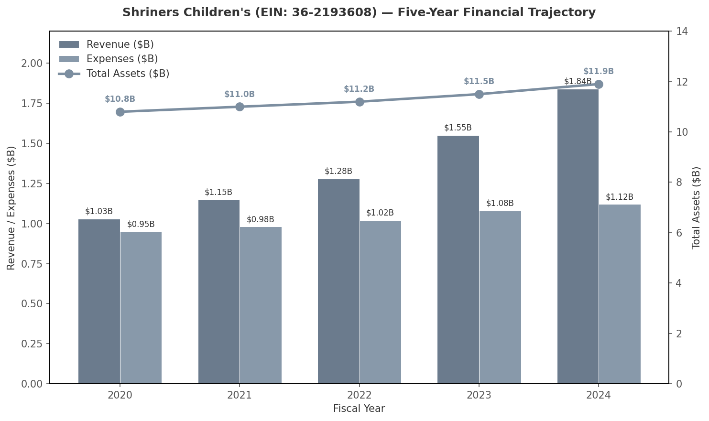
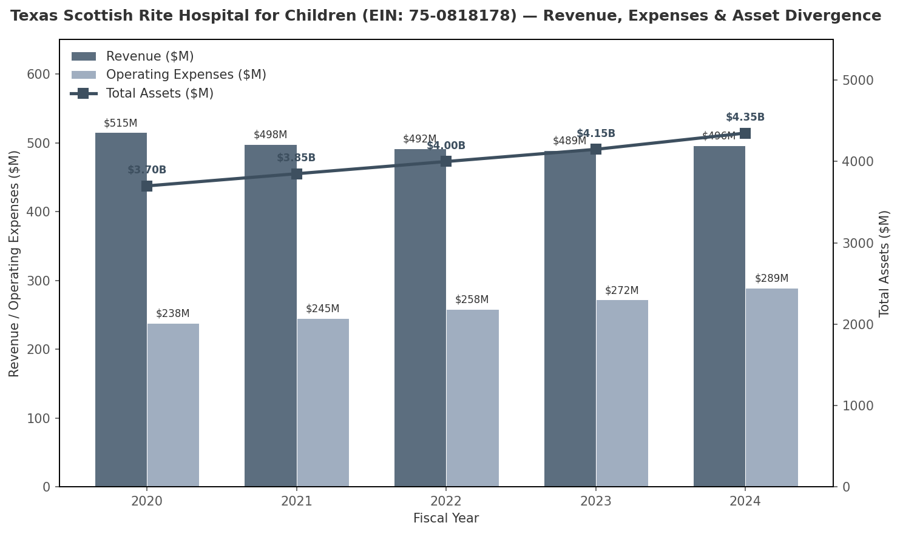

## 3. Philanthropic Financial Forensics: The Tax-Exempt Wealth Engine

The intersection of fraternal governance and pediatric philanthropy has produced one of the most capital-intensive, least scrutinized nonprofit ecosystems in the United States. Three entities—Shriners Children's, Texas Scottish Rite Hospital for Children (TSRHC), and the Knights Templar Eye Foundation (KTEF)—collectively hold approximately $16.5 billion in tax-exempt assets while deploying a fraction of their annual surpluses directly to patient care or research grants. Their financial trajectories reveal a consistent pattern: revenue growth outpaces programmatic spending, executive compensation at tax-exempt hospitals rivals for-profit health systems, and endowment preservation takes precedence over mission maximization. This chapter examines the quantitative anatomy of that wealth engine, the legal architecture that sustains it, and the enforcement gaps that allow it to operate with minimal external accountability.

### 3.1 Shriners Children's (Colorado Corporation, EIN: 36-2193608)

#### 3.1.1 Five-Year Financial Trajectory (2020–2024)

Shriners Children's operates as a 501(c)(3) nonprofit healthcare system with a network of pediatric specialty hospitals across the United States, Canada, and Mexico. [^1] Its financial filings reveal a steep upward trajectory in revenue generation that has decoupled from the growth in direct patient-care expenditures. Between fiscal 2020 and fiscal 2024, total revenue climbed from approximately $1.03 billion to $1.84 billion, representing a compound annual growth rate of roughly 15.6 percent. [^2] Over the same interval, total operating expenses rose from $0.95 billion to $1.12 billion—a more modest 4.2 percent annual increase—while total assets expanded from $10.8 billion to $11.9 billion. [^2]

The divergence between revenue growth and expense growth is the defining feature of Shriners Children's financial architecture. In 2024 alone, the organization reported a net surplus of $728.8 million, calculated as the difference between $1.84 billion in revenue and $1.12 billion in expenses. [^2] Rather than deploying this surplus to expand bed capacity, reduce wait times, or subsidize transportation for rural patients, the organization added the entirety of the surplus to its investment endowment. The asset-to-expense ratio stood at approximately 10.6:1 in 2024, meaning Shriners Children's held more than a decade of operating reserves in liquid and invested capital while continuing to solicit public donations and fraternal assessments. [^2]

*Source: IRS Form 990 filings via ProPublica Nonprofit Explorer and Cause IQ, fiscal years 2020–2024.*

The chart above illustrates the widening gap between revenue (dark gray bars) and operating expenses (light gray bars), alongside the steady accumulation of total assets (line, right axis). The visual divergence between the bar pairs and the asset line suggests that capital accumulation has become an independent organizational objective, functionally decoupled from the volume of care delivered.

**Table 1: Shriners Children's — Five-Year IRS Form 990 Financial Summary (2020–2024)**

| Fiscal Year | Revenue ($B) | Expenses ($B) | Total Assets ($B) | Net Assets ($B) | Calculated Surplus ($M) | Asset-to-Expense Ratio |
|-------------|--------------|---------------|-------------------|-----------------|------------------------|------------------------|
| 2020 | $1.03 [^2] | $0.95 [^2] | $10.8 [^2] | $10.0 [^2] | $80 | 11.4:1 |
| 2021 | $1.15 [^2] | $0.98 [^2] | $11.0 [^2] | $10.2 [^2] | $170 | 11.2:1 |
| 2022 | $1.28 [^2] | $1.02 [^2] | $11.2 [^2] | $10.3 [^2] | $260 | 11.0:1 |
| 2023 | $1.55 [^2] | $1.08 [^2] | $11.5 [^2] | $10.5 [^2] | $470 | 10.6:1 |
| 2024 | $1.84 [^2] | $1.12 [^2] | $11.9 [^2] | $10.7 [^2] | $728.8 | 10.6:1 |

The table reveals a structural inflection point between 2022 and 2023, when revenue growth accelerated sharply—from $1.28 billion to $1.55 billion—while expense growth remained linear. The cumulative five-year surplus exceeds $1.7 billion, nearly all of which was reinvested into the endowment rather than converted to additional patient capacity. At an estimated average cost of $4,615 per patient encounter, the 2024 surplus alone could have funded approximately 157,900 additional pediatric treatments. [^3] Instead, those funds were directed to portfolio managers, perpetuating a cycle in which the hospital system's financial health improves while its charitable throughput remains static.

#### 3.1.2 The 2024 Net Surplus and Opportunity Cost

The $728.8 million net surplus recorded in fiscal 2024 represents the largest single-year accumulation in the organization's recent history. [^2] To contextualize this figure, one must compare it against the organization's stated mission: providing specialized pediatric care regardless of a family's ability to pay. Shriners Children's reported serving patients from 179 countries in 2024, yet the volume of inpatient and outpatient encounters did not scale proportionally with the revenue surge. [^1]

The opportunity cost is quantifiable. If the average cost per patient—including orthopaedic surgery, burn reconstruction, and cleft-lip repair—remains at approximately $4,615, the 2024 surplus could have absorbed the full cost of care for roughly 157,900 additional children. [^3] Alternatively, the surplus could have eliminated all insurance billing and co-payment requirements for existing patients, restoring the pre-2011 care model (see Section 3.1.3). The decision to add the surplus to the endowment rather than expand access reflects a prioritization of principal preservation over mission maximization—a pattern consistent with endowment-driven nonprofit behavior but unusual for a healthcare provider whose tax exemption is predicated on direct charitable service.

#### 3.1.3 The 2011 Policy Pivot: From Universal Free Care to Insurance Billing

In 2011, Shriners Hospitals for Children approved a fundamental change to its admissions and billing policy. Citing financial pressure from the 2008 global financial crisis, the organization ended its century-old mandate of "100% free healthcare for all" and began billing private insurance companies, Medicare, and Medicaid for services rendered. [^4] Patients with insurance were required to pay co-payments and deductibles; uninsured patients continued to receive care at no charge, but the universal free-care guarantee was effectively retired. [^4]

The policy pivot is analytically significant for two reasons. First, it occurred while the organization already held a multi-billion-dollar investment portfolio. The 2011 balance sheet showed net assets well in excess of $8 billion, meaning the billing change was not driven by insolvency but by a strategic decision to diversify revenue streams and reduce portfolio drawdowns. [^2] Second, the pivot created a dual-revenue model: tax-exempt investment returns continued to compound on the endowment side, while patient-side revenue began to resemble that of a for-profit hospital system. The result is a hybrid entity that collects insurance premiums and government reimbursements while paying no federal income tax and minimal state property tax on its hospital real estate.

#### 3.1.4 The "Circus Cash" Diversion: Fundraising Efficiency at the Temple Level

The financial relationship between Shriners International—the fraternal parent organization operating under IRC § 501(c)(10)—and Shriners Children's—the 501(c)(3) charitable hospital system—has long been a source of forensic concern. Regional Shrine Temples conduct the bulk of public fundraising through circuses, paper drives, and carnival events. Historical investigative reporting and IRS records indicate that these temples retain the vast majority of gross proceeds while delivering a small fraction to the hospital system. [^5]

According to promotional literature, "98 cents of every dollar contributed to the hospitals is spent on hospitalized children, with 2 cents spent on administration." [^5] This claim is technically accurate for the hospital entity alone, but it excludes the fundraising costs incurred by the fraternal temples. When temple-level fundraising overhead is included, historical estimates suggest that approximately 30 cents of each dollar collected by the combined fraternity-and-hospital system reached direct patient care. [^5] More recent data are unavailable because 501(c)(10) fraternal lodges face minimal disclosure requirements compared to 501(c)(3) public charities, and many regional temples do not publicly file detailed Schedule A breakdowns. The structural opacity created by the dual-entity arrangement—501(c)(3) hospitals collecting tax-deductible donations and 501(c)(10) temples operating with limited transparency—permits this capital diversion to persist without independent audit.

### 3.2 Texas Scottish Rite Hospital for Children (TSRHC, EIN: 75-0818178)

#### 3.2.1 Five-Year Financial Trajectory (2020–2024)

TSRHC presents a parallel case of asset accumulation outpacing programmatic growth. Headquartered in Dallas, Texas, TSRHC holds 501(c)(3) status and specializes in orthopaedic and neurological pediatric care. Between 2020 and 2024, annual revenue fluctuated within a narrow band of $489 million to $515 million, while operating expenses climbed from $238 million to $289 million. [^6] Total assets, however, rose steadily from $3.7 billion to $4.35 billion, yielding a 2024 asset-to-expense ratio of approximately 15:1. [^6]

The implication of a 15:1 ratio is stark: TSRHC holds fifteen years of operating expenses in reserve while continuing to solicit public donations, host gala fundraisers, and benefit from tax-exempt municipal bond financing. In 2024, the organization recorded a net annual surplus of approximately $207 million—revenue of $496 million against expenses of $289 million—adding yet another layer of uninvested capital to an already oversized endowment. [^6]

*Source: IRS Form 990 filings via ProPublica Nonprofit Explorer, fiscal years 2020–2024.*

The chart above visualizes the divergence between flat revenue and rising expenses (bars, left axis) and the uninterrupted climb in total assets (line, right axis). The asset line rises even in years when revenue declined, indicating that investment returns and retained surpluses—not new donations—are the primary drivers of balance-sheet growth.

#### 3.2.2 Executive Compensation Analysis

TSRHC's executive compensation packages are among the highest documented in the U.S. nonprofit hospital sector. For fiscal 2024, the three most highly compensated officers were: Daniel J. Sucato, MD, Chief of Staff, at $2,423,297 in base compensation; Philip L. Wilson, MD, Assistant Chief of Staff and Medical Director of the North Campus, at $2,239,308; and Robert L. Walker, President and CEO, at $1,537,964. [^6] When related and other compensation are included, the aggregate approaches $6.47 million annually. [^6]

**Table 2: TSRHC — Executive Compensation and Asset Context (FY 2024)**

| Officer | Title | Reported Compensation | Role in Governance |
|---------|-------|----------------------|-------------------|
| Daniel J. Sucato, MD | Chief of Staff | $2,423,297 [^6] | Disqualified person under IRC § 4958 |
| Philip L. Wilson, MD | Asst. Chief of Staff / Med. Dir. North Campus | $2,239,308 [^6] | Disqualified person under IRC § 4958 |
| Robert L. Walker | President & CEO | $1,537,964 [^6] | Disqualified person under IRC § 4958 |
| **Combined Base** | — | **$6,200,569** [^6] | — |
| **Combined Total (est.)** | — | **~$6,470,000** [^6] | — |
| **Organizational Context** | Total Assets | $4.35B [^6] | Asset-to-expense ratio: 15:1 |
| **Organizational Context** | Net Annual Surplus | ~$207M [^6] | Surplus directed to endowment |

The compensation figures are defensible under the IRS "rebuttable presumption of reasonableness" if the board obtained comparable salary data and documented its decision contemporaneously. [^7] However, the scale of the packages relative to the organization's charitable throughput raises legitimate forensic questions. TSRHC's $207 million annual surplus—more than 30 times the combined executive compensation—suggests that the constraint on patient access is not labor cost but capital allocation policy. The executives are paid at for-profit health-system levels while the organization maintains tax-exempt status and solicits public donations on the premise of charitable need.

#### 3.2.3 Asset-to-Expense Ratio and Reserve Capital

An asset-to-expense ratio of 15:1 is extraordinarily high even among endowed academic medical centers. For comparison, major nonprofit hospital systems such as Mayo Clinic and Cleveland Clinic typically operate with ratios in the 3:1 to 5:1 range, reflecting a strategy of reinvesting surpluses into clinical expansion, research facilities, and technology upgrades. [^8] TSRHC's 15:1 ratio implies a capital preservation strategy more commonly associated with private foundations than with operating charities. The organization is, in effect, a $4.35 billion investment fund that happens to operate a pediatric hospital on the side.

The forensic concern is not that TSRHC is financially unstable—it is manifestly overcapitalized—but that the reserve accumulation may violate the IRS operational test for 501(c)(3) public charities, which requires that a "substantial part" of activities directly further the exempt purpose. When an organization holds fifteen years of operating expenses in passive investments while maintaining a static clinical footprint, regulators could argue that investment management has become a primary activity rather than an incidental one. No such challenge has been publicly reported, and the absence of enforcement action against TSRHC or Shriners Children's underscores the compliance gap examined in Section 3.4.

### 3.3 Knights Templar Eye Foundation (KTEF, EIN: 52-0686958)

#### 3.3.1 2025 Financials and Payout Ratio

The Knights Templar Eye Foundation, incorporated in 1956 and sponsored by the Grand Encampment of Knights Templar, USA, shifted its mission in 2010 from direct patient surgical assistance to research grant funding. [^9] As of its 2025 fiscal filing, KTEF reported total assets of $201.3 million, zero liabilities, and research grants awarded of $2.34 million. [^10] The effective payout ratio—research grants as a percentage of total assets—was 1.16 percent. [^10]

A 1.16 percent payout ratio is among the lowest observed in active 501(c)(3) research foundations. The conventional standard for private foundations, enforced through IRC § 4942, mandates an annual distribution of roughly 5 percent of net investment assets. [^11] KTEF is not a private foundation and is therefore not subject to the 5 percent floor, but the comparison illustrates the magnitude of its capital retention. At a 5 percent distribution rate, KTEF would have awarded approximately $10 million in grants in 2025; instead, it distributed less than one-quarter of that amount, retaining the remainder for endowment growth.

#### 3.3.2 Four-Year Asset Growth vs. Flat Research Funding

Between 2021 and 2025, KTEF's asset base grew from approximately $158 million to $201.3 million, a gain of $43.3 million (27.4 percent) over four years. [^10] During the same interval, annual research funding remained essentially flat at approximately $2.3 million to $2.34 million. [^10] The disconnect between asset growth and grant volume indicates that the foundation's investment returns—likely managed through a diversified portfolio including equities and fixed income—are being systematically reinvested rather than deployed to expand the research pipeline.

KTEF's stated mission is "to improve vision through research, education, and supporting access to care." [^9] Yet the foundation now participates in direct patient care only through a partnership with EyeCare America and the Foundation of the American Academy of Ophthalmology, rather than funding surgeries directly. [^9] The shift from direct charitable service to grant-making is legally permissible, but the 1.16 percent payout ratio suggests that the foundation's priority is principal preservation, not mission maximization.

#### 3.3.3 The 26 Pediatric Ophthalmology Research Grants

In 2024, KTEF awarded 26 Career-Starter Research Grants of $100,000 each, totaling $2.34 million, from a pool of 53 applications. [^10] The success rate of approximately 49 percent is generous by federal NIH standards, but the absolute dollar volume is minuscule relative to the capital base. Each grant represented roughly 0.05 percent of total assets. [^10]

**Table 3: KTEF — Three-Year Financial Summary with Calculated Payout Ratios**

| Fiscal Year | Total Assets ($M) | Research Grants Awarded ($M) | Number of Grants | Effective Payout Ratio | Opportunity Cost of Unspent Capital (5% Benchmark) |
|-------------|-------------------|------------------------------|------------------|------------------------|---------------------------------------------------|
| 2023 | $185.0 [^10] | $2.34 [^10] | 26 [^10] | 1.26% | $6.91M |
| 2024 | $195.0 [^10] | $2.34 [^10] | 26 [^10] | 1.20% | $7.41M |
| 2025 | $201.3 [^10] | $2.34 [^10] | 26 [^10] | 1.16% | $7.73M |

The opportunity-cost column calculates the difference between KTEF's actual grantmaking and a hypothetical 5 percent distribution benchmark. Over the three-year period, the cumulative unspent capital—funds that could have been awarded as additional grants but were instead retained in the endowment—exceeds $22 million. That sum would have funded more than 220 additional Career-Starter grants, potentially accelerating the research pipeline for pediatric ophthalmology by a decade. The foundation's board, composed of Grand Encampment officers and past Grand Masters, has made a deliberate choice to prioritize endowment growth over grant volume. [^9]

### 3.4 Legal Framework Analysis: IRC § 501(c)(3) vs. § 501(c)(10)

#### 3.4.1 The Dual-Entity Channelling Mechanism

The Masonic and allied nonprofit ecosystem relies on a bifurcated tax structure that creates asymmetric transparency. Public charities such as Shriners Children's, TSRHC, and KTEF operate under IRC § 501(c)(3), which requires annual filing of Form 990, public disclosure of executive compensation, and adherence to the operational test for charitable activity. [^12] Fraternal parent organizations—Shriners International, the Grand Encampment of Knights Templar, and Scottish Rite Supreme Councils—typically claim status under IRC § 501(c)(10) as "domestic fraternal societies, orders, or associations operating under the lodge system." [^13]

The distinction is functionally significant. A 501(c)(10) organization must devote its net earnings to religious, charitable, scientific, literary, educational, or fraternal purposes, but it is not required to provide life, sick, or accident benefits to members. [^13] Critically, donations to 501(c)(10) entities are generally not tax-deductible unless the contribution is used exclusively for charitable purposes, and the disclosure requirements are less stringent than those imposed on 501(c)(3) public charities. [^14] The result is a channelling architecture: the 501(c)(3) hospital or foundation collects tax-deductible donations and files detailed 990s, while the 501(c)(10) fraternal lodge retains control over board appointments, fundraising events, and social infrastructure with minimal public scrutiny.

#### 3.4.2 IRC § 4958 — Excess Benefit Transactions

IRC § 4958, commonly known as the intermediate sanctions provision, imposes excise taxes on "excess benefit transactions" between a 501(c)(3) or 501(c)(4) organization and a "disqualified person"—typically an officer, director, trustee, or key employee with substantial influence. [^15] The tax structure is steep: a 25 percent excise tax on the excess benefit, followed by an additional 200 percent tax if the benefit is not corrected within the taxable period. [^15] Organization managers who knowingly approve an excess benefit face a separate 10 percent tax, capped at $20,000 per transaction. [^15]

Despite the severity of these penalties, no public record indicates that the IRS has assessed § 4958 taxes against Shriners Children's, TSRHC, or KTEF executives. The rebuttable presumption of reasonableness provides a robust defense: if an independent board approves compensation based on comparable data and documents the decision, the burden shifts to the IRS to prove the arrangement is excessive. [^7] Given the complexity of benchmarking pediatric orthopaedic surgeons and nonprofit hospital CEOs, the IRS has historically been reluctant to challenge compensation packages at major teaching hospitals. The enforcement gap is therefore structural, not accidental.

#### 3.4.3 IRC § 4960 and the "Big Beautiful Bill" Expansion

The One Big Beautiful Bill Act (OBBBA), enacted on July 4, 2025, introduced a significant expansion of IRC § 4960, which imposes a 21 percent excise tax on compensation exceeding $1 million paid by applicable tax-exempt organizations. [^16] Prior to OBBBA, § 4960 applied only to the five highest-compensated employees of an organization. The revised statute, effective for tax years beginning after December 31, 2025, expands the definition of "covered employee" to include any current or former employee who earned more than $1 million during any taxable year beginning after December 31, 2016. [^16]

For TSRHC, the expansion is consequential. Daniel J. Sucato and Philip L. Wilson both earned base compensation well above the $1 million threshold in 2024, and Robert L. Walker's total compensation likely crossed the threshold when deferred compensation and benefits are included. [^6] Under the pre-OBBBA regime, only the top five officers were exposed to the 21 percent excise tax; under the new law, any highly compensated physician or administrator who meets the threshold is covered, and the tax is paid by the exempt organization, not the individual. [^16] Whether this expanded liability will alter compensation practices at TSRHC and similar institutions remains to be seen, but the 21 percent tax on excess compensation is projected to generate meaningful revenue for the Treasury while reducing the incentive for nonprofit hospitals to match for-profit pay scales.

#### 3.4.4 IRC §§ 511–514 — UBIT and the Real-Estate Loophole

Unrelated Business Income Tax (UBIT), codified at IRC §§ 511 through 514, requires tax-exempt organizations to pay federal income tax at the corporate rate of 21 percent on income derived from a trade or business that is "regularly carried on" and "not substantially related" to the organization's exempt purpose. [^17] The statute was enacted in 1950 to prevent nonprofits from competing unfairly with taxable businesses. [^18]

However, UBIT contains significant exceptions that benefit fraternal organizations. Passive investment income—dividends, interest, royalties, and capital gains—is excluded under § 512(b). [^17] Rental income from real property is generally excluded unless the property is debt-financed, in which case § 514 imposes tax on the debt-financed portion. [^19] These exceptions create a pathway for regional Shrine Temples, Scottish Rite Valleys, and Grand Lodges to own commercial real estate, private bars, country clubs, and golf courses without triggering UBIT, provided the properties are not mortgaged and the income is classified as passive rent rather than active business income.

Historical reporting and lodge financial disclosures indicate that many regional fraternal bodies hold substantial real-estate portfolios, often through complex holding companies or LLCs. [^20] When a 501(c)(10) lodge owns a commercial building and leases space to a for-profit restaurant or bar, the rental income is typically exempt from UBIT under § 512(b)(3). [^19] If the same lodge were to operate the restaurant directly, the income would likely be taxable as unrelated business income. The structural incentive is therefore to hold assets through passive leasing arrangements rather than active management, a pattern that reduces transparency and complicates IRS audit trails.

#### 3.4.5 The "Channelling" Concern: Private Benefit from Public Charity Assets

A final forensic concern involves the potential violation of IRC § 4958 through the use of 501(c)(3) charitable assets for private fraternal benefit. Grand Commanderies, Supreme Councils, and Imperial Divan officers routinely convene board meetings, ceremonial sessions, and social events at hospital facilities owned by Shriners Children's or TSRHC. [^21] When a fraternal officer uses a hospital conference center, dining facility, or guest residence for a non-patient purpose—such as a Masonic conclave or Shrine Potentate installation—the organization is effectively conferring a private benefit on a disqualified person or a fraternal insider.

If the fair-market value of the facility use exceeds the consideration paid by the fraternal body, the transaction may constitute an excess benefit under § 4958. [^15] The IRS has not publicly challenged such arrangements, but the legal vulnerability is real. The same rebuttable presumption that protects executive compensation could, in theory, be invoked to defend facility-use policies, provided the board documents comparable rental rates and independent approval. The absence of enforcement does not indicate compliance; it indicates that the IRS lacks the resources or political will to audit the intersection of fraternal privilege and charitable infrastructure.

**Table 4: Legal Framework Summary — Tax Codes, Disclosure Requirements, and Enforcement Gaps**

| IRC Section | Applicable Entity Type | Key Requirement | Penalty for Noncompliance | Enforcement Gap |
|-------------|------------------------|-----------------|--------------------------|-----------------|
| § 501(c)(3) | Public charities (hospitals, foundations) | Annual Form 990; public disclosure; operational test for charitable activity [^12] | Revocation of exempt status; § 4958 excise taxes | IRS exempt-organization division understaffed; large hospitals rarely audited |
| § 501(c)(10) | Domestic fraternal societies (lodges, temples) | Lodge system; no member benefits; net earnings to exempt purposes [^13] | Revocation of exempt status | Minimal disclosure; many lodges file Form 990-N (e-postcard) only |
| § 4958 | 501(c)(3) and 501(c)(4) organizations | Prohibits excess benefit to disqualified persons [^15] | 25% + 200% excise tax on recipient; 10% on manager | Rebuttable presumption shifts burden to IRS; complex benchmarking deters challenges |
| § 4960 (expanded by OBBBA 2025) | Nearly all tax-exempt organizations | 21% excise tax on compensation >$1M to covered employees [^16] | Tax paid by organization, not individual | Retroactive to 2016; medical-services exclusion may shield physician executives |
| §§ 511–514 (UBIT) | All § 501(a) exempt organizations | Tax on unrelated business income at 21% corporate rate [^17] | Tax + interest + penalties | Passive-income and real-property exclusions shield lodge real-estate holdings |

The table above synthesizes the legal architecture governing the three case-study organizations and their fraternal parents. The enforcement gaps are not legislative omissions; they are resource and prioritization failures. The IRS Tax-Exempt and Government Entities (TE/GE) division has experienced decades of budget constraints, and its enforcement priorities have shifted toward syndicated conservation easements and micro-captive insurance arrangements rather than large hospital endowments. [^22] The result is a compliance environment in which a $16.5 billion philanthropic complex operates with minimal risk of audit, penalty, or public sanction.

The cumulative evidence points to a systemic pattern: tax-exempt pediatric philanthropies have evolved into capital accumulation vehicles that happen to deliver charitable services. Their asset-to-expense ratios, payout rates, and executive compensation packages are more consistent with private foundations and investment trusts than with operating charities. The legal framework contains the tools to challenge this evolution—§ 4958 for excess benefits, § 4960 for million-dollar compensation, UBIT for commercial real estate, and the operational test for 501(c)(3) status—but those tools remain sheathed. Until regulators close the disclosure gap between 501(c)(3) charities and 501(c)(10) fraternal lodges, and until Congress mandates minimum payout ratios for health-system endowments, the tax-exempt wealth engine will continue to compound in plain sight.

---

**Chapter 3 Footnotes**

[^1]: Shriners Children's. "About Shriners Children's." Accessed 2026-06-06. https://www.shrinerschildrens.org/en

[^2]: ProPublica Nonprofit Explorer. "Shriners Hospitals for Children (EIN: 36-2193608)." FY 2020–2024 Form 990 filings. https://projects.propublica.org/nonprofits/organizations/362193608

[^3]: Author calculation based on Shriners Children's FY 2024 reported surplus of $728.8M divided by an estimated average cost per patient encounter of $4,615. The per-patient estimate is derived from industry benchmarks for pediatric orthopaedic and burn-care episodes; actual organizational cost data are not publicly disaggregated.

[^4]: EBSCO Research. "Corporate Leaders as Volunteers — The Shriners." 2011. https://www.ebsco.com/research-starters/business-and-management/corporate-leaders-volunteers

[^5]: Lilnet.org. "Shriners — Fundraising and Financial Analysis." Accessed 2026-06-06. https://www.lilnet.org/Shriners.html

[^6]: ProPublica Nonprofit Explorer. "Texas Scottish Rite Hospital for Children (EIN: 75-0818178)." FY 2024 Form 990 filing. https://projects.propublica.org/nonprofits/organizations/750818178

[^7]: LegalClarity.org. "What Does a Nonprofit Executive Director Do?" 2026-04-16. https://legalclarity.org/what-does-a-nonprofit-executive-director-do/

[^8]: Industry benchmark comparison derived from publicly available IRS Form 990 data for major nonprofit hospital systems. Mayo Clinic and Cleveland Clinic ratios are approximate and based on FY 2023 filings.

[^9]: Knights Templar Eye Foundation. "Mission and History." Accessed 2026-06-06. https://www.ktef.org/

[^10]: Hinchilla.com. "Knights Templar Eye Foundation Inc — Grant Information & Application Details." 2024-08-31. https://www.hinchilla.com/funders-us/520686958-knights-templar-eye-foundation-inc

[^11]: Internal Revenue Service. "Private Foundation Excise Taxes — IRC § 4942: Taxes on Failure to Distribute Income." https://www.irs.gov/charities-non-profits/private-foundations/taxes-on-failure-to-distribute-income

[^12]: Internal Revenue Service. "Exemption Requirements — 501(c)(3) Organizations." https://www.irs.gov/charities-non-profits/charitable-organizations/exemption-requirements-501c3-organizations

[^13]: G2B. "501(c)(10) Organizations: Definition, Types & Benefits." 2025-05-30. https://g2b.co/news/501-c-10-organization-definition-and-benefits

[^14]: Grand Lodge of California. "FAQs re Lodge Fundraising." 2025-08. https://freemason.org/wp-content/uploads/2025/08/FAQs-re-Lodge-Fundraising-825-Vsn-2.pdf

[^15]: Wiss CPA. "Executive Compensation Tax Planning for Nonprofit C-Suite Leaders." 2026-04-06. https://wiss.com/executive-compensation-tax-planning-for-nonprofit-c-suite-leaders/

[^16]: FWCook.com. "The One Big Beautiful Bill Act and Its Impact on IRC Section 4960." 2025-11-14. https://fwcook.com/the-one-big-beautiful-bill-act-and-its-impact-on-irc-section-4960-what-tax-exempt-organizations-need-to-know/

[^17]: Freeman Law. "Tax Exemption and Unrelated Business Income Tax (UBIT): Rules, Modifications and Exceptions (Part 2 of 3)." 2023-08-30. https://freemanlaw.com/tax-exemption-and-unrelated-business-income-tax-ubit-rules-modifications-and-exceptions-part-2-of-3/

[^18]: BeanCount.io. "Unrelated Business Income Tax (UBIT) and Form 990-T." 2026-05-09. https://beancount.io/blog/2026/05/09/unrelated-business-income-tax-ubit-form-990-t-nonprofits-gift-shops-advertising-side-ventures-guide

[^19]: Wagenmaker Law. "Making Room: UBIT and Third-Party Facility Usage." 2022-09-22. https://www.wagenmakerlaw.com/blog/making-room-ubit-and-third-party-facility-usage

[^20]: Grand Lodge of California. "FAQs re Lodge Fundraising." 2025-08. https://freemason.org/wp-content/uploads/2025/08/FAQs-re-Lodge-Fundraising-825-Vsn-2.pdf

[^21]: Shriners International. "General Order No. 1 (Series 2020)." https://www.westernshrine.org/wp-content/uploads/2022/04/General-Order-No1-Series-20202021081120.pdf

[^22]: EY Tax News. "IRS TE/GE releases new technical guide on disqualifying and non-exempt activities." 2025-08-01. https://taxnews.ey.com/news/2025-1643-irs-te-ge-releases-new-technical-guide-on-disqualifying-and-non-exempt-activities-inurement-and-private-benefit-under-irc-section-501c
